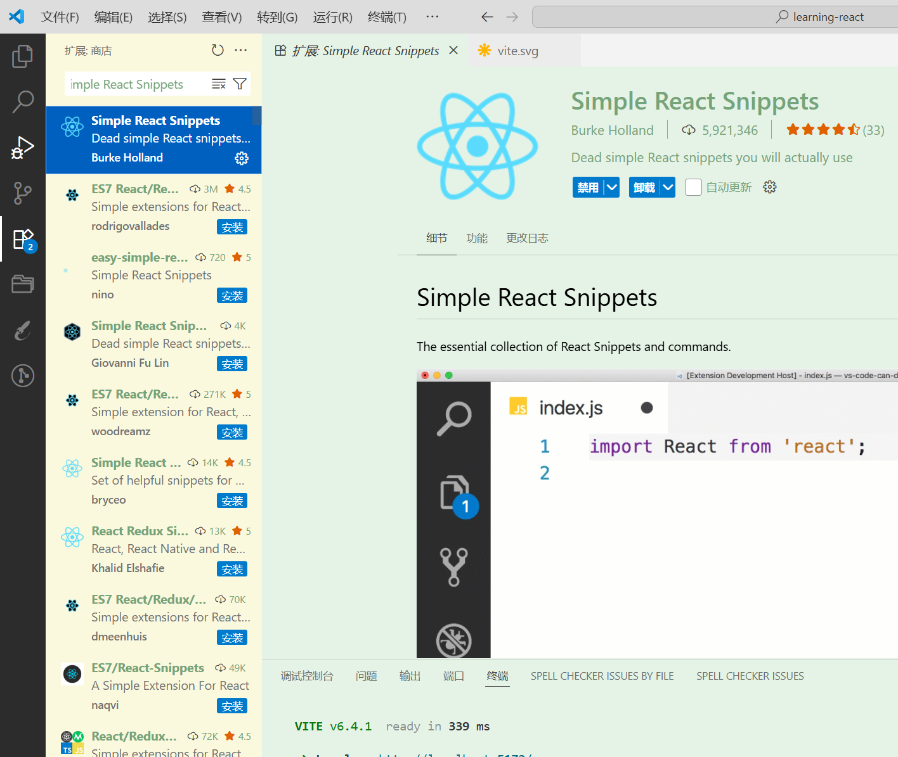

# React入门

## React基本介绍

### 什么是react?


React 是一个用于构建用户界面的 JavaScript 库。它由 Facebook(现Meta) 开发和维护，并在2013年开源。React 的设计初衷是帮助开发者构建复杂的用户界面，同时保持代码的可维护性和可扩展性。

### react的特点

1. 组件化：React 通过将 UI 分解为独立的、可重用的组件，使得代码更易于管理和维护。每个组件只关注于自身的逻辑和视图。
2. 声明式编程：React 采用声明式的编程风格，开发者只需描述 UI 应该是什么样子的，而不需要手动操作 DOM。React 会根据数据的变化自动更新 UI。
3. 虚拟 DOM：React 使用虚拟 DOM（Virtual DOM）来优化 UI 的更新过程。当数据发生变化时，React 会创建一个新的虚拟 DOM，然后将其与之前的虚拟 DOM 进行比较，找出最小的变化，并将这些变化应用到实际的 DOM 中，从而提高性能。
4. 单向数据流：React 采用单向数据流（也称为单向数据绑定），这意味着数据在组件之间通过 props 进行传递，使得数据的流动更加清晰和可预测。
5. 生态系统：React 有一个庞大且活跃的社区，提供了大量的第三方库和工具，如 React Router（用于路由管理）、Redux（用于状态管理）等，帮助开发者构建复杂的应用。

### 前置知识

你必须学会以下知识才能使用 React:

- JavaScript`(es6+)`
- HTML
- CSS
- TypeScript(基本使用) [Typescript教程](https://www.bilibili.com/video/BV1wR4y1377K/?spm_id_from=333.999.0.0)
- Npm包管理器

### 安装环境准备

1. node.js 下载地址：https://nodejs.org/en **建议安装18以上版本，或者使用nvm管理node版本**
2. vsocde编辑器(如果安装过了请略过|或者喜欢其他编辑器) https://code.visualstudio.com/
3. vscode插件安装 可选 (`Simple React Snippets`)




## React开发环境搭建

### 开发环境搭建

选择一个你喜欢的目录，然后运行以下命令：

```
npm init vite
```

- 执行完成之后会让你输入项目名称 例如` learning-react`
- 接下来会让你选择一个框架 这时候选择 `react`
- 然后选择 `TypeScript + SWC` 如果你不会ts就选择js

### 目录介绍

```
public 公共目录
src
    assets 静态资源
    App.css 根组件样式
    App.tsx 根组件
    index.css 全局css文件
    main.tsx 全局tsx文件
    vite-env.d.ts 声明文件
.eslintrc.cjs eslint配置文件
.gitignore git忽略文件
index.html 入口文件index.html
package.json 项目依赖模块文件
tsconfig.json ts配置文件
tsconfig.node.json vite-ts配置文件
vite.config.ts vite配置文件
```

**FAQ:**

- **public公共目录和assets静态资源有什么区别?**

答：public目录的资源编译之后会存放到根目录，而静态资源assets是会随着项目一起打包的，public则不会被编译。

- **为什么main.tsx的`document.getElementById('root')!`要加一个!**

答：因为`document.getElementById('root')`返回可能为空，这时候就会报错。!是非空断言，告诉编辑器这个表达式不会为空。

### 命令介绍(package.json)

```
"dev": "vite",//启动开发模式项目
"build": "tsc && vite build", //打包构建生产包
"lint": "eslint . --ext ts,tsx --report-unused-disable-directives --max-warnings 0",//代码检查
"preview": "vite preview" //预览模式
```

**eslint命令详解**

```
eslint .：对当前目录（以及子目录）中的文件运行 ESLint。
--ext ts,tsx：指定要检查的文件扩展名为 .ts 和 .tsx，即 TypeScript 和 TypeScript React 文件。
--report-unused-disable-directives：报告未使用的 eslint-disable 指令。这可以帮助你清理不再需要的 ESLint 禁用指令。
--max-warnings 0：将警告数量限制为 0。如果有任何警告，ESLint 将返回非零退出代码，这通常用于在 CI/CD 环境中确保代码库没有任何警告。
```

## tsx语法入门

### FAQ

**tsx跟jsx有什么区别**

答: 基本没有没有区别只是在jsx语法上增加了类型。

**jsx是什么？**

答：jsx是js的语法扩展，允许在js中编写html代码。

例如：`const fn = () => <div>小满是谁？没听说过</div>`

### 语法编写

??? 代码先不复制

- 使用tsx绑定变量`{value}`

绑定class需要用className


- 使用tsx绑定事件`on[Click]{fn}`小驼峰 其他事件也是一样的


- tsx如何使用泛型


- tsx如何渲染html代码片段(dangerouslySetInnerHTML)

dangerouslySetInnerHTML 的值是一个对象，该对象包含一个名为 __html 的属性，且值为你想要插入的 HTML 字符串


- tsx如何遍历dom元素

使用map遍历返回html标签即可


- tsx如何编写条件语句

使用三元表达式就可以了


- tsx注意事项

**{}插值语句内不允许编写`switch` `if` `变量声明` 或者直接放入`对象本体`**

下面展示错误用法正确用法对比