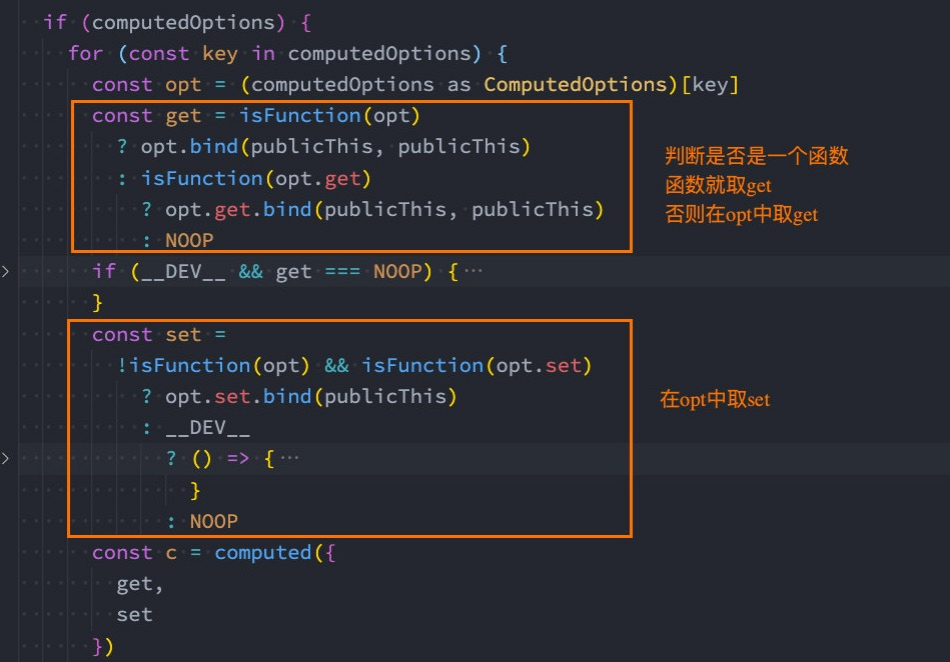
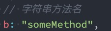
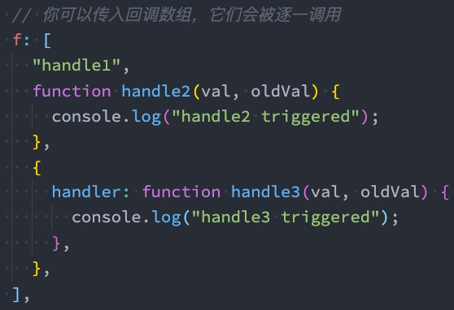
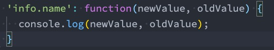
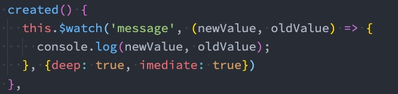
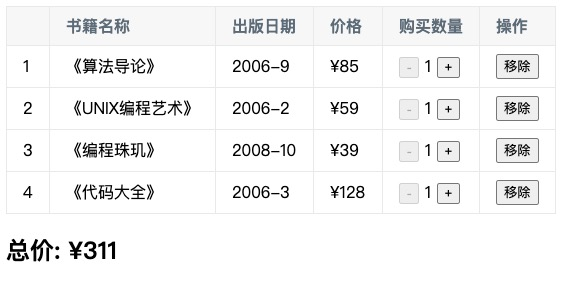
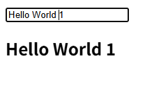
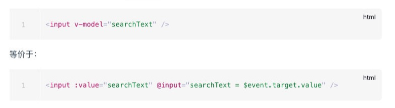
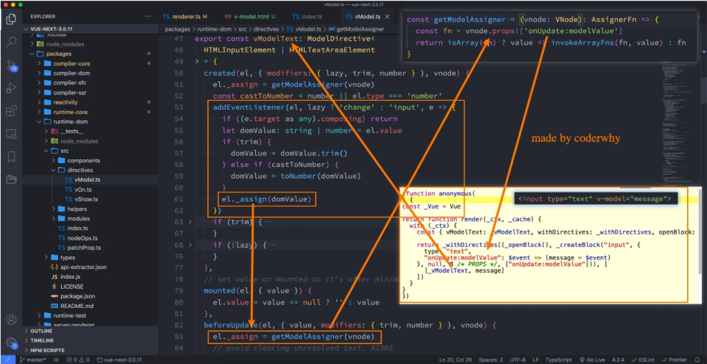

<!--
 * @Author: laidz laidz@yelinked.com
 * @Date: 2025-09-17 14:04:10
 * @LastEditors: laidz laidz@yelinked.com
 * @LastEditTime: 2025-09-17 19:02:17
 * @Description: 
-->
# Vue3的OptionsAPI

# 计算属性computed

## 复杂data的处理方式

我们知道,在模板中可以直接通过插值语法显示一些data中的数据。


但是在某些情况,我们可能需要对数据进行一些转化后再显示,或者需要将多个数据结合起来进行显示;

比如我们需要对多个data数据进行运算、三元运算符来决定结果、数据进行某种转化后显示;

在模板中使用表达式,可以非常方便的实现,但是设计它们的初衷是用于简单的运算;

在模板中放入太多的逻辑会让模板过重和难以维护;

并且如果多个地方都使用到,那么会有大量重复的代码;


我们有没有什么方法可以将逻辑抽离出去呢？

可以,其中一种方式就是将逻辑抽取到一个method中,放到methods的options中;

但是,这种做法有一个直观的弊端,就是所有的data使用过程都会变成了一个方法的调用;

另外一种方式就是使用计算属性computed;

## 认识计算属性computed

**什么是计算属性呢？**

官方并没有给出直接的概念解释;

而是说：对于任何包含响应式数据的复杂逻辑,你都应该使用**计算属性**;

计算属性将被混入到组件实例中。所有 getter 和 setter 的 this 上下文自动地绑定为组件实例;


计算属性的用法：

**选项：**'computed'

**类型：**'{ [key: string]: Function | { get: Function, set: Function } }'


那接下来我们通过案例来理解一下这个计算属性。

## 案例实现思路

**我们来看三个案例：**

案例一：我们有两个变量：firstName和lastName,希望它们拼接之后在界面上显示;


案例二：我们有一个分数：score

当score大于60的时候,在界面上显示及格;

当score小于60的时候,在界面上显示不及格;


案例三：我们有一个变量message,记录一段文字：比如Hello World

某些情况下我们是直接显示这段文字;

某些情况下我们需要对这段文字进行反转;


**我们可以有三种实现思路：**

思路一：在模板语法中直接使用表达式;

思路二：使用method对逻辑进行抽取;

思路三：使用计算属性computed;

## 实现思路一：模板语法

**思路一的实现：模板语法**

缺点一：模板中存在大量的复杂逻辑,不便于维护（模板中表达式的初衷是用于简单的计算）;

缺点二：当有多次一样的逻辑时,存在重复的代码;

缺点三：多次使用的时候,很多运算也需要多次执行,没有缓存;

```vue
  <template>
    <h2>{{firstName + " " + lastName}}</h2>
    <h2>{{score >= 60 ? '及格': '不及格'}}</h2>
    <h2>{{message.split(" ").reverse().join(" ")}}</h2>
  </template>
```


## 实现思路二：method实现

**思路二的实现：method实现**

缺点一：我们事实上先显示的是一个结果,但是都变成了一种方法的调用;

缺点二：多次使用方法的时候,没有缓存,也需要多次计算;

```vue
  <template>
    <h2>{{getFullName()}}</h2>
    <h2>{{getResult()}}</h2>
    <h2>{{getReverseMessage()}}</h2>
  </template>
  
      methods: {
        getFullName() {
          return this.firstName + " " + this.lastName;
        },
        getResult() {
          return this.score >= 60 ? "及格": "不及格";
        },
        getReverseMessage() {
          return this.message.split(" ").reverse().join(" ");
        }
      }
    }
```


## 思路三的实现：computed实现

**思路三的实现：computed实现**

注意：计算属性看起来像是一个函数,但是我们在使用的时候不需要加(),这个后面讲setter和getter时会讲到;

我们会发现无论是直观上,还是效果上计算属性都是更好的选择;

并且计算属性是有缓存的;

```vue
  <template >
    <h2>{{fullName}}</h2>
    <h2>{{result}}</h2>
    <h2>{{reverseMessage}}</h2>
  </template>

      computed: {
        // 定义了一个计算属性叫fullname
        fullName() {
          return this.firstName + " " + this.lastName;
        },
        result() {
          return this.score >= 60 ? "及格": "不及格";
        },
        reverseMessage() {
          return this.message.split(" ").reverse().join(" ");
        }
      }
```


## 计算属性 vs methods
在上面的实现思路中,我们会发现计算属性和methods的实现看起来是差别是不大的,而且我们多次提到计算属性有缓存的。

接下来我们来看一下同一个计算多次使用,计算属性和methods的差异：

```vue
  <template id="my-app4">
    <button @click="changeFirstName">修改firstName</button>

    <h2>{{fullName}}</h2>
    <h2>{{fullName}}</h2>
    <h2>{{fullName}}</h2>
    <h2>{{fullName}}</h2>
    <h2>{{fullName}}</h2>
    <h2>{{fullName}}</h2>
    <h2>{{fullName}}</h2>
    <h2>{{fullName}}</h2>

    <h2>{{getFullName()}}</h2>
    <h2>{{getFullName()}}</h2>
    <h2>{{getFullName()}}</h2>
    <h2>{{getFullName()}}</h2>
    <h2>{{getFullName()}}</h2>
    <h2>{{getFullName()}}</h2>
  </template>

      computed: {
        // 计算属性是有缓存的, 当我们多次使用计算属性时, 计算属性中的运算只会执行一次.
        // 计算属性会随着依赖的数据(firstName)的改变, 而进行重新计算.
        fullName() {
          console.log("computed的fullName中的计算");
          return this.firstName + " " + this.lastName;
        }
      },
      methods: {
        getFullName() {
          console.log("methods的getFullName中的计算");
          return this.firstName + " " + this.lastName;
        },
        changeFirstName() {
          this.firstName = "Coder"
        }
      }
    
```


## 计算属性的缓存

这是什么原因呢？

这是因为计算属性会基于它们的依赖关系进行缓存;

在数据不发生变化时,计算属性是不需要重新计算的;

但是如果依赖的数据发生变化,在使用时,计算属性依然会重新进行计算;


## 计算属性的setter和getter

计算属性在大多数情况下,只需要一个**getter方法**即可,所以我们会将计算属性直接**写成一个函数**。

但是,如果我们确实想**设置计算属性的值**呢？

这个时候我们也可以给计算属性设置一个setter的方法;

```vue
      computed: {

        // fullName 的 getter方法
        fullName() {
          return this.firstName + " " + this.lastName;
        },
        
        // fullName的getter和setter方法
        fullName: {
          get: function() {
            return this.firstName + " " + this.lastName;
          },
          set: function(newValue) {
            console.log(newValue);
            const names = newValue.split(" ");
            this.firstName = names[0];
            this.lastName = names[1];
          }
        }
      },
```


## 源码如何对setter和getter处理呢？

你可能觉得很奇怪,Vue内部是如何对我们传入的是一个getter,还是说是一个包含setter和getter的对象进行处理的呢？

事实上非常的简单,Vue源码内部只是做了一个逻辑判断而已;




# 侦听器watch
## 认识侦听器watch
**什么是侦听器呢？**

开发中我们在data返回的对象中定义了数据,这个数据通过插值语法等方式绑定到template中;

当数据变化时,template会自动进行更新来显示最新的数据;

但是在某些情况下,我们希望在代码逻辑中监听某个数据的变化,这个时候就需要用侦听器watch来完成了;


侦听器的用法如下：

**选项：**'watch'

**类型：**'{ [key: string]: string | Function | Object | Array}'


## 侦听器案例

**举个栗子（例子）：**

比如现在我们希望用户在input中输入一个问题;

每当用户输入了最新的内容,我们就获取到最新的内容,并且使用该问题去服务器查询答案;

那么,我们就需要实时的去获取最新的数据变化;


```vue
  <template id="my-app5">
    您的问题: <input type="text" v-model="question">
    <!-- <button @click="queryAnswer">查找答案</button> -->
  </template>
  
      watch: {
        // question侦听的data中的属性的名称
        // newValue变化后的新值
        // oldValue变化前的旧值
        question: function(newValue, oldValue) {
          console.log("新值: ", newValue, "旧值", oldValue);
          this.queryAnswer();
        }
      },
      methods: {
        queryAnswer() {
          console.log(`你的问题${this.question}的答案是哈哈哈哈哈`);
          this.anwser = "";
        }
      }
```


## 侦听器watch的配置选项

我们先来看一个例子：

当我们点击按钮的时候会修改info.name的值;

这个时候我们使用watch来侦听info,可以侦听到吗？答案是不可以。


这是因为默认情况下,**watch只是在侦听info的引用变化**,对于**内部属性的变化是不会做出响应**的：

这个时候我们可以使用一个选项deep进行更深层的侦听;

注意前面我们说过watch里面侦听的属性对应的也可以是一个Object;


还有**另外一个属性**,是**希望一开始的就会立即执行一次**：

这个时候我们使用immediate选项;

这个时候无论后面数据是否有变化,侦听的函数都会有限执行一次;


## 侦听器watch的配置选项（代码）

```vue
      watch: {
        // 默认情况下我们的侦听器只会针对监听的数据本身的改变(内部发生的改变是不能侦听)
        // info(newInfo, oldInfo) {
        //   console.log("newValue:", newInfo, "oldValue:", oldInfo);
        // }

        // 深度侦听/立即执行(一定会执行一次)
        info: {
          handler: function(newInfo, oldInfo) {
            console.log("newValue:", newInfo.nba.name, "oldValue:", oldInfo.nba.name);
          },
          deep: true, // 深度侦听
          // immediate: true // 立即执行
        }
      },
```


## 侦听器watch的其他方式（一）







## 侦听器watch的其他方式（二）

另外一个是Vue3文档中没有提到的,但是Vue2文档中有提到的是侦听对象的属性:




**还有另外一种方式就是使用 $watch 的API：**


我们可以在created的生命周期（后续会讲到）中,使用 this.$watchs 来侦听;

第一个参数是要侦听的源;

第二个参数是侦听的回调函数callback;

第三个参数是额外的其他选项,比如deep、immediate;




## 综合案例

现在我们来做一个相对综合一点的练习：**书籍购物车**




案例说明：

1.在界面上以表格的形式,显示一些书籍的数据;

2.在底部显示书籍的总价格;

3.点击+或者-可以增加或减少书籍数量（如果为1,那么不能继续-）;

4.点击移除按钮,可以将书籍移除（当所有的书籍移除完毕时,显示：购物车为空~）;


# v-model使用

## v-model的基本使用
**表单提交**是开发中非常常见的功能,也是和用户交互的重要手段：

比如用户在登录、注册时需要提交账号密码;

比如用户在检索、创建、更新信息时,需要提交一些数据;


这些都要求我们可以在**代码逻辑中获取到用户提交的数据**,我们通常会使用**v-model指令**来完成：

v-model指令可以在表单 input、textarea以及select元素上创建双向数据绑定;

它会根据控件类型自动选取正确的方法来更新元素;

尽管有些神奇,但 v-model 本质上不过是语法糖,它负责监听用户的输入事件来更新数据,并在某种极端场景

下进行一些特殊处理;

```
  <template id="my-app6">
    <!-- 1.v-bind value的绑定 2.监听input事件, 更新message的值 -->
    <!-- <input type="text" :value="message" @input="inputChange"> -->
    <input type="text" v-model="message">
    <h2>{{message}}</h2>
  </template>
```



## v-model的原理

官方有说到,**v-model的原理**其实是背后有两个操作：

v-bind绑定value属性的值;

v-on绑定input事件监听到函数中,函数会获取最新的值赋值到绑定的属性中;




## 事实上v-model更加复杂




## v-model绑定textarea

我们再来绑定一下**其他的表单类型**：textarea、checkbox、radio、select

我们来看一下绑定textarea：

```
    <!-- 1.绑定textarea -->
    <label for="intro">
      自我介绍
      <textarea name="intro" id="intro" cols="30" rows="10" v-model="intro"></textarea>
    </label>
```


## v-model绑定checkbox

我们来看一下v-model绑定**checkbox**：单个勾选框和多个勾选框


**单个勾选框：**

v-model即为布尔值。

此时input的value并不影响v-model的值。


**多个复选框：**

当是多个复选框时,因为可以选中多个,所以对应的data中属性是一个数组。

当选中某一个时,就会将input的value添加到数组中。

```
    <!-- 2.checkbox -->
    <!-- 2.1.单选框 -->
    <label for="agree">
      <input id="agree" type="checkbox" v-model="isAgree"> 同意协议
    </label>
    <h2>isAgree: {{isAgree}}</h2>

    <!-- 2.2.多选框 -->
    <span>你的爱好: </span>
    <label for="basketball">
      <input id="basketball" type="checkbox" v-model="hobbies" value="basketball"> 篮球
    </label>
    <label for="football">
      <input id="football" type="checkbox" v-model="hobbies" value="football"> 足球
    </label>
    <label for="tennis">
      <input id="tennis" type="checkbox" v-model="hobbies" value="tennis"> 网球
    </label>
    <h2>hobbies: {{hobbies}}</h2>
```


## v-model绑定radio

v-model绑定**radio**,用于选择其中一项;

```
    <!-- 3.radio -->
    <span>你的爱好: </span>
    <label for="male">
      <input id="male" type="radio" v-model="gender" value="male">男
    </label>
    <label for="female">
      <input id="female" type="radio" v-model="gender" value="female">女
    </label>
    <h2>gender: {{gender}}</h2>
```


## v-model绑定select

**和checkbox一样,select也分单选和多选两种情况。**


**单选：只能选中一个值**

v-model绑定的是一个值;

当我们选中option中的一个时,会将它对应的value赋值到fruit中;


**多选：可以选中多个值**

v-model绑定的是一个数组;

当选中多个值时,就会将选中的option对应的value添加到数组fruit中;

```
    <!-- 4.select -->
    <span>喜欢的水果: </span>
    <select v-model="fruit" multiple size="2">
      <option value="apple">苹果</option>
      <option value="orange">橘子</option>
      <option value="banana">香蕉</option>
    </select>
    <h2>fruit: {{fruit}}</h2>
```


## v-model的值绑定

目前我们在前面的案例中大部分的值都是在template中固定好的：

比如gender的两个输入框值male、female;

比如hobbies的三个输入框值basketball、football、tennis;


在真实开发中,我们的数据可能是来自服务器的,那么我们就可以先将值请求下来,绑定到data返回的对象中,

再通过v-bind来进行值的绑定,这个过程就是**值绑定**。

这里不再给出具体的做法,因为还是v-bind的使用过程。


## v-model修饰符 - lazy

**lazy修饰符是什么作用呢？**

默认情况下,v-model在进行双向绑定时,绑定的是input事件,那么会在每次内容输入后就将最新的值和绑定

的属性进行同步;

如果我们在v-model后跟上lazy修饰符,那么会将绑定的事件切换为 change 事件,只有在提交时（比如回车）

才会触发;

```
    <!-- 1.lazy修饰符 -->
    <input type="text" v-model.lazy="message">
```


## v-model修饰符 - number

我们先来看一下v-model绑定后的值是什么类型的：

message总是string类型,即使在我们设置type为number也是string类型;

```
    <!-- 2.number修饰符 -->
    <input type="text" v-model.number="message">
    <input type="number" v-model.number="message">
    <h2>{{message}}</h2>
    <button @click="showType">查看类型</button>
```


如果我们希望转换为数字类型,那么可以使用 .number 修饰符：

```
    <input type="number" v-model.number="message">
```


另外,在我们进行逻辑判断时,如果是一个string类型,在可以转化的情况下会进行隐式转换的：

下面的score在进行判断的过程中会进行隐式转化的;

```
          const score = "100"
          if(score > 90) {
            console.log('优秀');
          }
          console.log(typeof score);
```


## v-model修饰符 - trim

如果要自动过滤用户输入的守卫空白字符,可以给v-model添加 trim 修饰符：

```
    <!-- 3.trim修饰符 -->
    <input type="text" v-model.trim="message">
    <button @click="showResult">查看结果</button>
```


## v-mode组件上使用

v-model也可以使用在组件上,Vue2版本和Vue3版本有一些区别。

具体的使用方法,后面讲组件化开发再具体学习。