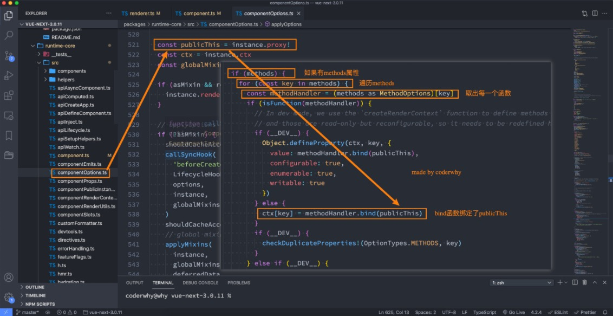

# Vue基础之模板语法

## methods方法绑定this

问题回顾：

问题一：为什么不能使用箭头函数（官方文档有给出解释）？

问题二：不使用箭头函数的情况下，this到底指向的是什么？（可以作为一道面试题）


## 问题一：不能使用箭头函数？

我们在methods中要使用data返回对象中的数据：

那么这个this是必须有值的，并且应该可以通过this获取到data返回对象中的数据。


**那么我们这个this能不能是window呢？**

不可以是window，因为window中我们无法获取到data返回对象中的数据；

但是如果我们使用箭头函数，那么这个this就会是window了；


**为什么是window呢？**

这里涉及到箭头函数使用this的查找规则，它会在自己的上层作用域中来查找this；

最终刚好找到的是script作用于中的this，所以就是window；


**this到底是如何查找和绑定的呢？**

在我的公众号有另外一篇文章，专门详细的讲解了this的绑定规则；

[前端面试之彻底搞懂this指向](https://mp.weixin.qq.com/s/hYm0JgBI25grNG_2sCRlTA)

认真学习之后你绝对对this的绑定一清二楚；


## 问题二：this到底指向什么？

事实上Vue的源码当中就是对methods中的所有函数进行了遍历，并且通过bind绑定了this：




## 模板语法

**React的开发模式：**

React使用的jsx，所以对应的代码都是编写的类似于js的一种语法；

之后通过Babel将jsx编译成 React.createElement 函数调用；


**Vue也支持jsx的开发模式（后续有时间也会讲到）：**

但是大多数情况下，使用基于HTML的模板语法；

在模板中，允许开发者以声明式的方式将DOM和底层组件实例的数据绑定在一起；

在底层的实现中，Vue将模板编译成虚拟DOM渲染函数，这个我会在后续给大家讲到；


所以，对于学习Vue来说，学习模板语法是非常重要的。


## Mustache双大括号语法

如果我们希望把数据显示到模板（template）中，使用最多的语法是 **“Mustache”语法 (双大括号)** 的文本插值。

并且我们前端提到过，data返回的对象是有添加到Vue的响应式系统中；

当data中的数据发生改变时，对应的内容也会发生更新。

当然，Mustache中不仅仅可以是data中的属性，也可以是一个JavaScript的表达式。

```vue
    <!-- 1.mustache的基本使用 -->
    <h2>{{message}} - {{message}}</h2>
    <!-- 2.是一个表达式 -->
    <h2>{{counter * 10}}</h2>
    <h2>{{ message.split(" ").reverse().join(" ") }}</h2>
    <!-- 3.也可以调用函数 -->
    <!-- 可以使用computed(计算属性) -->
    <h2>{{getReverseMessage()}}</h2>
    <!-- 4.三元运算符 -->
    <h2>{{ isShow ? "哈哈哈": "" }}</h2>
    <button @click="toggle">切换</button>
```


另外这种用法是错误的：

```vue
    <!-- 错误用法 -->
    <!-- var name = "abc" -> 赋值语句 -->
    <!-- <h2>{{var name = "abc"}}</h2>
    <h2>{{ if(isShow) {  return "哈哈哈" } }}</h2> -->
```


## v-once指令

**v-once用于指定元素或者组件只渲染一次：**

当数据发生变化时，元素或者组件以及其所有的子元素将视为静态内容并且跳过；

该指令可以用于性能优化；

```vue
    <h2>{{counter}}</h2>
    <div v-once>
      <h2>{{counter}}</h2>
      <h2>{{message}}</h2>
    </div>
    <button @click="increment">+1</button>
```

注：v-once里面的元素只会渲染一次，后面变化也不会改变。

如果是子节点，也是只会渲染一次。


## v-text指令

用于更新元素的 textContent

```vue
  <template id="my-app">
    <h2 v-text="message"></h2>
    <!-- 等价于 -->
    <h2>{{message}}</h2>
  </template>
```


## v-html

默认情况下，如果我们展示的内容本身是 html 的，那么vue并不会对其进行特殊的解析。

如果我们希望这个内容被Vue可以解析出来，那么可以使用 v-html 来展示

```vue
  <template id="my-app">
    <div>{{msg}}</div>
    <div v-html="msg"></div>
  </template>

  <script src="../js/vue.js"></script>
  <script>
    const App = {
      template: '#my-app',
      data() {
        return {
          msg: '<span style="color:red; background: blue;">哈哈哈</span>'
        }
      }
    }

    Vue.createApp(App).mount('#app');
  </script>
```


## v-pre

v-pre用于跳过元素和它的子元素的编译过程，显示原始的Mustache标签：

跳过不需要编译的节点，加快编译的速度；

```vue
  <template id="my-app">
    <h2 v-pre>{{message}}</h2>
  </template>
```

直接显示原始的Mustache标签


## v-cloak

这个指令保持在元素上直到关联组件实例结束编译。

和 CSS 规则如 [v-cloak] { display: none } 一起用时，这个指令可以隐藏未编译的 Mustache 标签直到组件实

例准备完毕。div 不会显示，直到编译结束。

```vue
<!DOCTYPE html>
<html lang="en">
<head>
  <meta charset="UTF-8">
  <meta http-equiv="X-UA-Compatible" content="IE=edge">
  <meta name="viewport" content="width=device-width, initial-scale=1.0">
  <title>Document</title>
  <style>
    [v-cloak] {
      display: none;
    }
  </style>
</head>
<body>
  
  <div id="app"></div>

  <template id="my-app">
    <h2 v-cloak>{{message}}</h2>
  </template>

  <script src="../js/vue.js"></script>
  <script>
    const App = {
      template: '#my-app',
      data() {
        return {
          message: "Hello World"
        }
      }
    }

    Vue.createApp(App).mount('#app');
  </script>
</body>
</html>
```


## v-bind的绑定属性

前端讲的一系列指令，主要是将值插入到模板内容中。

但是，除了内容需要动态来决定外，某些**属性**我们也希望动态来绑定。

比如动态绑定a元素的href属性；

比如动态绑定img元素的src属性；


**绑定属性我们使用v-bind：**

**缩写**：:

**预期**：any (with argument) | Object (without argument)

**参数**：attrOrProp (optional)

**修饰符**：

.camel - 将 kebab-case attribute 名转换为 camelCase。

**用法**：动态地绑定一个或多个 attribute，或一个组件 prop 到表达式。


## 绑定基本属性

v-bind用于绑定一个或多个属性值，或者向另一个组件传递props值（这个学到组件时再介绍）；

在开发中，有哪些属性需要动态进行绑定呢？

还是有很多的，比如图片的链接src、网站的链接href、动态绑定一些类、样式等等

v-bind有一个对应的**语法糖**，也就是简写方式。

在开发中，我们通常会使用语法糖的形式，因为这样更加简洁。

```vue
  <!-- vue2 template模板中只能有一个根元素 -->
  <!-- vue3 是允许template中有多个根元素 -->
  <template id="my-app">
    <!-- 1.v-bind的基本使用 -->
    
    <a v-bind:href="link">百度一下</a>

    <!-- 2.v-bind提供一个语法糖 : -->
    
    
  </template>
```


## 绑定class介绍

在开发中，有时候我们的元素class也是动态的，比如：

当数据为某个状态时，字体显示红色。

当数据另一个状态时，字体显示黑色。


**绑定class有两种方式：**

对象语法

数组语法


## 绑定class – 对象语法

对象语法：我们可以传给 :class (v-bind:class 的简写) 一个对象，以动态地切换 class。

```vue
<!DOCTYPE html>
<html lang="en">
  <head>
    <meta charset="UTF-8" />
    <meta http-equiv="X-UA-Compatible" content="IE=edge" />
    <meta name="viewport" content="width=device-width, initial-scale=1.0" />
    <title>Document</title>
    <style>
      .active {
        color: red;
      }
    </style>
  </head>
  <body>
    <div id="app"></div>

    <template id="my-app">
      <div :class="className">哈哈哈哈</div>
      <!-- 对象语法: {'active': boolean} -->
      <div :class="{'active': isActive}">呵呵呵呵</div>
      <button @click="toggle">切换</button>

      <!-- 也可以有多个键值对 -->
      <div :class="{active: isActive, title: true}">呵呵呵呵</div>

      <!-- 默认的class和动态的class结合 -->
      <div class="abc cba" :class="{active: isActive, title: true}">
        呵呵呵呵
      </div>

      <!-- 将对象放到一个单独的属性中 -->
      <div class="abc cba" :class="classObj">呵呵呵呵</div>

      <!-- 将返回的对象放到一个methods(computed)方法中 -->
      <div class="abc cba" :class="getClassObj()">呵呵呵呵</div>      
    </template>

    <script src="../js/vue.js"></script>
    <script>
      const App = {
        template: "#my-app",
        data() {
          return {
            className: "why",
            isActive: true,
            title: "abc",
            classObj: { 
              active: true, 
              title: true 
            },
          };
        },
        methods: {
          toggle() {
            this.isActive = !this.isActive;
          },
          getClassObj() {
            return { 
              active: true, 
              title: true 
            }
          }
        },
      };

      Vue.createApp(App).mount("#app");
    </script>
  </body>
</html>
```


## 绑定class – 数组语法

**数组语法：**我们可以把一个数组传给 :class，以应用一个 class 列表；

```vue
  <template id="my-app">
    <div :class="['abc', title]">哈哈哈哈</div>
    <div :class="['abc', title, isActive ? 'active': '']">哈哈哈哈</div>
    <div :class="['abc', title, {active: isActive}]">哈哈哈哈</div>
  </template>
```


## 绑定style介绍

我们可以利用v-bind:style来绑定一些CSS内联样式：

这次因为某些样式我们需要根据数据动态来决定；

比如某段文字的颜色，大小等等；


CSS property 名可以用驼峰式 (camelCase) 或短横线分隔 (kebab-case，记得用引号括起来) 来命名；


**绑定class有两种方式：**

对象语法

数组语法


## 绑定style演练

对象语法：

```vue
  <template id="my-app">
    <!-- :style="{cssPropertyName: cssPropertyValue}" -->
    <div :style="{color: finalColor, 'font-size': '30px'}">哈哈哈哈</div>
    <div :style="{color: finalColor, fontSize: '30px'}">哈哈哈哈</div>
    <div :style="{color: finalColor, fontSize: finalFontSize + 'px'}">哈哈哈哈</div>

    <!-- 绑定一个data中的属性值, 并且是一个对象 -->
    <div :style="finalStyleObj">呵呵呵呵</div>
    <!-- 调用一个方法 -->
    <div :style="getFinalStyleObj()">呵呵呵呵</div>
  </template>
```


数组语法：

style 的数组语法可以将多个样式对象应用到同一个元素上；

```vue
  <template id="my-app">
    <div :style="[style1Obj, style2Obj]">哈哈哈</div>
    
    <a :href=""></a>
    <div :class></div>
  </template>
```


## 动态绑定属性

**在某些情况下，我们属性的名称可能也不是固定的：**

前端我们无论绑定src、href、class、style，属性名称都是固定的；

如果属性名称不是固定的，我们可以使用 :[属性名]=“值” 的格式来定义；

这种绑定的方式，我们称之为动态绑定属性；

```vue
  <template id="my-app">
    <div :[name]="value">哈哈哈</div>
  </template>
```


## 绑定一个对象

如果我们希望将一个对象的所有属性，绑定到元素上的所有属性，应该怎么做呢？

非常简单，我们可以直接使用 v-bind 绑定一个 对象；


案例：info对象会被拆解成div的各个属性

```vue
  <template id="my-app">
    <div v-bind="info">哈哈哈哈</div>
    <!-- 可以，但不推荐，可读性不强 -->
    <div :="info">哈哈哈哈</div>
  </template>
```


## v-on绑定事件

前面我们绑定了元素的内容和属性，在前端开发中另外一个非常重要的特性就是交互。

**在前端开发中，我们需要经常和用户进行各种各样的交互：**

这个时候，我们就必须监听用户发生的事件，比如点击、拖拽、键盘事件等等

在Vue中如何监听事件呢？使用v-on指令。


## v-on的用法

**v-on的使用：**

**缩写**：@

**预期**：Function | Inline Statement | Object

**参数**：event

**修饰符**：

​	.stop - 调用 event.stopPropagation()。

​	.prevent - 调用 event.preventDefault()。

​	.capture - 添加事件侦听器时使用 capture 模式。

​	.self - 只当事件是从侦听器绑定的元素本身触发时才触发回调。

​	.{keyAlias} - 仅当事件是从特定键触发时才触发回调。

​	.once - 只触发一次回调。

​	.left - 只当点击鼠标左键时触发。

​	.right - 只当点击鼠标右键时触发。

​	.middle - 只当点击鼠标中键时触发。

​	 .passive - { passive: true } 模式添加侦听器


**用法**：绑定事件监听


## v-on的基本使用

我们可以使用v-on来监听一下点击的事件：


v-on:click可以写成@click，是它的语法糖写法：


当然，我们也可以绑定其他的事件：


如果我们希望一个元素绑定多个事件，这个时候可以传入一个对象：

```vue
  <template id="my-app">
    <!-- 完整写法: v-on:监听的事件="methods中方法" -->
    <button v-on:click="btn1Click">按钮1</button>
    <div class="area" v-on:mousemove="mouseMove">div</div>
    <!-- 语法糖 -->
    <button @click="btn1Click">按钮1</button>
    <!-- 绑定一个表达式: inline statement -->
    <button @click="counter++">{{counter}}</button>
    <!-- 绑定一个对象 -->
    <div class="area" v-on="{click: btn1Click, mousemove: mouseMove}"></div>
    <div class="area" @="{click: btn1Click, mousemove: mouseMove}"></div>
  </template>
```


## v-on参数传递

当通过methods中定义方法，以供@click调用时，需要**注意参数问题**：

情况一：如果该方法不需要额外参数，那么方法后的()可以不添加。

但是注意：如果方法本身中有一个参数，那么会默认将原生事件event参数传递进去

情况二：如果需要同时传入某个参数，同时需要event时，可以通过$event传入事件。

```vue
  <template id="my-app">
    <!-- 默认传入event对象, 可以在方法中获取 -->
    <button @click="btn1Click">按钮1</button>
    <!-- $event可以获取到事件发生时的事件对象 -->
    <button @click="btn2Click($event, 'coderwhy', 18)">按钮2</button>
  </template>

	methods: {
        btn1Click(event) {
          console.log(event);
        },
        btn2Click(event, name, age) {
          console.log(name, age, event);
        }
    }
```


## v-on的修饰符

v-on支持修饰符，修饰符相当于对事件进行了一些特殊的处理：

.stop - 调用 event.stopPropagation()。

.prevent - 调用 event.preventDefault()。

.capture - 添加事件侦听器时使用 capture 模式。

.self - 只当事件是从侦听器绑定的元素本身触发时才触发回调。

.{keyAlias} - 仅当事件是从特定键触发时才触发回调。

.once - 只触发一次回调。

.left - 只当点击鼠标左键时触发。

.right - 只当点击鼠标右键时触发。

.middle - 只当点击鼠标中键时触发。

.passive - { passive: true } 模式添加侦听器

```vue
  <template id="my-app">
    <div @click="divClick">
      <button @click.stop="btnClick">按钮</button>
    </div>
    <input type="text" @keyup.enter="enterKeyup">
  </template>
```


## 条件渲染

在某些情况下，我们需要根据当前的条件决定某些元素或组件是否渲染，这个时候我们就需要进行条件判断了。


Vue提供了下面的指令来进行条件判断：

v-if

v-else

v-else-if

v-show


## v-if、v-else、v-else-if

v-if、v-else、v-else-if用于根据条件来渲染某一块的内容：

这些内容只有在条件为true时，才会被渲染出来；

这三个指令与JavaScript的条件语句if、else、else if类似；

```vue
  <template id="my-app">
    <input type="text" v-model="score">
    <h2 v-if="score > 90">优秀</h2>
    <h2 v-else-if="score > 60">良好</h2>
    <h2 v-else>不及格</h2>
  </template>
```


v-if的渲染原理：

v-if是惰性的；

当条件为false时，其判断的内容完全不会被渲染或者会被销毁掉；

当条件为true时，才会真正渲染条件块中的内容；


## template元素

因为v-if是一个指令，所以必须将其添加到一个元素上：

但是如果我们希望切换的是多个元素呢？

此时我们渲染div，但是我们并不希望div这种元素被渲染；

这个时候，我们可以选择使用template；


template元素可以当做不可见的包裹元素，并且在v-if上使用，但是最终template不会被渲染出来：

有点类似于小程序中的block

```vue
  <template id="my-app">
    <template v-if="isShowHa">
      <h2>哈哈哈哈</h2>
      <h2>哈哈哈哈</h2>
      <h2>哈哈哈哈</h2>
    </template>

    <template v-else>
      <h2>呵呵呵呵</h2>
      <h2>呵呵呵呵</h2>
      <h2>呵呵呵呵</h2>
    </template>
  </template>
```


## v-show

v-show和v-if的用法看起来是一致的，也是根据一个条件决定是否显示元素或者组件：

```vue
  <template id="my-app">
    <h2 v-show="isShow">哈哈哈哈</h2>
  </template>
```


## v-show和v-if的区别

首先，在用法上的区别：

v-show是不支持template；

v-show不可以和v-else一起使用；


其次，本质的区别：

v-show元素无论是否需要显示到浏览器上，它的DOM实际都是有渲染的，只是通过CSS的display属性来进行

切换；

v-if当条件为false时，其对应的原生压根不会被渲染到DOM中；


开发中如何进行选择呢？

如果我们的原生需要在显示和隐藏之间频繁的切换，那么使用v-show；

如果不会频繁的发生切换，那么使用v-if；