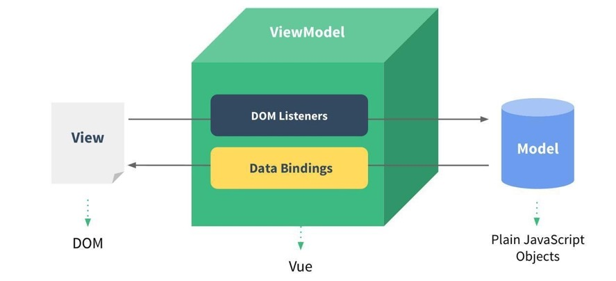
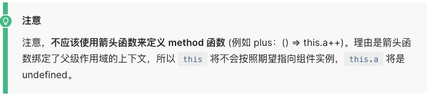
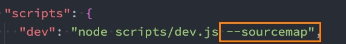

# 邂逅Vue3开发

老师：王红元 coderwhy


## 认识Vue

Vue (发音为 /vjuː/，类似 **view**) 是一款用于构建用户界面的 JavaScript 框架。它基于标准 HTML、CSS 和 JavaScript 构建，并提供了一套声明式的、组件化的编程模型，帮助你高效地开发用户界面。无论是简单还是复杂的界面，Vue 都可以胜任。

- 全称是Vue.js或者Vuejs；

- Vue是一套用于构建用户界面的**渐进式框架**。什么是渐进式框架呢？表示我们可以在项目中一点点来引入和使用Vue，而不一定需要全部使用Vue来开发整个项目；


## Vue3带来的变化

### 源码

1、源码通过monorepo的形式来管理源代码：

- Mono：单个
- Repo：repository仓库
- 主要是将许多项目的代码存储在同一个repository中；
- 这样做的目的是多个包本身相互独立，可以有自己的功能逻辑、单元测试等，同时又在同一个仓库下方便管理；
- 而且模块划分的更加清晰，可维护性、可扩展性更强；


2、源码使用TypeScript来进行重写：

- 在Vue2.x的时候，Vue使用Flow来进行类型检测；
- 在Vue3.x的时候，Vue的源码全部使用TypeScript来进行重构，并且Vue本身对TypeScript支持也更好了；


### 性能

1、 使用Proxy进行数据劫持

- 在Vue2.x的时候，Vue2是使用Object.defineProperty来劫持数据的getter和setter方法的
- 这种方式一致存在一个缺陷就是当给对象添加或者删除属性时，是无法劫持和监听的
- 所以在Vue2.x的时候，不得不提供一些特殊的API，比如$set或$delete，事实上都是一些hack方法，也增加了开发者学习新的API的成本
- 而在Vue3.x开始，Vue使用Proxy来实现数据的劫持，这个API的用法和相关的原理我也会在后续讲到


2、删除了一些不必要的API

- 移除了实例上的$on, $off 和 $once
- 移除了一些特性：如filter、内联模板等


3、包括编译方面的优化

- 生成Block Tree、Slot编译优化、diff算法优化


### 新的API

1、由Options API 到 Composition API

- 在Vue2.x的时候，我们会通过Options API来描述组件对象
- Options API包括data、props、methods、computed、生命周期等等这些选项
- 存在比较大的问题是多个逻辑可能是在不同的地方：比如created中会使用某一个method来修改data的数据，代码的内聚性非常差
- Composition API可以将 相关联的代码 放到同一处 进行处理，而不需要在多个Options之间寻找


2、Hooks函数增加代码的复用性

- 在Vue2.x的时候，我们通常通过mixins在多个组件之间共享逻辑
- 但是有一个很大的缺陷就是 mixins也是由一大堆的Options组成的，并且多个mixins会存在命名冲突的问题
- 在Vue3.x中，我们可以通过Hook函数，来将一部分独立的逻辑抽取出去，并且它们还可以做到是响应式的
- 具体的好处，会在后续的课程中演练和讲解（包括原理）


## 如何使用Vue呢？

Vue的本质，就是一个JavaScript的库：

刚开始我们不需要把它想象的非常复杂；我们就把它理解成一个已经帮助我们封装好的库；在项目中可以引入并且使用它即可。


那么安装和使用Vue这个JavaScript库有哪些方式呢？

方式一：在页面中通过CDN的方式来引入；

方式二：下载Vue的JavaScript文件，并且自己手动引入；

方式三：通过npm包管理工具安装使用它（webpack再讲）；

方式四：直接通过Vue CLI创建项目，并且使用它；


### 方式一：CDN引入

什么是CDN呢？CDN称之为内容分发网络（**C**ontent **D**elivery **N**etwork或**C**ontent **D**istribution **N**etwork，缩写：**CDN**）

- 它是指通过 相互连接的网络系统，利用最靠近每个用户的服务器；
- 更快、更可靠地将音乐、图片、视频、应用程序及其他文件发送给用户；
- 来提供高性能、可扩展性及低成本的网络内容传递给用户；


常用的CDN服务器可以大致分为两种：

- 自己的CDN服务器：需要购买自己的CDN服务器，目前阿里、腾讯、亚马逊、Google等都可以购买CDN服务器；
- 开源的CDN服务器：国际上使用比较多的是unpkg、JSDelivr、cdnjs；


Vue的CDN引入：

```html
<script src="https://unpkg.com/vue@next"></script>
```

Hello Vue案例的实现：

```vue
  <div id="app">
    <h2>Hello World</h2>
  </div>

  <script src="https://unpkg.com/vue@next"></script>
  <script>
    const why = {
      template: '<h2>Hello World</h2>'
    }

    const app = Vue.createApp(why);
    app.mount("#app")
  </script>
```


### 方式二：下载和引入

下载Vue的源码，可以直接打开CDN的链接：

打开链接，复制其中所有的代码；

创建一个新的文件，比如vue.js，将代码复制到其中；


通过script标签，引入刚才的文件：

```
<script src="../js/vue.js"></script>
```


你好啊，Vue3，案例的实现：

```vue
  <div id="app"></div>

  <script src="../js/vue.js"></script>
  <script>
    Vue.createApp({
      template: `<h2>你好啊, 李银河</h2>`
    }).mount("#app");
  </script>
```


## 计数器案例

如果我们希望实现一个计数器的案例：

- 点击+1，那么内容会显示数字+1；
- 点击-1，那么内容会显示数字-1；


我们可以选择很多种方式来实现：

- 在这里我们就对比原生和Vue的实现方式的不同。


计数器原生实现

```vue
    <h2 class="counter">0</h2>
    <button class="increment">+1</button>
    <button class="decrement">-1</button>

    <script>
      // 1.获取所有的元素
      const counterEl = document.querySelector(".counter");
      const incrementEl = document.querySelector(".increment");
      const decrementEl = document.querySelector(".decrement");

      // 2.定义变量
      let counter = 100;
      counterEl.innerHTML = counter;

      // 3.监听按钮的点击
      incrementEl.addEventListener("click", () => {
        counter += 1;
        counterEl.innerHTML = counter;
      });
      decrementEl.addEventListener("click", () => {
        counter -= 1;
        counterEl.innerHTML = counter;
      });
    </script>
```


计数器Vue实现

```vue
  <script>
    Vue.createApp({
      template: `
        <div>
          <h2>{{message}}</h2>
          <h2>{{counter}}</h2>
          <button @click='increment'>+1</button>
          <button @click='decrement'>-1</button>
        </div>
      `,
      data: function() {
        return {
          message: "Hello World",
          counter: 100
        }
      },
      // 定义各种各样的方法
      methods: {
        increment() {
          console.log("点击了+1");
          this.counter++;
        },
        decrement() {
          console.log("点击了-1");
          this.counter--;
        }
      }
    }).mount('#app');
  </script>
```


## 声明式和命令式

原生开发和Vue开发的模式和特点，我们会发现是完全不同的，这里其实涉及到**两种不同的编程范式**：

- 命令式编程和声明式编程；
- 命令式编程关注的是 “how to do”，声明式编程关注的是 “what to do”，由框架(机器)完成 “how”的过程；


 **在原生的实现过程中，我们是如何操作的呢？**

- 我们每完成一个操作，都需要通过JavaScript编写一条代码，来给浏览器一个指令；
- 这样的编写代码的过程，我们称之为命令式编程；
- 在早期的原生JavaScript和jQuery开发的过程中，我们都是通过这种命令式的方式在编写代码的；


**在Vue的实现过程中，我们是如何操作的呢？**

- 我们会在createApp传入的对象中声明需要的内容，模板template、数据data、方法methods；
- 这样的编写代码的过程，我们称之为是声明式编程；
- 目前Vue、React、Angular的编程模式，我们称之为声明式编程；


## MVVM模型

MVC和MVVM都是一种软件的体系结构

- MVC是Model – View –Controller的简称，是在前期被使用非常框架的架构模式，比如iOS、前端；
- MVVM是Model-View-ViewModel的简称，是目前非常流行的架构模式；


通常情况下，我们也经常称Vue是一个MVVM的框架。

- Vue官方其实有说明，Vue虽然并没有完全遵守MVVM的模型，但是整个设计是受到它的启发的。




## template属性

1、在使用createApp的时候，我们传入了**一个对象**，接下来我们详细解析一下之前传入的属性分别代表什么含义。

2、template属性：表示的是Vue需要帮助我们渲染的模板信息：

目前我们看到它里面有很多的HTML标签，这些标签会替换掉我们挂载到的元素（比如id为app的div）的innerHTML；

模板中有一些奇怪的语法，比如双大括号，比如 @click，这些都是模板特有的语法，我们会在后面讲到；

但是这个模板的写法有点过于别扭了，并且IDE很有可能没有任何提示，阻碍我们编程的效率。


**3、Vue提供了两种方式：**

方式一：使用script标签，并且标记它的类型为 x-template；

方式二：使用任意标签（通常使用template标签，因为不会被浏览器渲染），设置id；

template元素是一种用于保存客户端内容的机制，该内容再加载页面时不会被呈现，但随后可以在运行时使用JavaScript实例化；


## template写法

方式一：使用script标签

```vue
  <script type="x-template" id="why">
    <div>
      <h2>{{message}}</h2>
      <h2>{{counter}}</h2>
      <button @click='increment'>+1</button>
      <button @click='decrement'>-1</button>
    </div>
  </script>
```

方式二：使用template

```vue
  <template id="why">
    <div>
      <h2>{{message}}</h2>
      <h2>{{counter}}</h2>
      <button @click='increment'>+1</button>
      <button @click='decrement'>-1</button>
      <button @click="btnClick">按钮</button>
    </div>
  </template>
```

这个时候，在createApp的对象中，我们需要传入的template以 # 开头：

如果字符串是以 # 开始，那么它将被用作 querySelector，并且使用匹配元素的 innerHTML 作为模板字符串；


## data属性

**data属性**是传入一个函数，并且该函数需要返回一个对象：

在Vue2.x的时候，也可以传入一个对象（虽然官方推荐是一个函数）；

在Vue3.x的时候，必须传入一个函数，否则就会直接在浏览器中报错；


data中返回的对象会被Vue的响应式系统劫持，之后对该对象的修改或者访问都会在劫持中被处理：

所以我们在template中通过 {{counter}} 访问counter，可以从对象中获取到数据；

所以我们修改counter的值时，template中的 {{counter}}也会发生改变；


具体这种响应式的原理，我们后面会有专门的篇幅来讲解


## methods属性

**methods属性**是一个对象，通常我们会在这个对象中定义很多的方法：

这些方法可以被绑定到 template 模板中；

在该方法中，我们可以使用this关键字来直接访问到data中返回的对象的属性；


对于有经验的同学，在这里我提一个问题，官方文档有这么一段描述：

问题一：为什么不能使用箭头函数（官方文档有给出解释）？

问题二：不使用箭头函数的情况下，this到底指向的是什么？（可以作为一道面试题）




## Vue的源码

如果想要学习Vue的源码，比如看createApp的实现过程，应该怎么办呢？

第一步：在GitHub上搜索 vue-next，下载源代码；

这里推荐通过 git clone 的方式下载；

第二步：安装Vue源码项目相关的依赖；

执行 yarn install

第三步：对项目执行打包操作

执行yarn dev（执行前修改脚本）



第四步：通过 packages/vue/dist/vue.global.js 调试代码