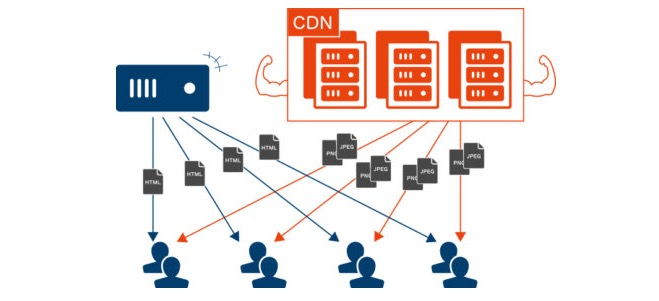

# 邂逅Vue3开发

老师：王红元 coderwhy


## 认识Vue

Vue (发音为 /vjuː/，类似 **view**) 是一款用于构建用户界面的 JavaScript 框架。它基于标准 HTML、CSS 和 JavaScript 构建，并提供了一套声明式的、组件化的编程模型，帮助你高效地开发用户界面。无论是简单还是复杂的界面，Vue 都可以胜任。

- 全称是Vue.js或者Vuejs；

- Vue是一套用于构建用户界面的**渐进式框架**。什么是渐进式框架呢？表示我们可以在项目中一点点来引入和使用Vue，而不一定需要全部使用Vue来开发整个项目；


## Vue3带来的变化

### 源码

1、源码通过monorepo的形式来管理源代码：

- Mono：单个
- Repo：repository仓库
- 主要是将许多项目的代码存储在同一个repository中；
- 这样做的目的是多个包本身相互独立，可以有自己的功能逻辑、单元测试等，同时又在同一个仓库下方便管理；
- 而且模块划分的更加清晰，可维护性、可扩展性更强；


2、源码使用TypeScript来进行重写：

- 在Vue2.x的时候，Vue使用Flow来进行类型检测；
- 在Vue3.x的时候，Vue的源码全部使用TypeScript来进行重构，并且Vue本身对TypeScript支持也更好了；


### 性能

1、 使用Proxy进行数据劫持

- 在Vue2.x的时候，Vue2是使用Object.defineProperty来劫持数据的getter和setter方法的
- 这种方式一致存在一个缺陷就是当给对象添加或者删除属性时，是无法劫持和监听的
- 所以在Vue2.x的时候，不得不提供一些特殊的API，比如$set或$delete，事实上都是一些hack方法，也增加了开发者学习新的API的成本
- 而在Vue3.x开始，Vue使用Proxy来实现数据的劫持，这个API的用法和相关的原理我也会在后续讲到


2、删除了一些不必要的API

- 移除了实例上的$on, $off 和 $once
- 移除了一些特性：如filter、内联模板等


3、包括编译方面的优化

- 生成Block Tree、Slot编译优化、diff算法优化


### 新的API

1、由Options API 到 Composition API

- 在Vue2.x的时候，我们会通过Options API来描述组件对象
- Options API包括data、props、methods、computed、生命周期等等这些选项
- 存在比较大的问题是多个逻辑可能是在不同的地方：比如created中会使用某一个method来修改data的数据，代码的内聚性非常差
- Composition API可以将 相关联的代码 放到同一处 进行处理，而不需要在多个Options之间寻找


2、Hooks函数增加代码的复用性

- 在Vue2.x的时候，我们通常通过mixins在多个组件之间共享逻辑
- 但是有一个很大的缺陷就是 mixins也是由一大堆的Options组成的，并且多个mixins会存在命名冲突的问题
- 在Vue3.x中，我们可以通过Hook函数，来将一部分独立的逻辑抽取出去，并且它们还可以做到是响应式的
- 具体的好处，会在后续的课程中演练和讲解（包括原理）


## 如何使用Vue呢？

Vue的本质，就是一个JavaScript的库：

刚开始我们不需要把它想象的非常复杂；我们就把它理解成一个已经帮助我们封装好的库；在项目中可以引入并且使用它即可。


那么安装和使用Vue这个JavaScript库有哪些方式呢？

方式一：在页面中通过CDN的方式来引入；

方式二：下载Vue的JavaScript文件，并且自己手动引入；

方式三：通过npm包管理工具安装使用它（webpack再讲）；

方式四：直接通过Vue CLI创建项目，并且使用它；


### 方式一：CDN引入

什么是CDN呢？CDN称之为内容分发网络（**C**ontent **D**elivery **N**etwork或**C**ontent **D**istribution **N**etwork，缩写：**CDN**）

- 它是指通过 相互连接的网络系统，利用最靠近每个用户的服务器；
- 更快、更可靠地将音乐、图片、视频、应用程序及其他文件发送给用户；
- 来提供高性能、可扩展性及低成本的网络内容传递给用户；


常用的CDN服务器可以大致分为两种：

- 自己的CDN服务器：需要购买自己的CDN服务器，目前阿里、腾讯、亚马逊、Google等都可以购买CDN服务器；
- 开源的CDN服务器：国际上使用比较多的是unpkg、JSDelivr、cdnjs；





Vue的CDN引入：

```html
<script src="https://unpkg.com/vue@next"></script>
```

Hello Vue案例的实现：


