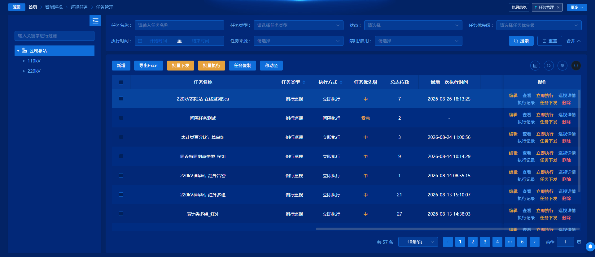
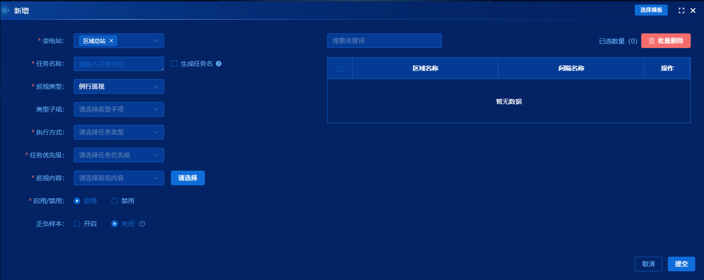
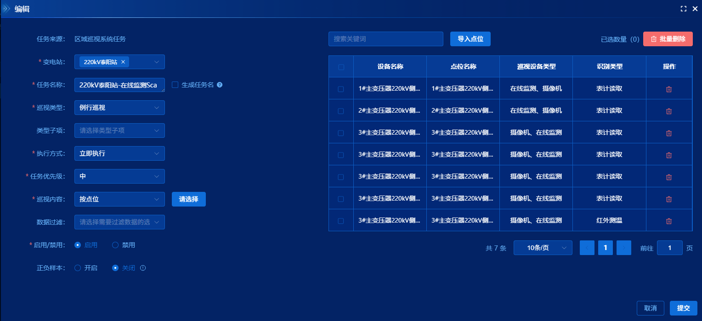
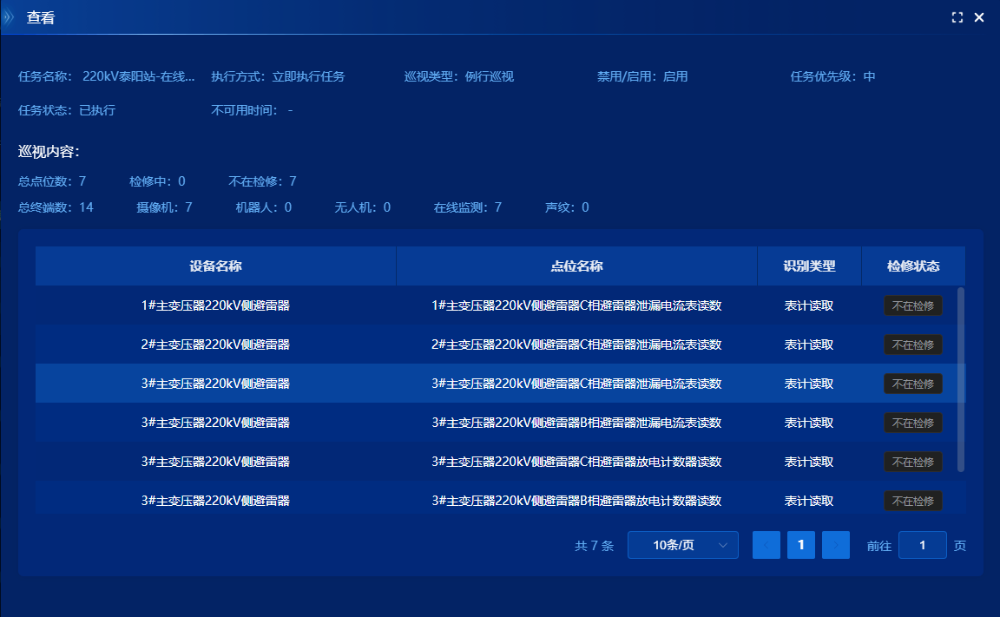
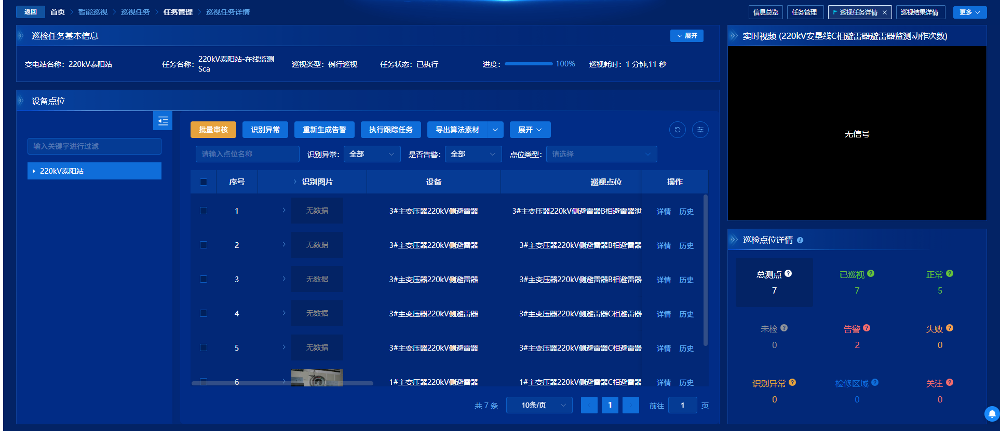
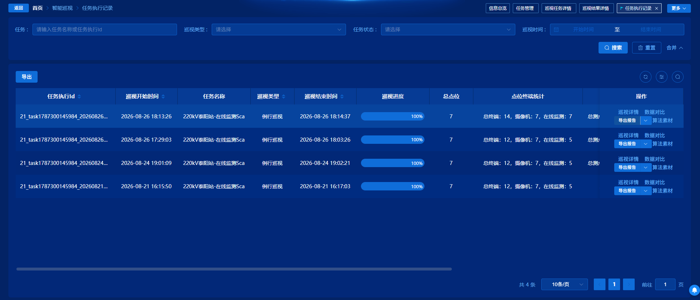

# 任务管理



















## 1. 一句话说明

这是智能巡视里的**任务管理**页：按变电站（奎屯站还会按自定义分组）列出巡视任务，供运维人员新增/编辑任务、启停与下发、复制与导出，并跳到年历、巡视详情、执行记录。

谁会用：有 `PatrolTaskManage_*` 等权限的运维人员。什么时候用：制定巡视计划、临时执行、把区域任务下发到边缘站、查看任务当前状态。

---

## 2. 代码地图

```
src/views/IntelligentPatrol/PatrolTaskManage/
├─ Index.vue                    页面入口：左树 + 右表 + 弹窗开关、奎屯分组/移动
├─ usePatrolTaskManage.tsx      列表列、查询、行操作、批量、导出、自检执行、socket 刷新
├─ enum/index.ts                任务状态圆点、执行方式文案（列表渲染用）
├─ index.scss                   状态圆点、奎屯树节点操作条
├─ components/
│  ├─ EditTask.vue              新增/编辑大弹窗（选站、巡视内容、执行方式）
│  ├─ PreviewTask.vue           查看弹窗（任务摘要 + 点位表）
│  ├─ SelectInterval/Device/Component/Point.vue  按层级选巡视内容
│  └─ SelectModel.vue           新增时从模板带入内容
└─ （同目录其它页，本页只负责跳转，不在本页渲染）
   ├─ components/CalendarYear.vue
   ├─ PatrolTaskDetail/Index.vue
   └─ PatrolTaskExecutionRecord/Index.vue

公共组件
├─ src/components/LeftStationTree/index.vue   非奎屯：站点树，type=3
├─ src/components/TreeFilter/index.vue        奎屯：自定义分组树 / 移动目标树
└─ src/components/BaseTable/index.vue         列表、搜索、多选、initParam 变化刷新

关键 API（src/api/modules/patrolTask.ts 为主）
├─ getPlanInformationByPage        分页列表
├─ createPlanInformation / updatePlanInformation  新增/编辑提交
├─ deletePlanInformation           删除
├─ updateTaskStatus                启用/禁用
├─ taskBatchStart                  立即执行 / 继续 / 批量执行（comman 区分）
├─ suspendTaskImmediately / stopTaskImmediately  暂停 / 终止
├─ startTaskBatchIssued            任务下发（需密码鉴别）
├─ copyPlanInformation             复制
├─ getPlanDetailInfo / getPlanAndPointsList  查看弹窗
├─ getCustomChildTree / addChildTree / deleteChildNode / moveChildNode  奎屯分组
├─ exportTaskList（export.ts）     导出
└─ startSelfTest（system.ts）      执行前设备自检
```

| 想改什么 | 先动哪 |
| --- | --- |
| 表头按钮、行按钮显隐、权限码、奎屯左树/移动 | `Index.vue` |
| 列、搜索项、列表请求参数、启停/下发/复制/导出逻辑 | `usePatrolTaskManage.tsx` |
| 新增/编辑表单字段、校验、选点、选模板 | `components/EditTask.vue` 及 `Select*.vue` |
| 查看弹窗展示字段 | `components/PreviewTask.vue` |
| 接口路径 | `src/api/modules/patrolTask.ts` |
| 状态圆点颜色/文案 | `enum/index.ts` |
| 年历 / 巡视详情 / 执行记录 | 各自独立页面，本页只 `router.push` |

路由：`/PatrolTaskManage`，菜单标题「任务管理」，`isKeepAlive: true`（`src/routers/modules/page/intelligentPatrol.ts`）。

---

## 3. 页面长什么样、能做什么

**整体**：左站点树 + 右「任务管理」表格。表格 `request-auto=false`，真正拉数发生在左侧选中站点、`initParam.stationId` 变化之后。

**左侧树（二选一）**

- 非奎屯：`LeftStationTree`（`type=3`，开了班组站点权限过滤）。点节点 → 右侧按该站刷新任务列表。
- 奎屯（字典 `kuitun` 可见）：自制 `TreeFilter`。变电站（`treeNodeType === 3`）和分组（`9`）右侧有「添加分组」；仅分组有「删除」。点节点同样刷新列表，分组会带 `nodeId`。

**表头按钮（都受权限控制，未授权不出现）**

| 用户点什么 | 系统反应 |
| --- | --- |
| 新增 | 打开编辑弹窗；未选站会提示；单站型在区域总站/电压等级上会拦 |
| 导出Excel | 带当前搜索条件 + 当前站导出 |
| 批量下发 / 批量执行 | 必须勾选行；下发先弹密码鉴别 |
| 任务复制 | 只能勾 1 条；跨站总站任务不能复制 |
| 移动至（仅奎屯） | 勾选任务后选目标站/分组 |
| 年历图标 | 跳转 `/CalendarYear`（另需 `CalendarYear_query`） |

「导出XML」「批量修改」按钮在模板里已注释，但批量修改弹窗代码仍在。

**表格列能看**：任务名称、类型、执行方式、最后执行时间、优先级（色值）、执行日期、点位数、终端统计、状态圆点、启用开关、是否已下发、创建/编辑时间与人。搜索区还有任务来源（只搜不展示列）。

**行操作（随状态变化，子任务 `isChildTask` 会藏掉大部分）**

| 用户点什么 | 出现条件（代码里） | 系统反应 |
| --- | --- | --- |
| 编辑 | 有编辑权限、状态不是「正在执行」、名称不含「主辅联动任务」、非子任务 | 打开编辑弹窗 |
| 查看 | 查询权限 | 打开查看弹窗 |
| 立即执行 | 控制权限、状态为已执行/终止/未执行/超期 | 确认后启动；字典开了自检时多一步勾选自检 |
| 终止 | 正在执行或暂停 | 按当前记录 id 终止 |
| 暂停 | 正在执行 | 暂停 |
| 继续 | 暂停 | `comman: 2` 再启动 |
| 巡视详情 | 查询权限 | 跳 `/PatrolTaskDetail` |
| 执行记录 | 执行记录查询权限 | 跳 `/PatrolTaskExecutionRecord` |
| 任务下发 | 下发权限、非子任务 | 密码鉴别后下发 |
| 删除 | 删除权限、不是正在执行、非子任务 | 确认后删，并提示上下级要手动同步 |

点「禁用/启用」开关：开关本身被禁止切换，真正生效走行点击（见第 6 节）。名称含「主辅联动任务」的开关是禁用的。

**弹窗**

- 新增/编辑：大表单（变电站、名称、巡视类型/子项、执行方式与时间、优先级、按间隔/设备/部件/点位选内容、启用、正负样本）。新增可「选择模板」。
- 查看：摘要 + 点位分页表。
- 任务复制：模板 / 普通任务 + 新名称。
- 移动至（奎屯）：再选一棵本站分组树。

---

## 4. 页面流程（用户视角）

**进页**

1. 路由 `isKeepAlive`，离开再回来会在 `onActivated` 里重新拉表（第一次进页不拉，等左树给出 `stationId`）。
2. 左树加载完成后默认选一个节点，写入 `initParam.stationId`（奎屯还有 `nodeId`），表格才请求 `getPlanInformationByPage`。
3. 若 URL 带 `stationId` / `stationName` / `TaskStatusType`：进页约 100ms 后程序化选中左树，并按状态筛一次。带 `inspectionType`、`startTime`/`endTime` 时，会尝试写成搜索框默认值（依赖字典先回来）。

**查任务**：选站 → 填名称/类型/状态/优先级/时间范围/来源 → 表格带 `stationId`、`nodeId` 分页查询。无 `PatrolTaskManage_query` 时请求直接空返回。

**新增一条任务**：选站 → 新增 →（可选）选模板 → 填表并选巡视内容 → 提交 `createPlanInformation` → 关弹窗并刷新表。

**编辑**：行上编辑 → 回填已选层级内容 → 正在执行/暂停时不能改巡视内容 → 提交 `updatePlanInformation`。

**立即执行（开了自检字典）**：点立即执行 → 勾不勾「执行前自检」→ 确定。勾了会先调自检、弹进度通知、等 websocket 到 100% 再启动；没勾则直接启动。未开自检字典则走普通确认框。

**下发**：单条或批量 → 输入登录密码鉴别 → `startTaskBatchIssued`。

**复制 / 移动 / 删除**：见上一节；成功后刷新并清空勾选。

**从其它页带 query 进来**：代码只在 `onMounted` 处理一次站点 + 状态筛选，keep-alive 再次带着新 query 进来时，这段不会再跑。

---

## 5. 页面逻辑（代码视角）

**站点类型 / 字典控显隐**

- `globalStore.systemEnv` 里 `dictCode == 'kuitun' && isVisible` → `isKUITUN`：换左树、出现「移动至」、加载自定义树。这段在 `setup` 里同步 `map` 一次，没有 `watch`。
- `InspectionTypeConfig` / `taskStateConfig`：表格搜索下拉（可见项才进枚举）。
- `SelfTestBeforeTaskStart` 中 `OpenSelfTest` 可见且启用 → 立即执行走自检确认框。
- `systemStore.isRegion === false` 时，在树节点类型 1、2（区域总站、电压等级）上禁止新增。默认 store 里 `isRegion` 为 `true`，区域型站点这条限制不会生效。
- 编辑弹窗里变电站下拉是否带头 `isEnableStationPermissionFilter`，由字典 `IsEnableStationPermissionFilter` 决定。

**节点 / 行分流**

- 奎屯树：`treeNodeType` 3/9 才能加组；只有 9 能删；最多 3 层子分组（`level == 3` 拦住）。点组时 `nodeId = 分组 id`，`stationId` 用分组上的 `stationId`。
- 行：`taskState` 决定执行/暂停/继续/终止/编辑/删除；`isChildTask` 藏控制类按钮；`planName` 含「主辅联动任务」不能编辑、不能拨启用开关。
- 状态码与圆点（`enum/index.ts`，下标即 `taskState`）：1 已执行、2 正在执行、3 暂停、4 终止、5 未执行、6 超期。

**父子通信**

- 左树 `@change` → `changeTreeFilter` 写 `activeStation` 和 `initParam`。
- 编辑/查看：父把 `show*Dialog` 设为 true，`nextTick` 调子组件 `acceptParams`。编辑还把 `createPlanInformation` / `updatePlanInformation` 和 `getTableList` 传进去，由子组件自己提交。
- 多选、导出参数、刷新都通过 `baseTable` ref。

**关键状态谁改谁读**

| 状态 | 谁改 | 谁读 |
| --- | --- | --- |
| `activeStation` / `initParam` | 点树 | 查询、新增选站、导出、跳执行记录 |
| `showEditDialog` / `showPreviewDialog` | 打开时父设 true；编辑关了会 `emit('cancel')` | `v-if` 控制挂载 |
| `isSelfTestOpen` | 字典回调（hook 内普通变量，不是 ref） | 立即执行分支 |
| `selfTestProgressMap` | 模块顶层 Map | 自检进度通知，多任务按 `planId` |
| 表格行 `taskState` | 接口成功刷新；socket `4_12` 只改当前页匹配行 | 操作按钮显隐 |

离开页 `onDeactivated` 把 `notFirstIn` 设为 true，再激活才自动 `getTableList`。

---

## 6. 重难点

### 6.1 同一页两套左树

1. **一句话**：多数站点用公共站点树；奎屯换成可分组的树，选组和选站带给接口的字段不一样。
2. **知识点**：用环境字典切 UI，而不是再做一个路由。分组是业务树上的 `treeNodeType === 9`，查询要额外带 `nodeId`。
3. **代码依据**：

```6:23:src/views/IntelligentPatrol/PatrolTaskManage/Index.vue
    <LeftStationTree
      ref="leftStationTreeRef"
      @change="changeTreeFilter"
      :type="3"
      v-if="!isKUITUN"
      :is-enable-station-permission-filter="true"
    />
    <div class="container-left card" :class="{ expand: openTree === false }" v-loading="treeLoading" v-else>
      ...
        <TreeFilter
          ...
          @node-click="changeGroupTreeFilter"
```

```75:82:src/views/IntelligentPatrol/PatrolTaskManage/usePatrolTaskManage.tsx
  const changeTreeFilter = (data: TreeInfo) => {
    activeStation.value = data;
    nextTick(() => {
      initParam.stationId = activeStation.value.stationId!;
      initParam.nodeId = activeStation.value.nodeId!;
    });
  };
```

点公共树会直接 `changeTreeFilter`。点奎屯树会先 `findParents` 拼 `stationId` / `nodeId` 再调用同一函数。`initParam` 被 BaseTable 深度 watch，一改就重新查表。

4. **新人易错**：只改 `LeftStationTree` 行为，会以为奎屯也跟着变；奎屯走的是 `changeGroupTreeFilter`，分组漏写 `nodeId` 会查出整站任务。

### 6.2 行按钮不是「有权限就全显示」

1. **一句话**：同一行能出现哪些按钮，要同时看权限、任务状态、是不是子任务、是不是主辅联动。
2. **知识点**：用状态码分流操作，避免对执行中的任务做编辑/删除。状态与 `taskStateArr` 下标对齐。
3. **代码依据**：

```95:107:src/views/IntelligentPatrol/PatrolTaskManage/Index.vue
            <el-button
              type="warning"
              link
              @click="editTask('编辑', scope.row)"
              v-if="
                permission.PatrolTaskManage_edit &&
                scope.row.taskState !== 2 &&
                scope.row.planName.indexOf('主辅联动任务') === -1 &&
                !scope.row.isChildTask
              "
            >
              编辑
            </el-button>
```

```30:67:src/views/IntelligentPatrol/PatrolTaskManage/enum/index.ts
export const taskStateArr = [
  {},
  { ..., label: '已执行' },
  { ..., label: '正在执行' },
  { ..., label: '暂停' },
  { ..., label: '终止' },
  { ..., label: '未执行' },
  { ..., label: '超期' }
];
```

立即执行看 `[1,4,5,6]`，终止看 `[2,3]`，暂停只看 `2`，继续只看 `3`，删除同样排除状态 `2` 和子任务。

4. **新人易错**：按产品文案改按钮却去改错状态码；或以为 `isChildTask` 在 `ResPatrolTaskManage` 类型里（类型定义里没有，但模板在用，来自接口运行时字段）。

### 6.3 启用开关点了为什么表面不动

1. **一句话**：开关被做成「点了也不切换」，真正改启用状态靠点这一格时的行点击。
2. **知识点**：`el-switch` 的 `before-change` 返回 `false` 会取消这次切换，避免开关先翻转、接口失败再弹回去。真正请求在 `@row-click` 里发，成功后再整表刷新。
3. **代码依据**：

```235:247:src/views/IntelligentPatrol/PatrolTaskManage/usePatrolTaskManage.tsx
              <el-switch
                v-model={scope.row.isEnable}
                active-value={0}
                inactive-value={1}
                disabled={scope.row.planName && scope.row.planName.indexOf('主辅联动任务') > -1}
                before-change={() => {
                  return false;
                }}
              />
```

```420:439:src/views/IntelligentPatrol/PatrolTaskManage/usePatrolTaskManage.tsx
  const rowClick = async (rowData, column) => {
    if (column.property === 'isEnable') {
      if (!permission.value.PatrolTaskManage_edit) {
        return ElMessage.warning('权限不足');
      }
      if (rowData.planName && rowData.planName.indexOf('主辅联动任务') > -1) return;
      await _updateTaskStatus(rowData);
    }
  };
  const _updateTaskStatus = async (rowData) => {
    const res = await useHandleData(
      updateTaskStatus,
      { PlanId: rowData.planId, IsEnable: rowData.isEnable === 1 ? 0 : 1 },
      `${rowData.isEnable ? '启用' : '禁用'}【${rowData.planName}】任务`
    );
```

因为开关没改 `v-model`，`rowData.isEnable` 仍是旧值，所以请求里要取反。`0` 启用、`1` 禁用。主辅联动在开关 `disabled` 和 `rowClick` 里挡了两次。

4. **新人易错**：删掉 `before-change` 想「让开关能拨」，会和 `rowClick` 重复请求，或出现开关先变、确认框点取消后界面已反了的情况。

### 6.4 立即执行可能先自检再启动

1. **一句话**：字典打开「任务前自检」后，立即执行会多一个勾选框；勾了要等 websocket 进度，但自检失败时代码仍可能去启动任务。
2. **知识点**：确认框里的勾选值用闭包变量带出（`defineComponent` + `ElMessageBox` 的 `message` 插槽）。进度用模块级 `Map` 按 `planId` 对着 `mittBus` 的 `socketInspectionSelfCheck`（websocket `4_15`）。
3. **代码依据**：

```564:590:src/views/IntelligentPatrol/PatrolTaskManage/usePatrolTaskManage.tsx
    if (operateType === '立即执行') {
      if (isSelfTestOpen) {
        const { confirm, isChecked } = await openConfirmDialog(rowData.planName || '');
        let selfCheckId: string | undefined;
        if (confirm) {
          if (isChecked) {
            rowData.taskState = 2;
            let checkProgress: ShowCheckProgressReturn | null = null;
            try {
              await startSelfTest({ planId: rowData.planId });
              checkProgress = showCheckProgress(rowData.planId as string);
            } catch (error) {
              ElMessage.error('设备自检失败');
            }
            try {
              selfCheckId = await updateProgress(checkProgress as ShowCheckProgressReturn);
            } catch (error) {
              ElMessage.error('任务执行失败');
            }
          }
          res = await taskBatchStart({ planIdArr: [rowData.planId], comman: 1, ...(selfCheckId && { selfCheckId }) });
        }
```

用户确定后：若勾了自检 → `startSelfTest` → 通知条进度 → `IsSuccess === true` 才 `resolve(SelfCheckId)` → 再 `taskBatchStart`。两个 `try/catch` 都吃掉错误后，**仍然会执行**最后那行 `taskBatchStart`。批量执行不走这套自检。

4. **新人易错**：以为自检失败就不会启动；或把 `rowData.taskState = 2` 当成已成功（这只是改了当前行对象，接口还没成功）。

### 6.5 新增/编辑弹窗怎么把「选了哪些点」交出去

1. **一句话**：父页面只负责打开弹窗并传入「新增还是编辑、用哪个 API」；选间隔/设备/部件/点位、校验、提交都在 `EditTask` 里。
2. **知识点**：`acceptParams` 注入模式。巡视内容用 `pointSelectLevelType` 1～4 对应四种选择器，提交时整表 `selectLevelList` 带给后端。
3. **代码依据**：

```405:416:src/views/IntelligentPatrol/PatrolTaskManage/usePatrolTaskManage.tsx
    const params = {
      title: title,
      station: station,
      rowData: { ...rowData },
      api: title === '新增' ? createPlanInformation : updatePlanInformation,
      getTableList: tableRef.value.getTableList,
      isEnableStationPermissionFilter: true
    };
    showEditDialog.value = true;
    nextTick(() => {
      editTaskRef.value.acceptParams(params);
    });
```

```549:570:src/views/IntelligentPatrol/PatrolTaskManage/components/EditTask.vue
const acceptParams = (params: DrawerProps) => {
  drawerProps.value = params;
  drawerVisible.value = true;
  ...
  if (drawerProps.value.title === '编辑') {
    form.value = drawerProps.value.rowData;
    ...
    _getSelectLevelList();
```

```1158:1174:src/views/IntelligentPatrol/PatrolTaskManage/components/EditTask.vue
  const params: ReqCreatePlanInformation = {
    stationIds: form.value.stationIds!,
    ...
    pointSelectLevelType: activeTableType.value,
    selectLevelList: tableData.value,
    unConfigs: form.value.unConfigs,
    enablePositiveNegativeSamples: form.value.enablePositiveNegativeSamples
  };
```

父用 `v-if="showEditDialog"` 挂载，必须 `nextTick` 之后才有 ref。编辑时用 `getSelectLevelList` 回填右侧已选表；正在执行/暂停时 `selectPointsDisabled` 为 true，不能改巡视内容。提交成功调传入的 `getTableList` 并 `emit('cancel')` 让父卸载。

4. **新人易错**：在 `Index.vue` 里找提交接口；以及编辑时 `form.value = rowData` 若引用的是表格行，改表单等于改列表（本页 `editTask` 传了 `{ ...rowData }` 浅拷贝，嵌套字段仍可能共享）。

### 6.6 表什么时候会自动刷新

1. **一句话**：进页不自动查；选站改 `initParam`、操作成功、从其它页返回（keep-alive）、websocket 改状态，这几条路径都会动表格。
2. **知识点**：`request-auto=false` 关掉挂载即请求；`initParam` 深度监听仍会 debounce 拉数。任务状态推送只改当前页内存，不打接口。
3. **代码依据**：

```337:348:src/components/BaseTable/index.vue
onMounted(() => {
  props.requestAuto && getTableList();
  ...
});
watch(() => props.initParam, debounceTableList, { deep: true });
```

```88:94:src/views/IntelligentPatrol/PatrolTaskManage/usePatrolTaskManage.tsx
  onActivated(() => {
    notFirstIn && tableRef.value?.getTableList();
  });
  onDeactivated(() => {
    notFirstIn = true;
  });
```

```790:797:src/views/IntelligentPatrol/PatrolTaskManage/usePatrolTaskManage.tsx
  mittBus.on('socketPatrolTaskListChange', (data: any) => {
    const newData = convertObjectKeysToLowCase(data);
    tableRef.value.tableData.forEach((item) => {
      if (item.planId === newData.planId) {
        item.taskState = newData.taskState;
      }
    });
  });
```

websocket `4_12` → `useHandleWebsocketData` → `mittBus`。只更新 `taskState`，下发标记、点位数等不会跟着变。`mittBus.on` 在 hook 里注册，没有对应 `off`。

4. **新人易错**：把 `request-auto=false` 改成 true，会在还没选站时打一次空 `stationId` 请求；或以为 socket 会刷新整行。

### 6.7 从首页等处带 query 跳进来

1. **一句话**：站点 + 任务状态靠进页后 100ms 调左树和表格搜索；巡视类型、时间靠给列配置写 `defaultValue`，而且状态那列下标写错了。
2. **知识点**：keep-alive 下 `onMounted` 只跑一次。字典是异步的，写 `columns[n].search.defaultValue` 时 BaseTable 可能已经用空默认值初始化完搜索表单。
3. **代码依据**：

```275:284:src/views/IntelligentPatrol/PatrolTaskManage/Index.vue
onMounted(() => {
  if (!route.query.stationId) return;
  setTimeout(() => {
    leftStationTreeRef.value?.changeTreeFilter({
      id: route.query.stationId,
      name: route.query.stationName,
      key: route.query.stationId
    });
    baseTable.value?.handleSearch('taskStatusType', Number(route.query.TaskStatusType), true);
  }, 100);
});
```

```314:335:src/views/IntelligentPatrol/PatrolTaskManage/usePatrolTaskManage.tsx
    if (route.query.inspectionType && columns[3].search) {
      const activeItem = inspectionTypeEnum.value.filter(item => item.label === route.query.inspectionType);
      columns[3].search.defaultValue = activeItem[0]?.value;
    }
    ...
    if (route.query.taskState && columns[4].search) {
      const activeItem = taskStateEnum.value.filter(item => item.label === route.query.taskState);
      columns[4].search.defaultValue = activeItem[0]?.value;
    }
```

`columns[3]` 确是任务类型。`columns[4]` 是「执行方式」，**没有** `search`，所以 `route.query.taskState` 这条赋值永远进不去。真正带状态筛选的是 URL 里的 `TaskStatusType` + `handleSearch('taskStatusType', ...)`（注意大小写与列 search 的 `key: 'TaskStatusType'` 也不完全一致，能否筛中取决于 BaseTable 如何合并参数）。

4. **新人易错**：在 `columns[10]`（状态列）上改 `defaultValue` 却发现首页跳转仍不生效；或 keep-alive 里改 query 期望 `onMounted` 再跑一遍。

---

## 7. 坑点（已存在的别扭实现）

**查看弹窗关不掉父级 `v-if`**（`Index.vue` + `PreviewTask.vue`）：父监听 `@cancel`，子关闭时 `emit('close')`，事件名对不上。弹窗能靠内部 `drawerVisible` 关上，但 `showPreviewDialog` 会一直为 true，组件不会卸载。

```176:177:src/views/IntelligentPatrol/PatrolTaskManage/Index.vue
    <template v-if="showPreviewDialog">
      <PreviewTask ref="previewTaskRef" @cancel="showPreviewDialog = false" />
```

```187:196:src/views/IntelligentPatrol/PatrolTaskManage/components/PreviewTask.vue
const close = () => {
  drawerVisible.value = false;
  setTimeout(() => {
    emits('close');
  }, 1000);
};
const emits = defineEmits<{
  (e: 'close'): void;
}>();
```

**新增不清空上一份表单**（`EditTask.vue`）：编辑会 `form.value = rowData`；再点新增只覆盖部分字段（名称、类型等），`isEnable`、周期时间、备注、已选点表等可能残留。

```571:585:src/views/IntelligentPatrol/PatrolTaskManage/components/EditTask.vue
  } else if (!drawerProps.value.isTrackPlan) {
    form.value.nodeId = params.station.id;
    form.value.stationIds = [params.station.key];
    ...
    form.value.taskSecondTypeName = '';
    contentType.value = '';
    tableData.value = [];
  }
```

**`route.query.taskState` 写错列**（`usePatrolTaskManage.tsx`）：见 6.7，`columns[4].search` 不存在。

**批量修改是半截功能**（`Index.vue`）：表头「批量修改」已注释，弹窗、`changeUpdateDialog`、`batchOperateTask('批量修改')` 仍在。从界面进不去，改弹窗容易误以为线上在用。

**导出扩展名**（`Index.vue` + hook）：表头调用 `handleExport('')`，`useDownload` 的后缀是 `` `.${fileType}` ``，会变成 `.`。XML 按钮已注释。

**密码鉴别取消会未捕获 reject**（`usePatrolTaskManage.tsx`）：`userCertification()` 取消时 Promise reject，`operateTask` / `batchOperateTask` 的下发分支没有 `.catch`。

**奎屯字典只读一次**（`Index.vue`）：`systemEnv.map` 写在 setup 同步路径。若进页时字典还没进 store，`isKUITUN` 会一直是 false，左树不会换成分组树。

```476:482:src/views/IntelligentPatrol/PatrolTaskManage/Index.vue
globalStore.systemEnv.map((item: DataDictionary) => {
  if (item.dictCode == 'kuitun' && item.isVisible) {
    isKUITUN.value = true;
    _getInfoTree();
  }
});
```

**进页 query 用 `onMounted` + `setTimeout(100)`**（`Index.vue`）：注释写「路由参数变化时及时更新」，实际没有 `watch(route.query)`。左树/表格 ref 未就绪时这 100ms 也不保险。

**`mittBus.on('socketPatrolTaskListChange')` 没有 `off`**（`usePatrolTaskManage.tsx`）：页面 keep-alive 时通常没事；若实例被销毁重建，会叠多个监听，一行状态被改多次。

**删除确认文案 HTML 标签未闭合**（`usePatrolTaskManage.tsx`）：`dangerouslyUseHTMLString` 里 `<p>` 没有 `</p>`。

**模板回填启用值取反**（`EditTask.vue`）：`form.value.isEnable = Number(!data.isEnable)`，模板接口的布尔/数字语义若与列表的 `0/1` 不一致，选模板后启用状态会反。

**查看弹窗 `stationId` 用的是 `activeStation.id`**（hook 的 `openPreviewDialog`），列表查询用的是 `stationId` 字段。点分组时两者可能不是同一个 id，点位列表请求参数可能不对。未在接口响应里核对实际需要哪个字段。

---

## 8. 风险点（改这里容易出事故）

**自检失败仍启动任务**（`usePatrolTaskManage.tsx`）：两个 catch 只弹错误，后面照样 `taskBatchStart`。改立即执行时如果只测「自检成功」路径，会把「自检失败仍执行」带上线。见 6.4 引用。

**乐观改 `taskState = 2`**（同上）：自检一开始就把当前行标成「正在执行」，按钮立刻变成终止/暂停。若用户不刷新、接口失败，界面状态和后台不一致。

**删除不同步上下级**（`deleteTask`）：确认文案明确要求人工在上级/下级再删一遍。改成「静默删除」或去掉这段提示，区域-边缘会留脏任务。

```610:611:src/views/IntelligentPatrol/PatrolTaskManage/usePatrolTaskManage.tsx
    const tips = `确定要删除任务【${rowData.planName}】吗？<p style="font-size: 12px;">注：为避免数据问题，请在上级/下级(若有)同步手动删除该任务<p>`;
```

**下发带 `downloadToken`**（`operateTask` / `batchOperateTask`）：密码验证通过后把 `result.data` 当作 token 传给下发接口。改鉴别流程或改 token 字段名会导致区域任务下不到边缘。

**新增站点限制和 `isRegion` 耦合**（`editTask`）：

```394:397:src/views/IntelligentPatrol/PatrolTaskManage/usePatrolTaskManage.tsx
    if (title === '新增' && !isRegion.value && [1, 2].includes(activeStation.value.treeNodeType as number)) {
      ElMessage.warning(`区域总站、电压等级不允许新增任务！`);
      return;
    }
```

默认 `isRegion === true` 时，在总站/电压节点上仍可点新增。若有人「顺手」去掉 `!isRegion` 或改 store 默认值，区域型/单站型谁能新建任务会整批反转。

**权限漏判**：列表无 `PatrolTaskManage_query` 时 `getTableList` 返回 `null`，表格表现为空而不是 403。行上启用仍要 `PatrolTaskManage_edit`，但开关列对无编辑权限的人仍看得到（点了才提示）。改权限时不要只改表头按钮。

**跨页面模块状态**：`selfTestProgressMap` 在 hook 文件顶层。热更新或多实例时，关不掉别人的通知条。改自检进度不要改成「清空整个 Map」。

**巡视详情依赖 `inspectionRecordId`**：未执行过的任务该字段可能为空，跳详情会带着空 `recordId`。改详情页入参时要同时看本页 `toDetail`。

**奎屯移动任务**（`Index.vue`）：目标节点 `treeNodeType === 3` 用 `key` 当 `stationId`，分组用 `stationId`。改树节点字段会把任务移错站。

```365:369:src/views/IntelligentPatrol/PatrolTaskManage/Index.vue
  let params = {
    nodeId: moveNode.value.id,
    stationId: moveNode.value.treeNodeType === 3 ? moveNode.value.key : moveNode.value.stationId,
    planIds: ids
  };
```

**编辑正在执行的任务**：行按钮已藏「编辑」，但若有人用其它入口打开 `EditTask` 且 `taskState` 为 2/3，只能锁巡视内容，其它字段仍可提交。不要只在按钮上拦。

---

## 9. 改动导航

| 需求 | 先看 |
| --- | --- |
| 加/改列表列、搜索、导出字段 | `usePatrolTaskManage.tsx` 的 `columns`、`getTableList`、`handleExport` |
| 加表头按钮、改行按钮出现条件、权限码 | `Index.vue` 模板 + `usePermission` 的权限字面量 |
| 新增/编辑字段、校验、选点、模板 | `components/EditTask.vue`，选点再进对应 `Select*.vue` |
| 查看弹窗字段 | `components/PreviewTask.vue`，接口 `getPlanDetailInfo` |
| 立即执行 / 自检 / 暂停终止继续 | `usePatrolTaskManage.tsx` 的 `operateTask`；自检字典 `SelfTestBeforeTaskStart`；推送 `4_15` |
| 批量下发/执行 | `batchOperateTask`；下发还要 `userCertification` |
| 奎屯分组、移动、左树差异 | `Index.vue` 的 `_getInfoTree` / `addGroup` / `moveTaskTo`；字典 `kuitun` |
| 从其它页跳进来要带筛选 | `Index.vue` `onMounted` 的 query；以及 hook 里给 `columns[].search.defaultValue` 赋值（注意列下标） |
| 状态圆点颜色、执行方式文案 | `enum/index.ts`（和后端状态码下标绑定，不要只改 label） |
| 接口 URL | `src/api/modules/patrolTask.ts` |
| 年历 / 巡视详情 / 执行记录页本身 | 不要改本 `Index.vue`，去对应子目录 |
