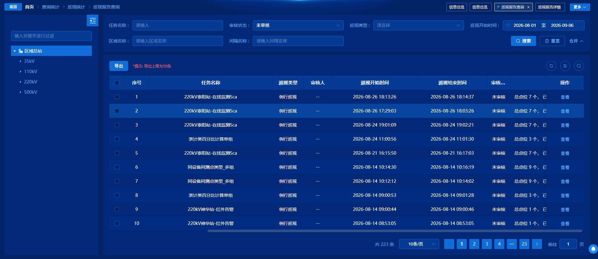
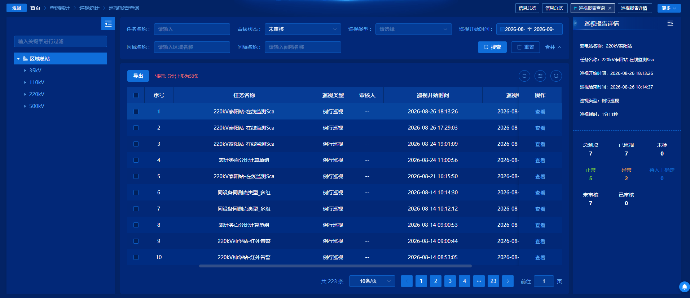
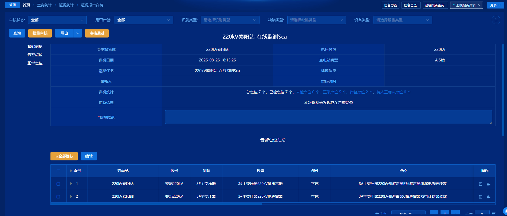

# 巡视报告查询









## 1. 一句话说明

巡视报告查询页供运维/审核人员按变电站筛选已生成的巡视报告，支持导出与侧栏概览；点「查看」进入独立的巡视报告详情页，对点位做筛选、批量审核、修正结果编辑、整份报告审核通过，以及按需查看 SF6 / 避雷器 / 一体化在线监测数据。

## 2. 代码地图

```
PatrolReport/                          # 列表页（菜单：巡视报告查询）
├─ Index.vue                           # 入口：左树 + BaseTable + 侧栏详情 + 权限按钮
├─ usePatrolReport.tsx                 # 列配置、列表/导出、跳转详情、树筛选、嵌入模式
├─ components/RepotDetail.vue          # 单击行后右侧统计侧栏（非「查看」页）
├─ enum/index.ts                       # 本目录枚举（列表实际多用 @/utils/baseType）
└─ 巡视报告查询.md                     # 本文档

PatrolReportPreview/                   # 详情页（路由隐藏，showBack）
├─ index.vue                           # 报告预览、五类点位表、审核/导出、底部监测 Tab
└─ index.scss                          # 详情页样式

路由：src/routers/modules/page/patrolQuery.ts
  /PatrolReport → Index.vue
  /PatrolReportPreview?id= → index.vue（isHide: true）

关键 API（src/api/modules/PatrolQuery.ts 等）
  patrolReportList / patrolReportListZL     # 列表
  patrolExportBatch                         # 列表批量导出
  getInspectionRecordDetail(ZL)             # 侧栏详情（patrolTask）
  patrolPreview                             # 详情头信息
  patrolAttachPointList / patrolUncheckedPointList / patrolPointList
  patrolAudit / batchAuditPointStatus / batchAuditPointAll / batchCorrectionResult
  patrolPreviewExport                       # 详情导出
  patrolSf6List / patrolArresterList / patrolDigitalList
```

| 想改什么 | 先看哪里 |
| --- | --- |
| 列表筛选项 / 默认审核状态 / 30 天限制 | `usePatrolReport.tsx` |
| 「查看」跳哪、带什么 query | `usePatrolReport.tsx` → `toDetail` |
| 单击行右侧概览 | `RepotDetail.vue` |
| 详情筛选、五类点位、审核/导出 | `PatrolReportPreview/index.vue` |
| 中铝列表接口切换 | `usePatrolReport.tsx` 的 `zhonglv` |
| 嵌入首页弹窗行为 | `Index.vue` props + `usePatrolReport` 的 `embedded` |

## 3. 页面长什么样、能做什么

### 列表页（`/PatrolReport`）

- **左侧**：`LeftStationTree`（`type=6`，按站权限过滤）。非嵌入模式显示；选节点后右侧表按 `stationId` 等刷新。
- **右侧表格**：任务名称、巡视类型、审核人、起止时间、审核状态、巡视统计、结论等；搜索含任务名、巡视类型、时间范围、审核状态、区域/间隔名。
- **表头**：有 `PatrolReport_export` 时可导出（提示上限 50 条）；勾选行后异步导出，下载任务 id 写入 `localStorage.downloadIds`。
- **行操作**：有 `PatrolReportPreview_query` 时显示「查看」→ 跳转详情；「提升算法」写死 `v-if="0"`，不可见。
- **单击行**（非点按钮）：右侧展开 `RepotDetail` 侧栏，展示站名、任务、耗时、点位统计等。
- **嵌入模式**（首页弹窗等）：无左树，可带入初始时间/审核状态/站名关键字；结束时间保留到秒。

### 详情页（`/PatrolReportPreview?id=`）

- **顶栏筛选**（仅「巡视报告」Tab）：审核状态、是否告警、识别类型、缺陷类型、设备类型；查询 / 批量审核 / 导出下拉勾选点位类型 / 审核通过。
- **左锚点菜单**：基础信息、重点关注 / 未检 / 告警 / 待人工确认 / 正常点位（有数据才显示）。
- **基础信息区**：站名、电压等级、巡视日期、站类型、任务、环境、审核人/时间、统计链接、汇总 HTML、可编辑「巡视结论」（未整份审核时）。
- **五类点位树表**（vxe-table）：勾选、展开、分页、列设置；行上可进点位结果详情、播视频。
- **区块按钮**（未整份审核且有批量审核权限）：全部确认、编辑/取消/保存修正结果。
- **底栏 Tab**：有数据时出现 SF6 / 避雷器 / 一体化在线监测；切 Tab 拉对应表。

## 4. 页面流程（用户视角）

1. 进入「巡视报告查询」→ 选左侧站树 → 表按站加载（`request-auto=false`，靠树 `change` / 嵌入时 `onMounted` 拉数）。
2. 默认审核状态搜索为「未审核」(0)；时间跨度超过 30 天会警告并中断请求。
3. 单击一行 → 右侧侧栏拉记录统计详情；再点同一行且侧栏已开同一 id 则不重复请求。
4. 点「查看」→ `/PatrolReportPreview?id={报告id}`。
5. 详情 `onMounted`：拉预览头、重点关注、未检、正常/告警/待确认三类点位，并探测 SF6/避雷器/一体化是否有数据；无查询权限则直接 return。
6. 改筛选点「查询」→ 同步刷新头与各类点位列表。
7. 勾选多表点位 →「批量审核」填结论 → `batchAuditPointStatus` → 刷新各列表。
8. 某区块「全部确认」→ `batchAuditPointAll`（`pointListType` 1～5）→ 只刷该区块。
9. 「编辑」改修正结果 →「保存」→ `batchCorrectionResult`（表计/红外须为数字）→ 全量 `search()`。
10. 填写巡视结论 →「审核通过」→ `patrolAudit` → 再拉预览；有 `auditorTime` 后审核类按钮与结论输入隐藏。
11. 点位行票据图标 → `/PatrolResultDetail`（`pointId`/`resultId`/`recordId`）；摄像头图标 → `VideoDialog`。

## 5. 页面逻辑（代码视角）

- **权限**：列表查询 `PatrolReport_query`、导出 `PatrolReport_export`；详情查询/导出/批量审核/报告审核分别为 `PatrolReportPreview_*`；分页上限还受 `PagingControl_permissions_xsbgcx` + 字典 `MaxPagingCount` 影响。
- **中铝**：`systemEnv` 中 `zhonglv` 可见时列表走 `patrolReportListZL`；侧栏详情走 `getInspectionRecordDetailZL`。详情页本身走通用 `patrolPreview` 等，未在入口再切 ZL。
- **地区字典**：详情里 `changji` / `lanjiang` / `jincheng` 影响审核结论联想词、导出是否插「重要等级」、SF6 斜率列是否插入；`colChange` 影响巡视图像预览是否走列表联动。
- **列表两套「详情」**：行点击 → 侧栏 `RepotDetail`；「查看」→ 路由详情页。不要混为一谈。
- **整份已审核判定**：`previewInfo.auditorTime` 有值则锁定审核 UI。
- **点位 status**：`patrolPointList` 的 `status`：0 正常、1 告警、2 待人工确认；重点关注另接口且 `isAbnormal: 1`；未检另接口。
- **全部确认 type**：1 重点关注、2 未检、3 正常、4 告警、5 待人工确认（与 `editEnabled` 下标 `type-1` 对应）。
- **列配置**：`tableStore` 键 `patrolReportPreviewOfTask`；`patrolTableColumns` 与 `dynamicColumns` 双份维护，列设置变更时同步。
- **导出类型**：勾选状态存在 `systemStore.patrolReportExportTypes`，来自账号巡视报告配置。

## 6. 重难点

### 6.1 「查看」和「点行」不是同一套详情

1. **一句话**：点行只出右侧窄栏统计；「查看」才进完整审核页。
2. **知识点**：同一列表页用两种交互承载不同深度：侧栏用 `ref.acceptParams`，整页用路由 query。
3. **代码依据**：

```253:266:src/views/PatrolQuery/PatrolReport/usePatrolReport.tsx
  const handleCurrentChange = (val: any) => {
    if (lookStatus.value) return;
    detailRef.value.acceptParams(val);
  };

  // 查看详情和审核
  const toDetail = (rowData: PatrolQuery.PatrolReport) => {
    router.push({
      path: '/PatrolReportPreview',
      query: {
        id: rowData.id
      }
    });
  };
```

点「查看」时模板加了 `@click.stop`，避免同时触发行点击打开侧栏。侧栏自己再调 `getInspectionRecordDetail`，和预览页的 `patrolPreview` 不是同一接口。
4. **新人易错**：改「详情字段」却只改了 `RepotDetail` 或只改了 Preview，另一边不会变。

### 6.2 详情页进页一次拉多路数据

1. **一句话**：进详情不是一张表，而是头 + 五类点位 + 三个监测探测并行。
2. **知识点**：按业务分区拆接口，用 `search()` 统一刷新巡视相关；监测有无决定底部 Tab 是否出现。
3. **代码依据**：

```1085:1174:src/views/PatrolQuery/PatrolReportPreview/index.vue
onMounted(() => {
  if (!permission.value['PatrolReportPreview_query']) {
    return;
  }
  search();
  _patrolSf6List();
  _patrolArresterList();
  _patrolDigitalList();
  // ...
});

const search = () => {
  if (!permission.value['PatrolReportPreview_query']) {
    return;
  }
  getPatrolPreview();
  _patrolAttachPointList();
  _patrolUncheckedPointList();
  getPatrolPointList(0, normalPage);
  getPatrolPointList(1, problemPage);
  getPatrolPointList(2, waitAuditPage);
};
```

用户点查询或切回「巡视报告」Tab 会再跑一遍 `search()`；SF6/避雷器在切 Tab 时用 `requestTimes++` 触发 BaseTable 重载。
4. **新人易错**：只改某一类列表刷新却漏掉 `search()` 其它分支，会出现区块数据不一致。

### 6.3 「全部确认」的 type 与编辑下标要对齐

1. **一句话**：五个区块共用一套 type 编号，错一位就会刷新错表或打开错编辑态。
2. **知识点**：前端用数字枚举区分区块，模板 `editEnabled[n]` 与 `handleConfirm(type)` 绑定。
3. **代码依据**：

```1855:1904:src/views/PatrolQuery/PatrolReportPreview/index.vue
const handleConfirm = (type: number) => {
  // ... MessageBox 填结论后
    const params = {
      id: previewId.value,
      pointListType: type,
      value: confirmAllResult.value
    };
    batchAuditPointAll(params).then((res: ResultData) => {
      if (res.success) {
        // case 1 重点关注 → case 5 待人工确认
        switch (type) { /* ... */ }
      }
    });
};
```

模板里告警区块点全部确认传 `4`、正常传 `3`；`edit(4)` 写的是 `editEnabled[3]`，告警表绑定的也是 `editEnabled[3]`。
4. **新人易错**：对照 `_changeTop` 的注释会以为 3=告警、5=正常——那是另一套映射，和 `handleConfirm` 不一致。

### 6.4 修正结果保存有识别类型校验

1. **一句话**：表计读取、红外测温的修正结果只能是数字，否则整批不提交。
2. **知识点**：前端在调批量修正接口前做业务校验，失败用点位名拼错误提示。
3. **代码依据**：

```2135:2170:src/views/PatrolQuery/PatrolReportPreview/index.vue
  const errorList: any[] = [];
  data.forEach((item: any) => {
    if (
      item.correctionConclusion &&
      item.correctionConclusion.trim() !== '' &&
      !isNum(item.correctionConclusion) &&
      ['表计读取', '红外测温'].includes(item.recognitionTypeName)
    ) {
      errorList.push(item.pointName);
    }
  });
  if (errorList.length) {
    ElMessage.error(`表计读取、红外测温的修正结果仅允许输入数字,以下点位错误：${errorList.join('、')}`);
    return;
  }
  const params = data
    .map((item: any) => {
      if (!item.auditStatus && item.correctionConclusion && item.correctionConclusion.trim() !== '') {
        return {
          inspectionResultId: item.resultId,
          auditResult: '',
          correctionConclusion: item.correctionConclusion
        };
      }
    })
    .filter((item: any) => item !== undefined);
```

已审核行不可编辑修正结果；空修正不入参。保存成功后关编辑并 `search()`。
4. **新人易错**：以为「取消」会恢复服务端原值——实际是把未审核行的 `correctionConclusion` 清成空字符串。

### 6.5 列表时间范围：嵌入与独立页结束时间算法不同

1. **一句话**：独立页结束时间被改成当天 23:59:59；嵌入页保留传入的精确秒。
2. **知识点**：同一 `getTableList` 用 `options.embedded` 分支，兼容首页柱状图下钻。
3. **代码依据**：

```95:106:src/views/PatrolQuery/PatrolReport/usePatrolReport.tsx
    if (newParams.startTime) {
      newParams.startTime = dayjs(params.startTime[0]).format('YYYY-MM-DD HH:mm:ss');
      const endTimeBase = dayjs(params.startTime[1]);
      newParams.endTime = options.embedded
        ? endTimeBase.format('YYYY-MM-DD HH:mm:ss')
        : endTimeBase.format('YYYY-MM-DD') + ' 23:59:59';
      if (new Date(newParams.endTime).getTime() - new Date(newParams.startTime).getTime() > 30 * 24 * 60 * 60 * 1000) {
        ElMessage.warning('只支持任意30天范围内搜索');
        return Promise.resolve();
      }
    }
```

超 30 天返回空 Promise，表格不会更新为错误结果，但也不会清旧数据（表现为「点了查询没变化」）。
4. **新人易错**：在独立页按「选到某一时刻」理解结束时间，实际会被撑到当天末。

### 6.6 汇总文案点击会带设备名重查告警点位

1. **一句话**：汇总 HTML 里的 `<span>` 可点，滚到告警区并按设备名排序/过滤。
2. **知识点**：服务端下发可点击 HTML，前端事件委托取 `span` 文本当 `orderByEquipment`。
3. **代码依据**：

```934:942:src/views/PatrolQuery/PatrolReportPreview/index.vue
const handleSummaryTextClick = (event: MouseEvent) => {
  const target = event.target as HTMLElement | null;
  const clickedSpan = target?.closest('span');
  if (clickedSpan) {
    const clickedText = clickedSpan.textContent?.trim() || '';
    console.log('clicked span text:', clickedText);
    elementScrollIntoView('preview-task-report-problem-points');
    getPatrolPointList(1, problemPage, clickedText);
  }
};
```

```1228:1239:src/views/PatrolQuery/PatrolReportPreview/index.vue
const getPatrolPointList = (status: number, page: Pageable, clickedText?: string) => {
  const params = {
    id: previewId.value,
    status: status,
    // ...
    ...(clickedText ? { orderByEquipment: clickedText } : {})
  };
```

依赖后端 `alarmSummaryMsg` 用 span 包设备名；普通查询不传该字段。
4. **新人易错**：改汇总展示时去掉 span，点击联动会失效且不易察觉。

### 6.7 双列模型：`patrolTableColumns` vs `dynamicColumns`

1. **一句话**：列显隐/宽度存在 BaseTable 风格配置里，真正渲染用另一份带 JSX template 的 dynamicColumns。
2. **知识点**：vxe 动态列 + Pinia 持久化列设置，改宽时五张表一起 `setColumnWidth`。
3. **代码依据**：

```1021:1059:src/views/PatrolQuery/PatrolReportPreview/index.vue
const getColumnStatus = (field: string, prop: string) => {
  const item: any = patrolTableColumns.value.find(item => item.prop === prop);
  if (!item) return false;
  return item[field] ?? false;
};
// ...
const resizableChange = ({ column }: any) => {
  // 写回 tableStore，并同步五张 vxe 表列宽
};
```

兰江且任务二级类型为「SF6斜率对比」时，watch 会往两份列配置里插入斜率列。
4. **新人易错**：只改 `patrolTableColumns` 的 label/顺序，表格单元格自定义渲染仍看 `dynamicColumns`，两边不同步就会「设置里有列、表上没有/渲染不对」。

## 7. 坑点（已存在的别扭实现）

- **重点关注分页写错分页对象**：`attachSizeChange` / `attachCurrentChange` 改的是 `problemPage`，不是 `attachPage`。路径：`src/views/PatrolQuery/PatrolReportPreview/index.vue`。

```1626:1634:src/views/PatrolQuery/PatrolReportPreview/index.vue
const attachSizeChange = (size: number) => {
  problemPage.pageSize = size;
  _patrolAttachPointList();
  _changeTop(1);
};
const attachCurrentChange = (currentPage: number) => {
  problemPage.pageNum = currentPage;
  _patrolAttachPointList();
  _changeTop(1);
};
```

  实际请求仍读 `attachPage`，所以翻页/改页大小对重点关注表可能无效，却污染了告警分页状态。

- **`_changeTop` 与 `handleConfirm` 的 type 含义不一致**：同文件内 3/4/5 对应区块不同，靠注释更易误导。路径：`PatrolReportPreview/index.vue`。

- **「提升算法」死代码**：模板 `v-if="0"`，且 `ImageLabel` 在 `Index.vue` 使用但未 import；`markLabel`/`showImageLabelDialog` 仍从 hook 返回。路径：`PatrolReport/Index.vue`、`usePatrolReport.tsx`。

- **`lookStatus` 从未置 true**：传入 hook 用于挡住行点击开侧栏，列表页没有赋值逻辑，该守卫等于无效。路径：`Index.vue`、`usePatrolReport.tsx`。

- **`operator` / `exportReport` 与 localStorage `substation-reportSavedObject`**：列表 hook 里仍有「识别/判别」逻辑并对外 return，但当前 `Index.vue` 未使用。路径：`usePatrolReport.tsx`。

- **取消编辑清空而非回滚**：`cancel` 把未审核行的修正结果置 `''`，不是恢复接口原值。路径：`PatrolReportPreview/index.vue`。

- **两套审核状态枚举**：列表列用 `@/utils/baseType` 的「全部/未审核/已审核」；同目录 `enum/index.ts` 另有「未审核/通过/不通过/无需审核」，易拿错。路径：`usePatrolReport.tsx`、`PatrolReport/enum/index.ts`。

- **组件文件名拼写**：`RepotDetail.vue`（Report 少一个 r）。

## 8. 风险点（改这里容易出事故）

- **整份审核后 UI 锁定靠 `auditorTime`**：若后端只改 `auditStatus` 不写时间，前端仍显示可审核/可编辑。路径：`PatrolReportPreview/index.vue`。

```62:67:src/views/PatrolQuery/PatrolReportPreview/index.vue
          <el-button
            type="warning"
            v-if="permission.PatrolReportPreview_batch_audit && !previewInfo?.auditorTime"
            @click="batchConfirm"
```

- **批量审核合并五表勾选**：`batchConfirm` 拼接五类 `select*Ids`；某表全选逻辑与单选 push 混用，跨页 reserve 勾选时可能丢或重。路径：同文件选中事件与 `batchConfirm`。

- **导出列依赖当前列显隐 + 站点开关**：昌吉会往导出列插「重要等级」；改列 label 或显隐会影响导出 `column` 与后端约定。路径：`exportPreview`。

- **嵌入模式被首页复用**：改默认审核状态/时间处理会影响 `home/index_aks.vue` 等嵌入场景。路径：`usePatrolReport.tsx`、`Index.vue` props。

- **中铝只切列表/侧栏接口**：详情页未切 ZL，中铝环境若详情字段不同，列表进详情可能对不上。路径：`usePatrolReport.tsx`、`RepotDetail.vue` vs `PatrolReportPreview`。

- **无查询权限时详情空白**：`onMounted`/`search` 直接 return，无提示。路径：`PatrolReportPreview/index.vue`。

- **KeepAlive + 仅初始化读 `route.query.id`**：`previewId` 在 setup 时取一次；若同组件实例被复用且只换 query，未在代码中确认会重新拉数（路由 `isKeepAlive: true`）。路径：路由配置与 `const previewId = ref(route.query.id || '')`。

## 9. 改动导航

| 需求类型 | 优先文件 |
| --- | --- |
| 列表字段、搜索默认值、导出、30 天限制、中铝列表 | `usePatrolReport.tsx` |
| 左树/嵌入布局、权限按钮显隐 | `PatrolReport/Index.vue` |
| 单击行右侧统计面板 | `components/RepotDetail.vue` |
| 详情筛选、点位表、审核、修正、导出、监测 Tab | `PatrolReportPreview/index.vue` |
| 详情样式 | `PatrolReportPreview/index.scss` |
| 列表/详情路由与是否隐藏菜单 | `routers/modules/page/patrolQuery.ts` |
| 接口 URL | `api/modules/PatrolQuery.ts`、`api/modules/patrolTask.ts` |
| 导出默认勾选点位类型 | `stores/modules/system.ts` + 账号「巡视报告配置」 |
| 点位行再进结果详情 | `/PatrolResultDetail`（本页只负责 `toDetail` 跳转） |
