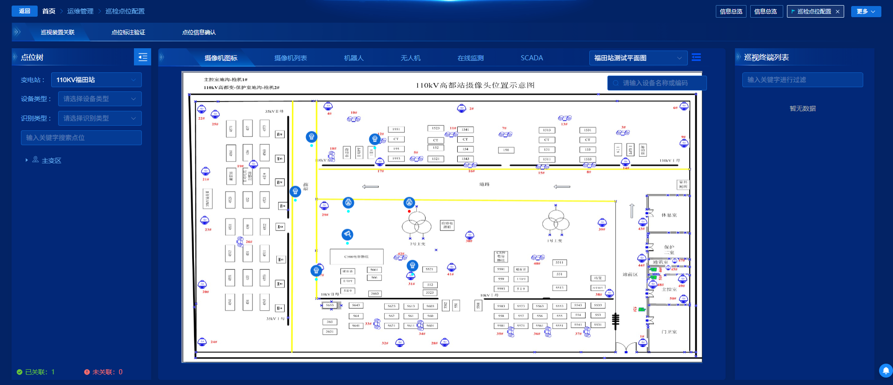
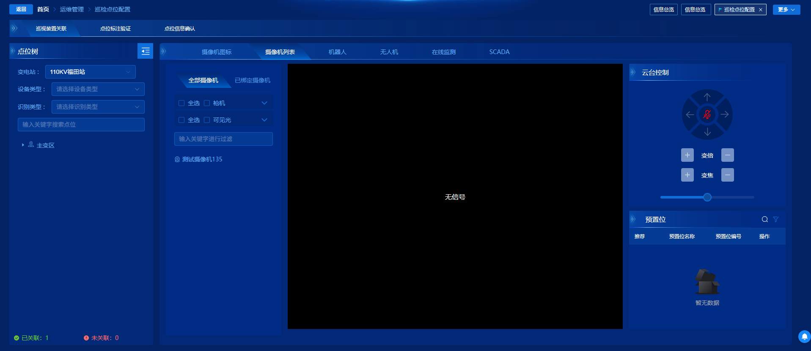
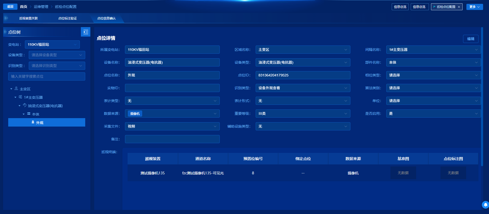

# 巡视点位配置

> 入口：`src/views/EquipmentManage/PointScreenBinding/Index.vue`  
> 路由：`/PointScreenBinding`（后台动态菜单，不在 `src/routers` 静态配置里）  
> 组件名：`PointScreenBinding`

本文从代码层面说明本页做什么、怎么走、难点和风险在哪。结论均来自当前代码，未读到的不写。

---










## 1. 一句话说明

这个页面把**巡视点位**和**巡视装置**（摄像机预置位、机器人、无人机、在线监测、声纹等）绑在一起，并在区域站/单站上做**点位标注验证**和**点位信息确认**。

典型使用场景：点位台账配好之后，运维在这里完成「这个点位用哪路视频 / 哪台机器人去拍」，否则后续巡视任务没有画面来源。系统自检页的「去看看」、巡视点位管理页也会跳到这里。

---

## 2. 代码地图

```
src/views/EquipmentManage/PointScreenBinding/
├── Index.vue                    壳：顶 Tab、左树、右内容、拖拽宽度
├── usePointScreenBinding.ts     本页主逻辑：站点、树、Tab 分流、跳转定位、统计
├── index.scss                   布局样式
└── components/
    ├── PatrolDevice/            【Tab1】巡视装置关联（摄像机/机器人/无人机/监测/声纹）
    │   ├── index.vue            右栏 Tab、绑定/解绑、批量生成
    │   └── useIntegratedMonitor.ts  各装置列表、平面图、视频弹窗（含模块级共享状态）
    ├── PatrolDeviceList/        摄像机列表绑定
    ├── PreviewVideo/            预置位关联视频弹窗
    ├── VideoSettingDialog/      摄像机终端设置
    ├── TerminalSettingDialog/   非摄像机终端设置
    ├── PointLabeling/           【Tab2】点位标注验证
    ├── PointInfo/               【Tab3】点位信息确认
    └── PointScreen/             旧实现，当前 Index 未引用
```

### 改功能先动哪

| 你想改什么 | 先看 |
|---|---|
| 进页默认 Tab、站点、树筛选、树图标 | `usePointScreenBinding.ts` |
| 摄像机平面图 / 预置位绑定 | `PatrolDevice/index.vue` + `PreviewVideo` |
| 机器人/无人机/监测勾选绑定 | `PatrolDevice/index.vue` 的 `initTable` / `bindPoint` |
| 标注能否开始、终端列表 | `PointLabeling/Index.vue` |
| 点位字段能否编辑保存 | `PointInfo/Index.vue` |
| 兰江/阿克苏/主辅融合显隐 | `Index.vue` 字典 + `PatrolDevice` 的 `v-if` |

---

## 3. 页面长什么样、能做什么

整体是「上 Tab + 左树 + 右内容」。

### 3.1 顶部三个 Tab（不一定全显示）

- **巡视装置关联**：把点位绑到摄像机 / 机器人 / 无人机 / 监测 / 声纹
- **点位标注验证**：对已绑定终端做画面标注
- **点位信息确认**：看（直连站可改）点位详情和已绑终端表

显隐由站点形态决定，不是权限菜单单独控的：

```64:70:src/views/EquipmentManage/PointScreenBinding/usePointScreenBinding.ts
  const tabListEnum = computed(() => {
    return {
      pointScreen: isSingle.value || isEdge.value || (isRegion.value && isDirectConnect.value),
      pointLabeling: isRegion.value || isSingle.value,
      pointInfo: isRegion.value || isSingle.value
    };
  });
```

人话对照：

| 站点形态 | 巡视装置关联 | 点位标注验证 | 点位信息确认 |
|---|---|---|---|
| 单站 | 有 | 有 | 有 |
| 边缘站 | 有 | 无 | 无 |
| 区域站 + 直连 | 有 | 有 | 有 |
| 区域站 + 非直连 | 无 | 有 | 有 |

### 3.2 左侧点位树

用户可以：

1. **选变电站**（级联，只显示最后一级站名）
2. **搜点位**、按装置类型筛（`VirtualizedTree` 的 `device-type-filter`）
3. **点树节点**：区域 / 部件 / 点位，右侧跟着变
4. **点底部统计条**当筛选：
   - 关联 Tab：已关联 / 未关联
   - 标注 Tab：已标注 / 部分标注 / 未标注 / 无需标注
5. **收起树**；仅关联 Tab 可拖左侧宽度（300～500px）

树上的勾 / 钟 / 叹号：

- 关联 Tab：`isBind` 为真显示绿勾
- 标注 Tab：`markStatus` 1 已标、2 部分、3 未标

### 3.3 右侧：巡视装置关联

点的是**点位**时（`isSysComponent = false`）：

- **摄像机图标**：平面图上找摄像机，点开「预置位关联」视频弹窗去绑
- **摄像机列表**：表格里绑
- **机器人 / 无人机**：勾选绑定或解绑
- **在线监测 / 主辅融合 / SCADA**：由字典控制，见第 5、6 节
- **声纹**：仅当点位 `collectFileType == '3'` 才出现，并会顶掉摄像机 Tab

点的是**部件**时（`isSysComponent = true`）：摄像机相关 Tab 隐藏，默认进机器人，操作变成「生成数据 / 批量生成」，不是勾选绑定。

点的是**区域**（`treeNodeType === 4`）：可对区域机器人做「批量生成」。

### 3.4 右侧：点位标注验证

先选点位，再选该点位下的巡视终端。没有标注记录时提示「开始标注」；识别类型不在 `1/2/3/4/6` 时按钮禁用，文案是「该识别类型无法标注」。有权限 `PatrolPointManagement_config_base_image` 才能开「基准图」。

### 3.5 右侧：点位信息确认

展示点位字段和已绑终端表。编辑按钮还要同时满足：当前站是直连，且有权限 `PointScreenBinding_edit_point`。取消编辑**不会**把表单恢复成打开编辑前的值。

---

## 4. 页面流程（用户视角）

### 4.1 正常进页

1. `onMounted` 调 `stationLevelList` 拉站点级联。
2. 默认站：URL 有 `stationId` 用它，否则用列表里**第一项的第一个子站**。
3. 默认 Tab：能显示「巡视装置关联」就进它，否则进标注，再否则进信息确认。  
   注意：hook 里先写过「区域站默认标注」，站点列表回来后又会按上面规则再改一次。
4. 拉整棵点位树 `pointTree`，再拉底部统计（已关联数 / 已标注数）。
5. 关联 Tab 还会再调 `_getInfoTree` 给平面图准备站点信息。

### 4.2 选站

`changeStation`：级联值若是数组，取第二级当真正的 `stationId`；按该站 `isDirectConnect` 切 Tab（直连 → 关联，非直连 → 标注）；重置树的装置筛选；重新拉树。

### 4.3 点树（核心分流）

| 点的节点 | 关联 Tab 右侧 |
|---|---|
| 区域（type 4） | 进机器人列表，可区域批量生成 |
| 部件（type 7） | 懒加载该部件下点位挂到树上；右侧当「系统部件」走生成数据 |
| 点位（type 8 或无 type） | **单击**拉点位详情并交给右侧绑定；**300ms 内再点一次**视为双击，再去拉识别画面并打开视频 |

标注 Tab / 信息 Tab：只有点到点位才会拉详情填右侧。信息 Tab 底部统计条不显示。

### 4.4 从别的页跳进来

`expandNode` 认这些 query：`stationId`、`componentId`、`pointId`、`areaId`、`intervalId`、`deviceId`。有 `componentId` 时先展开部件、再延时选中点位并触发一次点位点击。巡视点位管理页会往这里跳。

### 4.5 绑定 / 标注成功之后

`bindPresetSuccess`：刷新底部统计；若树当前没有筛选，整棵按部件重刷；有筛选则只改当前点位节点的 `items`、`isBind` 或 `markStatus`。

---

## 5. 页面逻辑（代码视角）

### 5.1 站点类型怎么控 Tab

来源是 `useSystemStore()` 的 `isEdge / isRegion / isSingle`，再加上站点接口里的 `isDirectConnect`。选站时会覆盖 `isDirectConnect`。

`Index.vue` 另拉字典 `SpecialEnableConfiguration`、`MixAuxiliaryPlan`：

- `lanjiang` 可见 → `isLanJiang`
- `akesu` 可见 → `isAksu`
- `MixAuxiliaryPlan` 启用 → `mixAuxiliaryPlan`

这三个只传给 `PatrolDevice`，决定监测类 Tab 长什么样：

- 非兰江、非主辅：一个「在线监测」
- 非兰江、主辅、非阿克苏：「主辅融合」
- 非兰江、主辅、阿克苏：「在线监测」+「SCADA」
- 兰江：自定义「在线监测」+ 一体化设备树

### 5.2 父子通信

- 父 → 子：`ref.actionEvent` / `changeAreaEvent` / `playMultVideo` / `_getInfoTree` / `updateDetailData`
- 子 → 父：`bind-preset-success`、`save-reload`
- **额外还有模块级变量**：`useIntegratedMonitor.ts` 里 `export let pointInfo`、`areaRobotInfo`、`bindPresetCallback`

点位树本身不是 el-tree 懒加载那套。`usePointScreenBinding.ts` 里写了 `treeLazyLoad`，但 `Index.vue` 没用。实际是一次 `pointTree` 拉到部件，点部件再 `getPatrolTreeNode` 把点位插进树。

### 5.3 关联绑定在干什么

`PatrolDevice` 勾选时走 `initTable`：

- 勾上：若该点位已绑过同类装置，弹「是否覆盖」；阿克苏的监测 / SCADA 还会查「测点是否已绑多个巡视点位」
- 勾掉：调解绑接口
- 成功后 `initTerminalTree` 刷新右侧已绑终端树，并 `emit` 给父组件改左树图标

摄像机绑定不走这个勾选，走平面图 / 列表 → `PreviewVideo`。

摄像机图标 / 列表哪个默认打开，写在 `localStorage.bindVideoType` 里，下次进页还记着。

### 5.4 树节点类型约定

```608:616:src/utils/baseType.ts
export const treeNodeTypeEnum = [
  { value: 1, label: '区域变电站' },
  { value: 2, label: '电压等级' },
  { value: 3, label: '变电站--边缘节点装置' },
  { value: 4, label: '区域' },
  { value: 5, label: '间隔' },
  { value: 6, label: '设备' },
  { value: 7, label: '部件' },
  { value: 8, label: '点位' }
];
```

点击时会用 `findParents` 把祖先的站 / 区域 / 间隔 / 设备 / 部件摊平进当前节点，右侧绑接口才带得上 `stationId`、`areaId` 等。注意：区域 / 间隔 / 设备 / 部件用的是祖先的 `item.key`，站用的是 `item.id`。

---

## 6. 重难点

每条固定四段：一句话 → 知识点 → 代码依据 → 新人易错。

### 难点 1：同一棵树，点不同层级，右侧完全两套玩法

**一句话**  
左边点的是「区域 / 部件 / 点位」，右边不是刷新同一张表，而是切换三种业务模式。

**知识点**  
点位树按层级编号，不是普通文件夹。父组件先按类型分流；点到部件时还会给子组件传第二个参数 `true`，意思是「现在是系统部件，不要走绑定，走生成数据」。

| `treeNodeType` | 含义 | 右侧玩法 |
|---|---|---|
| 4 | 区域 | 机器人列表，可批量生成 |
| 7 | 部件 | 生成数据，摄像机 Tab 隐藏 |
| 8（或无 type） | 点位 | 勾选绑定 / 预置位关联 |

**代码依据**

点击后的总开关在 `changeTreeFilter`：区域走 `changeAreaEvent`，部件走懒加载 + `bindSystemComponent`，点位走绑定 / 标注 / 信息。

```295:351:src/views/EquipmentManage/PointScreenBinding/usePointScreenBinding.ts
  const changeTreeFilter = async (data: any) => {
    !data.forceFresh && clickTreeNode(data);

    // 区域层级时可加载机器人列表并批量生成
    if (data.treeNodeType === 4 || data.forceFresh) {
      if (nodeMessageActiveTab.value == 'pointScreen') {
        nextTick(() => {
          pointScreenRef?.value.changeAreaEvent(data);
        });
      }
    }
    if (data.treeNodeType === 7 || data.forceFresh) {
      if (data.child && data.child.length > 0 && !data.forceFresh) {
        bindSystemComponent(activeNode);
        return;
      }
      // ... getPatrolTreeNode 拉点位再插入树
    } else if ((!data.treeNodeType || data.treeNodeType == 8) && data.id) {
      // 点位：单击绑定 / 双击播视频
    }
  };
```

部件点击会把 `sysComponentFlag` 设成 `true`：

```286:291:src/views/EquipmentManage/PointScreenBinding/usePointScreenBinding.ts
  const bindSystemComponent = (data: any) => {
    if (nodeMessageActiveTab.value == 'pointScreen') {
      nextTick(() => {
        pointScreenRef?.value.actionEvent(data, true);
      });
    }
  };
```

子组件用这个 flag 决定默认 Tab：点位进摄像机，部件进机器人。

```677:683:src/views/EquipmentManage/PointScreenBinding/components/PatrolDevice/index.vue
const actionEvent = (data: any, sysComponentFlag: boolean = false) => {
  areaRobotInfo.value = {};
  pointInfo.value = data;
  // 是否位系统部件
  isSysComponent.value = sysComponentFlag;
  getTabsIndex();
```

```647:662:src/views/EquipmentManage/PointScreenBinding/components/PatrolDevice/index.vue
  if (!isSysComponent.value) {
    robotTerminalColumns.value[0].isShow = false;
    droneTerminalColumns.value[0].isShow = false;
    customOnlineColumns.value[0].isShow = false;
    nodeMessageActiveTab.value = bindVideoType || 'video';
    return;
  }

  if (isSysComponent.value) {
    robotTerminalColumns.value[0].isShow = true;
    droneTerminalColumns.value[0].isShow = true;
    customOnlineColumns.value[0].isShow = true;
    nodeMessageActiveTab.value = 'robot';
    robotTableRef.value?.getTableList();
    return;
  }
```

区域则清空当前点位，只留机器人列表做批量生成：

```666:674:src/views/EquipmentManage/PointScreenBinding/components/PatrolDevice/index.vue
const changeAreaEvent = (data: any) => {
  if (data.treeNodeType === 4) {
    areaRobotInfo.value = data;
    pointInfo.value = {};
    isSysComponent.value = false;
    getTabsIndex();
    robotTableRef.value?.getTableList();
  }
};
```

**新人易错**  
只拿一个点位测「勾选绑定」。部件上勾选是隐藏的，按钮是「生成数据」；区域上是「批量生成」。三种入口共用 `PatrolDevice`，改一处 `v-if` 可能三种模式一起坏。

---

### 难点 2：点位单击绑信息、双击才播视频，靠 300ms 计数

**一句话**  
树上点一次和连点两次，走的不是同一条路。浏览器没有现成的「树节点双击」，所以自己用计数器模拟。

**知识点**  
常见写法：第一次点击先 `numTime++` 并启动 300ms 定时器；300ms 内如果又点了一次，计数变成 2。定时器到点后看数字：`1` 当单击，`2` 当双击。  
代价是：单击也被推迟 300ms 才发请求；快速连点时，第二次可能被当成双击。

**代码依据**

```351:368:src/views/EquipmentManage/PointScreenBinding/usePointScreenBinding.ts
    } else if ((!data.treeNodeType || data.treeNodeType == 8) && data.id) {
      if (nodeMessageActiveTab.value == 'pointScreen') {
        numTime.value++;
        clearTimeout(timeout);

        timeout = setTimeout(async function () {
          if (numTime.value === 1) {
            pointBindInfo(data);
          }
          if (numTime.value === 2) {
            let pointInfoRes = await pointBindInfo(data);
            playVideo(pointInfoRes);
          }

          numTime.value = 0;
        }, 300);
      }
```

顺着执行：

1. 每次点点位，`numTime` 加 1，并清掉上一次还没到点的定时器（重新等 300ms）。
2. 300ms 内只点了一次 → `pointBindInfo`：拉点位详情，交给右侧做绑定。
3. 300ms 内点了两次 → 仍会 `pointBindInfo`，再 `playVideo`：去查识别画面通道，打开预置位视频弹窗。

双击多出来的是这条：先查设备识别详情，没有再查摄像机列表，拼成通道后调用子组件 `playMultVideo`。

```182:231:src/views/EquipmentManage/PointScreenBinding/usePointScreenBinding.ts
  const playVideo = async (pointInfoRes: any) => {
    const res = await deviceRecognitionDetail({
      isCheck: 1,
      deviceId: pointInfoRes?.data?.deviceId
    });
    // ...没数据再走 deviceRecognitionCameras，按采集文件类型拼红外/可见光通道
    if (tempChannelList.length >= 1) {
      pointScreenRef?.value.playMultVideo(tempChannelList);
    }
  };
```

**新人易错**  
在 `changeTreeFilter` 里加「一点树就请求」，会和这 300ms 抢跑：单击也会被提前打接口，双击再打一次。标注 Tab、信息 Tab **没有**这套单击双击，只有关联 Tab 有。

---

### 难点 3：切顶部 Tab 不是只换右侧组件，还会把当前树节点再跑一遍

**一句话**  
从「关联」切到「标注」，不是单纯 `v-if` 换组件，而是清筛选、等 100ms、再按当前节点重新查询。

**知识点**  
三个 Tab 共用左树，但右侧要的数据不同（绑定列表 / 标注终端 / 点位详情）。切 Tab 后必须用「现在选中的那个节点」把新右侧灌一遍。  
同时底部「已关联 / 未关联」和「已标注 / 未标注」不是同一套筛选，所以切 Tab 会把 `treeStatusIndex`、`isSetup`、`markStatus` 清零。

**代码依据**

```82:105:src/views/EquipmentManage/PointScreenBinding/usePointScreenBinding.ts
  watch(
    () => nodeMessageActiveTab.value,
    () => {
      if (activeNode.pointPositionId) {
        activeNode.id = activeNode.pointPositionId;
      }

      treeStatusIndex.value = 0;
      isSetup.value = 0;
      markStatus.value = 0;
      let pointFlag = (!activeNode.treeNodeType || activeNode.treeNodeType == 8) && activeNode.id;

      setTimeout(() => {
        let changeFlag = systemTreeRef.value?.changeFilter();
        currentComponent.forceFresh = pointFlag && !changeFlag ? true : false;
        !changeFlag && changeTreeFilter(currentComponent as NewTreeInfo);
        pointFlag && changeTreeFilter(activeNode as NewTreeInfo);
      }, 100);
      _pointBindCount();
    }
  );
```

顺着读：

1. 若节点上有 `pointPositionId`，先把 `id` 改成点位 id（部件节点和点位节点 id 不是一回事）。
2. 清空底部状态筛选，避免「关联里筛已绑定」带到标注里。
3. 等 100ms：给 `v-if` 切出来的新组件一点挂载时间，否则 `pointLabelingRef.actionEvent` 可能还是 `undefined`。
4. `changeFilter()` 表示树上现在有没有关键字 / 装置筛选。
   - 没筛选：用记住的**部件** `currentComponent` 去刷新该部件下所有点位。
   - 有筛选：树里已经都是点位，就用当前点位再查一次。
5. `_pointBindCount()` 刷新底部数字。

`currentComponent` 只在点到部件时被深拷贝记住：

```281:284:src/views/EquipmentManage/PointScreenBinding/usePointScreenBinding.ts
    activeNode = temp;
    if (data.treeNodeType === 7) {
      currentComponent = JSON.parse(JSON.stringify(activeNode));
    }
```

**新人易错**  
以为切 Tab 很便宜。实际上会再打树接口和详情接口。另外 100ms 是经验值，子组件变慢时，`pointLabelingRef?.value.actionEvent` 仍可能赶上组件还没准备好。

---

### 难点 4：点位不在首包树里，要点部件才挂上去

**一句话**  
打开页面时，树只到「部件」；点位是点开部件后才请求、再插进树里的。

**知识点**  
整棵设备树如果连点位一次性拉完会很大，所以拆成两段：  
`pointTree` 先出站 → 区域 → 间隔 → 设备 → 部件；点部件再 `getPatrolTreeNode` 拉该部件下点位。  
插入时没有改原数组，而是 `JSON.parse(JSON.stringify(整棵树))` 深拷贝后再 `push`。这能避免直接改响应式树出奇怪引用问题，但树一大，每次点部件都拷贝整棵，会卡。

**代码依据**

先整棵拉到部件：

```583:599:src/views/EquipmentManage/PointScreenBinding/usePointScreenBinding.ts
  const _getPointTree = async () => {
    treeLoading.value = true;
    stationTree.value = [];

    const params: any = { stationId: stationId.value };
    await pointTree(params, { noLoading: true })
      .then((res: ResultData) => {
        if (res.success) {
          stationTree.value = res.data;
          treeLoading.value = false;
          _pointBindCount();
          expandNode();
        }
      })
```

点部件再拉点位，并标成 `treeNodeType: 8`：

```324:334:src/views/EquipmentManage/PointScreenBinding/usePointScreenBinding.ts
      getPatrolTreeNode(params, { noLoading: true, cancelAxios: true })
        .then((result: ResultData) => {
          const childrenData = result.data.items?.map((item: TreeInfo) => {
            return {
              ...item,
              treeNodeType: 8,
              leaf: true
            };
          });
          let temp = insertIntoTree(stationTree.value, childrenData, data.id);
          systemTreeRef.value.setData(temp);
```

插入实现就是深拷贝 + 按 `parentId` 找到部件再 `child.push`：

```108:120:src/views/EquipmentManage/PointScreenBinding/usePointScreenBinding.ts
  const insertIntoTree = (array: any, objectsToInsert: any, parentId: string) => {
    let newArray = JSON.parse(JSON.stringify(array));
    function recursiveInsert(nodes: any[]) {
      for (let i = 0; i < nodes.length; i++) {
        if (nodes[i].id === parentId) {
          if (!nodes[i].child) {
            nodes[i].child = [];
          }
          objectsToInsert.forEach((object: any) => nodes[i].child.push(object));
```

如果这个部件已经有 `child` 且不是强制刷新，就不再请求，直接当系统部件打开右侧：

```306:310:src/views/EquipmentManage/PointScreenBinding/usePointScreenBinding.ts
      if (data.child && data.child.length > 0 && !data.forceFresh) {
        bindSystemComponent(activeNode);
        return;
      }
```

**新人易错**  
进页就在 `stationTree` 里找某个 `pointId`，经常找不到——点位还没挂上。从别的页带 `componentId + pointId` 跳进来时，必须先展开部件、等插入完成，再选点位（`expandNode` 里那串 `setTimeout` 就是在等这个）。

---

### 难点 5：点树时会把祖先信息「摊平」进当前节点

**一句话**  
你点的是点位，但绑接口还要站、区域、间隔、设备、部件。这些不是点位对象自带的，是顺着父节点一层层抄上来的。

**知识点**  
树节点自己通常只有 `id/name/treeNodeType`。业务接口却要一整条路径。所以点击时用 `findParents` 拿到从根到当前的所有祖先，再按 `treeNodeType` 填到 `temp` 上。  
之后 `activeNode` 就变成「当前节点 + 祖先字段」的拼盘，右侧绑定才能带上 `stationId`、`areaId` 等。

**代码依据**

```236:281:src/views/EquipmentManage/PointScreenBinding/usePointScreenBinding.ts
  const clickTreeNode = (data: NewTreeInfo) => {
    const temp: NewTreeInfo = { ...data };
    const newStation = findParents(stationTree.value, data.id);
    if (newStation) {
      newStation.map((item: TreeInfo) => {
        switch (item.treeNodeType) {
          case 1:
          case 3:
            temp.stationId = item.id;
            temp.stationKey = item.key;
            temp.stationName = item.name;
            temp.stationIsDirect = item.isDirectConnect;
            break;
          case 4:
            temp.areaId = item.key;
            temp.areaName = item.name;
            break;
          case 5:
            temp.intervalId = item.key;
            temp.intervalName = item.name;
            break;
          case 6:
            temp.deviceId = item.key;
            temp.deviceName = item.name;
            break;
          case 7:
            temp.componentId = item.key;
            temp.componentName = item.name;
            break;
        }
      });
    }
    activeNode = temp;
```

**新人易错**  
给绑定接口只传树上点中的那个 `data.id`。机器人列表等地方还要用摊平后的 `areaId/intervalId/deviceId`。另外 `forceFresh === true` 时 `changeTreeFilter` **不会**再跑 `clickTreeNode`（第一行 `!data.forceFresh && clickTreeNode(data)`），祖先字段可能还是旧的。

---

### 难点 6：监测类 Tab 不是写死的，由三个运行时开关组合出来

**一句话**  
「在线监测 / 主辅融合 / SCADA / 兰江一体化树」不是每个环境都有，打开页面时查字典，再和「是不是点位、是不是兰江、是不是阿克苏」做乘法。

**知识点**  
项目用数据字典做地区定制，不靠发版切换。本页关心两个字典：`SpecialEnableConfiguration`（里面的 `lanjiang`、`akesu` 是否可见）、`MixAuxiliaryPlan`（是否启用）。  
它们只影响 `PatrolDevice` 里监测相关 Tab，不影响顶部三个大 Tab。

**代码依据**

进页拉字典，写成三个 boolean：

```193:209:src/views/EquipmentManage/PointScreenBinding/Index.vue
const { _getCommonDictionary } = useDataDictionary();
_getCommonDictionary(['SpecialEnableConfiguration', 'MixAuxiliaryPlan'], (data: DataDictionaryItem[]) => {
  data.forEach((dict: any) => {
    dict?.dictList.some((item: DataDictionary) => {
      if (item.dictCode == 'lanjiang' && item.isVisible) {
        isLanJiang.value = true;
      }
      if (item.dictCode == 'akesu' && item.isVisible) {
        isAksu.value = true;
      }
      if (item.dictCode == 'MixAuxiliaryPlan' && item.isEnable) {
        mixAuxiliaryPlan.value = true;
      }
    });
  });
});
```

右侧用它们组合 `v-if`。例如非兰江、又没开主辅，才显示普通「在线监测」：

```174:180:src/views/EquipmentManage/PointScreenBinding/components/PatrolDevice/index.vue
          <el-tab-pane
            label="在线监测"
            name="onlineMonitor"
            lazy
            v-if="!isSysComponent && !isLanJiang && !mixAuxiliaryPlan"
          >
```

主辅开了且不是阿克苏 → 「主辅融合」；阿克苏再拆成「在线监测 + SCADA」；兰江则是另一套带一体化设备树的 `onlineMonitorCustom`。

还有第四个维度：点位采集文件类型是声纹（`'3'`）时，摄像机那一组直接不渲染，只留声纹表。

```19:19:src/views/EquipmentManage/PointScreenBinding/components/PatrolDevice/index.vue
        <div v-if="pointInfo && pointInfo.collectFileType != '3'">
```

**新人易错**  
本地字典没开兰江，你改的监测绑定在兰江根本进不去那个 Tab。绑参字段也不通用：普通监测、主辅、阿克苏 SCADA、兰江自定义，`bindPoint` 里拼的 `patrolDeviceCode / originalId / monitorId` 都不一样。

---

### 难点 7：左边点位树和平面图用的不是同一棵树

**一句话**  
你在左侧点点位，摄像机图标平面图并不是这棵树画出来的，它另外拉了一份站点树 `getInfoTree`。

**知识点**  
本页有两套「当前站」：

- 左树：`stationId` + `pointTree`
- 平面图：`useVideo()` 里的 `activeStation`，来自 `_getInfoTree`

拉绑定统计时，会顺手给平面图初始化。平面图还要权限 `GraphicalMonitor_query`（图形监控），没有这个权限，图标 Tab 是空的，只能去「摄像机列表」绑。

**代码依据**

父组件刷新统计时调用子组件 `_getInfoTree`：

```500:508:src/views/EquipmentManage/PointScreenBinding/usePointScreenBinding.ts
    if (nodeMessageActiveTab.value === 'pointScreen') {
      nextTick(() => {
        pointScreenRef.value._getInfoTree(stationId.value);
      });

      getPointScreenCount(params).then((res: ResultData) => {
        dataBindingCount.bindCount = res.data?.useNum || 0;
        dataBindingCount.unbindCount = res.data?.notUseNum || 0;
      });
```

子组件用这份结果当平面图站点，再去拉平面图列表和坐标点：

```1138:1151:src/views/EquipmentManage/PointScreenBinding/components/PatrolDevice/useIntegratedMonitor.ts
  const _getInfoTree = (stationId: string) => {
    let params: any = {
      unitId: stationId || ''
    };
    getInfoTree(params, { noLoading: true }).then((result: ResultData) => {
      if (result.success && result.data) {
        let defaultNode = result.data[0];
        defaultNode.stationId = defaultNode.id;
        defaultNode.stationKey = defaultNode.key;
        defaultNode.stationName = defaultNode.name;
        changeTreeFilter(defaultNode);
      }
    });
  };
```

同文件里的 `changeTreeFilter` 和父 hook 的 `changeTreeFilter` **重名但不是同一个函数**。父的管左树点击，这个管平面图。

**新人易错**  
在父 hook 的 `changeTreeFilter` 里改逻辑，以为平面图也会变。平面图只认 `useVideo` 里那份 `activeStation`。两个函数都叫 `changeTreeFilter`，搜名字会改错地方。

---

### 难点 8：右侧点位数据是模块级单例，不是组件内部 state

**一句话**  
`PatrolDevice` 用的 `pointInfo` 不是 `ref` 写在组件里就结束了，而是写在 `.ts` 文件顶层并 `export` 出去的。谁 import 它，用的都是同一份。

**知识点**  
普通写法：`const pointInfo = ref({})` 放在组件或 composable 函数内部，每个调用一份。  
这里写成了 `export let pointInfo = ref({})`，模块加载时创建一次，全项目共享。好处是表格列、绑定回调不用层层传参；坏处是巡视任务详情页也 import 了它，两个页面会互相覆盖当前点位。

**代码依据**

```20:30:src/views/EquipmentManage/PointScreenBinding/components/PatrolDevice/useIntegratedMonitor.ts
export let pointInfo = ref<any>({});

export let areaRobotInfo = ref<any>({});
// ...
export const bindPresetCallback = {
  callback: (pointId: string) => {
    console.log(pointId);
  }
};
```

选点位时就是在改这份全局 `pointInfo`（`actionEvent` 里 `pointInfo.value = data`）。机器人列表请求也直接读它：

```77:101:src/views/EquipmentManage/PointScreenBinding/components/PatrolDevice/useIntegratedMonitor.ts
  const getTableList = (params: any) => {
    if (
      (!pointInfo.value || !Object.keys(pointInfo.value).length) &&
      (!areaRobotInfo.value || !Object.keys(areaRobotInfo.value).length)
    ) {
      return new Promise(resolve => {
        resolve(null);
      });
    }
    // ...
    newParams.areaId = pointInfo.value.areaId || areaRobotInfo.value.id || '';
```

父组件选点位后，通过 `actionEvent` 写入的就是它：

```677:680:src/views/EquipmentManage/PointScreenBinding/components/PatrolDevice/index.vue
const actionEvent = (data: any, sysComponentFlag: boolean = false) => {
  areaRobotInfo.value = {};
  pointInfo.value = data;
```

**新人易错**  
在这个文件里把 `pointInfo` 改成函数内局部变量，表格、绑定、任务详情会一起丢数据。反过来，在任务详情重置 `pointInfo`，回到本页也会发现「刚才选的点位没了」。这是跨页面的隐式耦合，不是普通 props。

---

## 7. 坑点（代码里已经别扭的地方）

1. **文件名和函数名对不上**  
   文件 `usePointScreenBinding.ts`，导出函数却叫 `usePointCorrectionManagement`。按文件名搜逻辑会漏。

2. **`NewTreeInfo` 声明了两次**  
   同文件 27 行和 444 行各一份，字段还不完全一样。TypeScript 会合并，读起来像两套树节点。

3. **`treeLazyLoad` 是死代码**  
   hook 里实现了按层级懒加载，页面没用，树走的是 `pointTree` + 点部件再插点位。

4. **`labelParams` 传了但从未赋值**  
   `Index.vue` 传给 `PointLabeling`，hook 里一直是空 `reactive({})`。真正数据走的是 `actionEvent`。

5. **`PointScreen/` 目录当前入口没用**  
   真正渲染的是 `PatrolDevice`。改错目录等于白改。

6. **勾选绑定时先把 `data.isBind = false`**  
   用户勾上后立刻被改回 false，等接口成功表格再刷新。点取消覆盖时，复选框会停在未勾，和「我想勾上」不一致。

7. **大量 `console.log`、注释掉的旧逻辑**  
   例如 `Index.vue` 的 `678688769`，`initTable` 的 `777777`。干扰排错，不是功能。

8. **跳转定位是多层 `nextTick` + `setTimeout(0)` + `setTimeout(1000)`**  
   `expandNode` 靠延时等树插完点位。树慢或接口慢时，会选不中或点到旧节点。

9. **点位信息「取消」不回滚**  
   `cancelEditDetail` 只关编辑态，改过的输入还在。

10. **`updateRulesData` 还在调用，模板里看不到告警规则表单**  
    父组件仍在组 `rulesParams` 并调用，当前 `PointInfo` 模板只有详情。规则相关要么已下线未删干净，要么藏在没渲染的代码里。以当前模板为准：用户改不了规则。

---

## 8. 风险点（改这里容易出事）

1. **`useIntegratedMonitor.ts` 的模块级共享状态**  
   `pointInfo`、`areaRobotInfo`、`bindPresetCallback` 是模块单例。巡视任务详情页也 `import { pointInfo, useVideo } from '.../useIntegratedMonitor'`。两个页面的点位数据会互相踩。这边改导出方式或重置时机，任务详情可能播错视频或绑错点。

2. **覆盖绑定 / 解绑没有前端二次权限墙**  
   关联操作主要靠接口成功；覆盖会直接换掉已有装置关系。绑参按装置类型拼的字段不同（机器人用 `robotCode`，监测用 `originalId` / `monitorId` 等），改错一个字段就是绑到错误终端或解不掉。

3. **阿克苏监测和 SCADA 互斥**  
   已绑 SCADA（`monitoringSubType === 1`）或在线监测（`0`）会警告并 return。产品规则写在前端分支里，后端若更严 / 更松，只改一边会对不上。

4. **直连开关同时影响 Tab 和「能否改点位信息」**  
   `isDirectConnect` 错了会出现：不该出现的关联 Tab、或信息确认里突然能编辑。选站、首包默认站、级联取 `[1]` 任何一处取错都会传导。

5. **级联清空**  
   变电站 `clearable`。代码里后续请求都直接把 `stationId` 传给 `pointTree` / 统计。清空后的行为代码没有单独保护，存在空站请求或树空白。

6. **`cancelAxios: true` 的点位懒加载**  
   快速点不同部件会取消上一次 `getPatrolTreeNode`。这是防抖，但和 `pointLoading`、树插入组合时，可能出现 loading 停了、子节点却是上一次的。

7. **统计筛选和树筛选不同步的窗口**  
   切 Tab、点统计、树关键字筛选都在 100ms 后各走一套。连续操作时，底部高亮、树过滤、右侧详情可能短暂不是同一点位。

---

## 9. 改动导航

- 只改「默认进哪个 Tab / 某类站不显示某 Tab」→ `tabListEnum`、`_getStationList`、`changeStation`
- 只改「点树之后右侧干什么」→ `changeTreeFilter`
- 只改摄像机绑定交互 → `PatrolDevice` 的 video / videoList + `PreviewVideo`
- 只改机器人勾选 → `initTable` + `bindPoint` 里 `typeName == 'robot'`
- 只改兰江监测 → `onlineMonitorCustom` 分支和 `isLanJiang` 字典
- 只改标注资格 → `PointLabeling` 里识别类型判断和 `getGroupDeviceTree`
- 只改点位字段保存 → `PointInfo` 的 `saveDetailForm` → `updatePoint`
