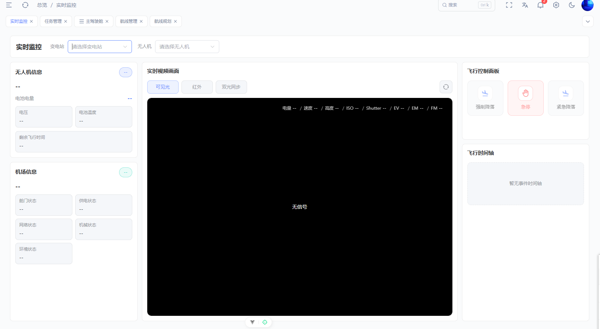
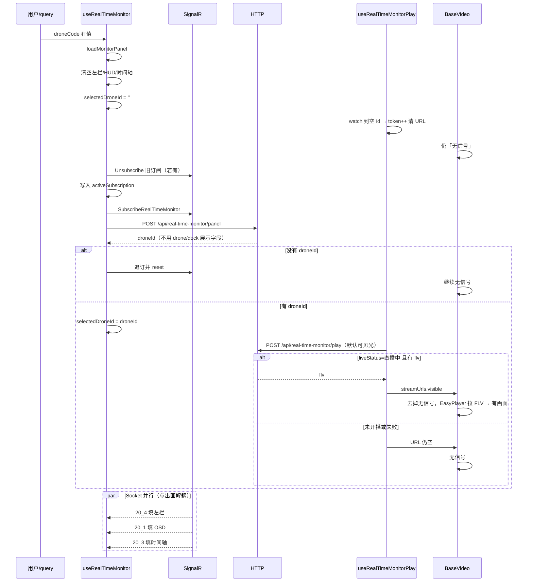
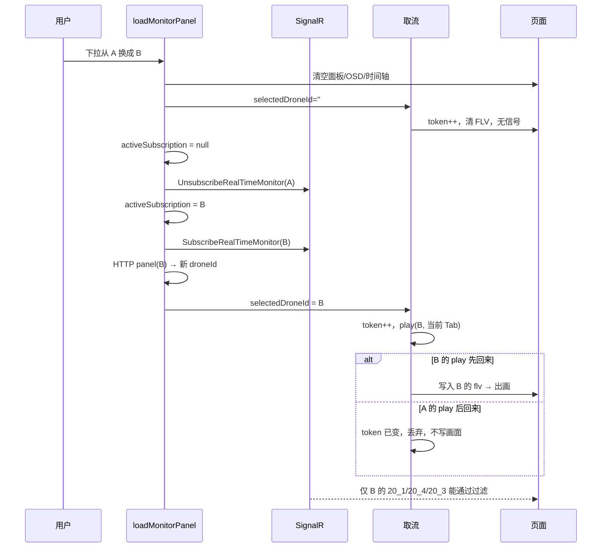
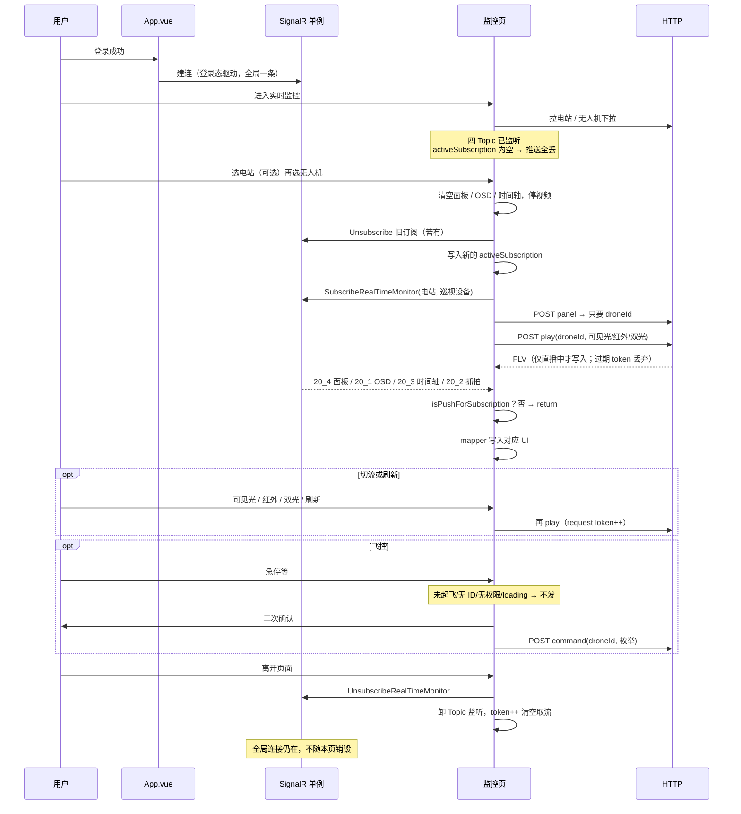

# 学习笔记：飞行实时监控多通道联动



## 通俗讲解（易懂易输出）

核心就一句话：**同一屏只盯一架机，但画面、电量、时间轴、指令不是同一条路来的；切机时旧数据可能后到，所以前端必须自己挡住串台。**

### 先用一个生活比喻

把实时监控想成**看电视直播间**。

1. **插座**（全局 Socket）
   登录就插上电。整栋楼共用这一根线。告警弹窗、监控页都用它。
   进监控页不是去插电，离页也不是拔插座。

2. **频道表**（Topic）
   线上一堆节目：`20_1` 是 OSD 字幕，`20_4` 是左侧卡片，`20_3` 是时间轴。
   模板只负责：来一条消息，按类型喊对应的人。它不管你正在看哪台机。

3. **遥控器当前频道**（`activeSubscription`）
   「我现在看的是：某电站 + 某巡视设备」。
   不是这台的包，直接丢掉。这叫**防串台**。

4. **点播地址**（HTTP play）
   视频不是 Socket 推过来的，是另发 HTTP 要 FLV 地址。
   切红外 = 换一路点播，不等于换频道。

5. **取号条**（`requestToken`）
   你连点两次「换台」，两份地址可能乱序回来。
   只认最新那张号，旧号作废。这叫**防视频串台**。

记住这个比喻，后面都是它的展开。

### 出门能讲的 30 秒版

> 登录建一条全局 SignalR。监控页不另建连接。
> 选无人机后做三件事：Hub 声明盯这台、HTTP panel 只要 `droneId`、HTTP play 去拉当前 Tab 的 FLV。
> 左栏、OSD、时间轴靠 Socket 四条 Topic 填；视频靠 play。
> 切机要退订旧机、订阅新机；切红外只重 play，不重订 Hub。
> 推送用当前订阅过滤，取流用 requestToken 丢过期响应。
> 飞控要过：有 ID、已起飞可飞控、权限、二次确认，成功只提示「指令已发送」。

能把这段背顺，笔记里 80% 的细节都能挂上去。

### 页面上你看见的，其实是四件不同步的事

笔记里叫「四条独立链路」。别记文件名，先记这四问：

| 问题 | 人话 | 走哪 |
| --- | --- | --- |
| 盯谁 | 哪座站、哪架机 | 下拉 + Hub Subscribe + HTTP panel 换 `droneId` |
| 现在怎样 | 电量、舱门、OSD、时间轴 | Socket `20_4` / `20_1` / `20_3` |
| 看哪路画面 | 可见光 / 红外 / 双光 | HTTP play |
| 能不能动手 | 急停、强制降落、紧急降落 | HTTP command |

为什么要拆开？
因为这四件事到达时间不一样。绑在一次 HTTP 里，切红外会把左栏闪空，切机也会把飞控拖死。

所以有两个「态」，面试最爱混：

- **实时态** = 这架飞机现在怎样（跟「盯哪台」走）
- **播放态** = 我此刻看哪路画面（跟 `droneId` + Tab 走）

切红外：实时态不变，只变播放态。
切无人机：两个态都要换。

### 代码怎么分层（讲给别人听）

不要说「Socket 很复杂」。说三层：

1. **连上**
   `App.vue` → `useSystemSocket` → 全局一条 SignalR。登录建、退出毁。

2. **送到哪类业务**
   信封里的 `type_code` 变成 Topic。`20_*` 给监控，`21_1` 给告警。
   分发器不认识「你正在看哪台」。

3. **是不是我正在看的那台**
   监控页自己用 `activeSubscription` 过滤。
   告警页没有这一层：合法告警来了就展示。

监控页内部再拆：

- `index.vue`：只排版
- `useRealTimeMonitor`：选谁、订谁、下指令（改功能先动这里）
- `realTimeMonitorSocket`：推送怎么映射成人话、怎么过滤
- `useRealTimeMonitorPlay`：取流、切流、token

子面板只吃 props，不自己订 Socket。

### 从进页到有画面（按屏幕现象记）

**进页本身不会出画。** 必须先选中无人机。

无 query 时：

1. 进页：四条 Topic 已在听，但「当前盯谁」是空的，推送全丢。中间是「无信号」。
2. 拉电站列表、无人机列表，只填下拉。
3. 你选一架机，才进入主链路。

有 `?stationCode=&droneCode=`：等同手动选机，后面一样。

选机之后，屏幕大概是这样变的：

1. 左栏、HUD、时间轴立刻清空成 `--`（防止 A 的数据留在 B 上）
2. 画面立刻回「无信号」（`droneId` 先被置空，旧视频停掉）
3. 告诉 Hub：我要盯这台
4. HTTP panel **只要** `droneId`（不要用它填左栏）
5. 有了 `droneId`，play 去要 FLV
6. 只有「直播中 + 有 flv」才真正出画
7. 左栏、OSD、时间轴是 Socket 另路填的，可能比视频早，也可能晚

易混点：**有画面 ≠ 左栏亮了。**
有画面只看 play 地址；左栏亮看 `20_4`。代码不保证谁先到。

### 切机 vs 切红外（一张嘴就能分清）

**切无人机 = 换人看。**
退订 A，订阅 B，`droneId` 先清空再换成 B，视频必断一下，左栏先空再等 B 的推送。

**切红外 = 同一人换镜头。**
Hub 订阅不动，左栏/OSD/时间轴继续显示这台，只按新 `mediaType` 再 play 一次。

切变电站更狠：无人机选择被清空，面板重置，**此时不会出画**，必须再选一架机。

### 四个重难点，改成「问题 → 答案」

#### 1. 旧 OSD 为什么盖不住新机？

因为 Hub 可能把多台推到同一条连接上。
前端不相信「订阅成功就只推这一台」。

闸门是：`isPushForSubscription`。
对不上当前 `电站 + 巡视设备`，第一行就 `return`。
换机瞬间还会先把订阅上下文置成 `null`，旧包全部对不上。

口诀：**Hub 订阅 = 请多推这台；页面过滤 = 只画这台。**

#### 2. 为什么选机后左栏先空一会儿？

HTTP panel 里其实有 drone/dock 展示字段，但代码故意不用。
电量、舱门飞行中一直在变。如果 HTTP 先填满，Socket 再盖一层，两套源会抢写，切机时空态也不干净。

所以：panel 只换取流身份（`droneId`），人话展示等 `20_4`。

口诀：**HTTP 换身份证，Socket 填成绩单。**

#### 3. 旧视频地址后回来，为什么不改画面？

切机、切 Tab 都会连续发多次 play，返回可能乱序。

每次取流把 `requestToken` 加一，这次请求在闭包里记下自己的号。
回来一看号对不上最新号，直接丢。

口诀：**视频串台靠取号，不是靠少建连接。**

#### 4. 飞控为什么不能点了就打接口？

强制降落、急停不可逆。前端也不知道飞机有没有真的执行完。

能发 = 有 `droneId` + 飞控已解锁 + 按钮权限 + 二次确认 + 发送中不能连点。
HTTP 成功只说「指令已发送」，不说「已经降落成功」。

另外：模板 key 叫 `takeoff`，映射的其实是**强制降落**，不是起飞。

### 四条 Topic 怎么记

别记数字，记「更新哪块」：

- `20_1`：画面上的 HUD（电量、速度、高度）
- `20_2`：抓拍结果（代码还在写，页面没挂，面试要主动说）
- `20_3`：右侧时间轴，整表替换
- `20_4`：左栏无人机/机巢 + 飞控能不能点

视频和控制都不是 Topic，是 HTTP。

### 和告警弹窗对比（用来证明你真懂分层）

告警：订 1 个 Topic，来一条合法的就展示，不声明「看哪台」。
监控：订 4 个 Topic，先声明看哪台，再过滤、取流、下指令，还要防串台。

同一根线，两种消费者。

### 方案为什么长这样（面试「为什么」）

PRD 要的是：同一屏盯一架正在飞的机，左状态、中画面、右指令同时在，飞控未起飞不能点。

所以方案不是从 Socket 倒推的，是从这几条压出来的：

- 展示、取流、指令不能绑成一次 HTTP
- 切红外不能当成换设备
- 乱序到达必须前端自己挡
- 指令成功 ≠ 飞机已经执行完

现在没做、但结构已经留口的：

- 抓拍区：通路在，UI 注释掉了
- 飞行路径小窗：组件在，没挂
- 机场画面：以后是第二种**画面源**，不是第四个视频 Tab；只换中间和右侧，左栏和 Hub 订阅不动

### 合上书四句（建议原文能背）

1. 多源状态在 `useRealTimeMonitor` 收敛
2. 推送用订阅上下文过滤
3. 取流用 `requestToken` 丢过期响应
4. 控制指令过可用性门槛和二次确认才下发

### 自己输出时的填空稿

下次别人问「实时监控怎么做的」，按这个顺序说，不容易卡：

1. **一屏盯一架机**，但状态、画面、指令不是一条请求。
2. **Socket 全局一条**，监控页只订阅/退订，不自建连接。
3. **选机**：清空 → 订阅 → panel 拿 `droneId` → play 出画；左栏等 `20_4`。
4. **切红外只换流，切机才换订阅。**
5. **两道闸**：订阅过滤挡旧 OSD/面板，token 挡旧 FLV。
6. **飞控**：能点才发，发出去只报已发送。
7. **抓拍/路径/机场画面**现在没挂或没做，不是漏想，是砍在产品增量上。

---

## 模拟口述 2 分钟

按正常语速大约 2 分钟。按段落换气，中间不用看后面的详细笔记。

实时监控这一页，说白了就是：**同一屏只盯一架正在飞的无人机**。左栏看飞机和机巢状态，中间看画面，右边能下急停、强制降落。但这三块不是一次接口拿回来的，所以不能当成一张报表来做。

Socket 是登录就建好的，全局只有一条 SignalR。告警弹窗和监控页共用。进监控页不是去建连，离开也不是拆连接，只退本页订阅。

用户选中无人机之后，页面做三件事。第一，跟 Hub 声明：我盯的是这座电站、这台巡视设备。第二，打 HTTP panel，几乎只拿走 `droneId`。第三，用这个 ID 去 play，拉当前 Tab 的 FLV。左栏、OSD、时间轴是 Socket 另路推上来的。所以**进页本身不会出画**，必须先选机。有没有画面，只看 play 是不是直播中并且有 flv；左栏亮不亮，看面板推送到没到。这两件事常常一前一后，代码不保证谁先到。

这里最容易混的是两个态。**实时态**是这架飞机现在怎样，跟「盯哪台」走；**播放态**是我看哪路画面，跟 `droneId` 加当前 Tab 走。所以切红外不要重订 Hub，左栏也不会闪空。切无人机才是换人看：要退订旧机、订阅新机，画面会先断一下，左栏会先空再等新机推送。

难点是推送和取流都会乱序。快速切机时，A 的 OSD、A 的视频地址都可能后到，写到 B 上就是串台。我们用两道闸。推送对不上当前订阅就丢掉，换机瞬间还会先把订阅置空。取流每次加一个 `requestToken`，过期响应不写画面。Hub 订阅只是请后端多推这台，真正只画这台的是前端过滤。

飞控是不可逆动作。能点要同时过：有 ID、已经起飞可飞控、有按钮权限、二次确认。HTTP 成功只提示「指令已发送」，不假装飞机已经降落。另外抓拍这条链路代码还在，页面没挂，这个要主动说清。

**卡住时就回这四句：**
多源状态收口到一个 hook；推送用订阅过滤；取流用 token 丢过期响应；指令过门槛和确认才下发。

---

> 对照手册第二节第 1 条 + 阶段 3。基于仓库真实代码整理，模板 Socket 与监控页业务分开记。  
> 证据主路径：`useRealTimeMonitor.ts` · `realTimeMonitorSocket.ts` · `useRealTimeMonitorPlay.ts`  
> PRD：[无人机实时监控](https://gcnbiesdw4br.feishu.cn/wiki/O5M9woOomiOR9JkVOvmcQZd1nfg)（修订 221）。需求 → 方案 → 实现对照见第 12 节。

**合上书四句：** 多源状态在 `useRealTimeMonitor` 收敛；推送用订阅上下文过滤；取流用 `requestToken` 丢过期响应；控制指令过可用性门槛和二次确认才下发。

---

## 1. 代码地图

分层：**模板 Socket 负责「一条连接、按 Topic 分发」；监控页负责「选哪台、过滤杂讯、合并多块 UI、取流、下指令」。** 不要把后者说成模板独创。

```text
App.vue
  └─ useSystemSocket()                    登录即建连、退出即销毁（全局单例）
       └─ src/utils/socket/index.ts       SignalR 单例：解包信封 → type_code → Topic
            ├─ topics.ts                  Topic 名（20_1~20_4、21_1…）
            └─ dispatcher.ts              内存发布订阅，不认业务身份

对照简单消费者
  useNotificationRealtime.ts              只订 21_1，校验告警 DTO 后塞 store/弹窗

实时监控页
  index.vue                               薄编排：toolbar + 左卡片 + 视频 + 控制/时间轴
       ├─ useRealTimeMonitor.ts           业务状态 / 订阅 / 指令（改功能先动这里）
       ├─ realTimeMonitorSocket.ts        推送映射 / Hub 方法 / 串台过滤
       ├─ useRealTimeMonitorPlay.ts       取流 / 切流 / requestToken
       └─ 子面板（只吃 props）
            ├─ monitor-toolbar.vue        选变电站 / 无人机
            ├─ drone-info-card.vue        无人机面板
            ├─ dock-info-card.vue         机巢面板
            ├─ video-panel/**             Tab + HUD + BaseVideo
            ├─ flight-control-panel.vue   强制降落 / 急停 / 紧急降落
            ├─ flight-timeline-panel.vue  时间轴
            ├─ capture-result-panel.vue   抓拍组件在，入口已注释
            └─ monitor-panel.vue          卡片壳

HTTP（src/api/real-time-monitor.ts）
  panel   → 只要 droneId（展示字段走 Socket）
  play    → FLV
  command → 飞控
  另：fetchGetStationList / fetchGetDroneList 填下拉
```

| 想改什么 | 先动哪 |
| --- | --- |
| 进页布局 | `index.vue` |
| 选设备后发生什么、指令确认 | `useRealTimeMonitor.ts` |
| 推送 → 展示字段 | `realTimeMonitorSocket.ts` |
| 切流 / 视频串台 | `useRealTimeMonitorPlay.ts` |
| 按钮权限、禁用文案 | `flight-control-panel.vue` + `FLIGHT_DASHBOARD_AUTH_CODE` |
| Topic 名 / 谁能收到消息 | 模板层 `topics.ts` + `socket/index.ts`（监控页不要另建连接） |

**代码里已确认的边界：**

- 静态路由文件里没有本页；E2E 路径为 `/flightDashboard/realTimeMonitor`（动态菜单）。
- HTTP `panel` 只用于取 `droneId` 和订阅上下文，机巢/无人机展示靠 `20_4`。
- Topic `20_2` 仍写入 `captureResults`，但 `index.vue` 注释掉了抓拍面板，当前 UI 不可见。
- 进页可用 URL query：`stationCode` / `droneCode` 预填下拉。

---

## 2. 用户操作流

登录就把全局 Hub 连上；进监控页只是「选设备 → 声明看哪台 → 过滤推送填 UI」。离页退的是监控订阅，不是整条 Socket。

1. **登录（未进页）**  
   `App.vue` 的 `useSystemSocket` 见已登录 + token，建唯一 SignalR。告警弹窗、监控页共用。

2. **进页**  
   拉电站/无人机列表。四条 Topic 已监听，但 `activeSubscription` 为空，推送全部丢掉。  
   可选：`?stationCode=&droneCode=` 等同手动选一遍。

3. **选变电站**  
   清空当前无人机、退旧订阅、面板/OSD/视频归空，再按电站重拉无人机。

4. **选无人机（开始盯这台）**  
   先清空展示并停视频 → Hub `SubscribeRealTimeMonitor(电站, 巡视设备)` 并写入 `activeSubscription` → HTTP panel 抽出 `droneId` → HTTP play 要可见光 FLV。

5. **看面板 / OSD / 视频（三路并行）**

   | 看见的 | 谁在喂 |
   | --- | --- |
   | 左：无人机 / 机巢 | Topic `20_4` |
   | 视频 OSD | Topic `20_1` |
   | 画面 | HTTP play 的 FLV（仅 `liveStatus=直播中` 且有 flv） |

   实时态（推送填卡片/HUD/时间轴）和播放态（取流地址）两套：切流只改视频请求，不重订 Hub。

6. **抓拍 / 时间轴**  
   `20_3` 整表替换右侧时间轴。`20_2` 仍写内存，页面未挂载抓拍区；导出按钮在组件里是「功能暂未开发」。

7. **控制指令**  
   同时过：有 `droneId`、`flightControlEnabled`、按钮权限。急停 danger 确认，强制降落/紧急降落 warning 确认。HTTP `command` 成功只提示「指令已发送」。  
   模板 key `takeoff` 映射的是 **强制降落**，不是起飞。

8. **离开**  
   `UnsubscribeRealTimeMonitor`；取流 `requestToken++` 清空地址；Topic 监听随页卸载。全局连接仍在。

---

## 2.1 进页到有画面（逐步）

结论先记：**进页本身不会出画。** 必须先有选中的无人机（手选或 URL query），再拿到 `droneId`，再 `play` 到「直播中 + flv」，`BaseVideo` 才摘掉「无信号」去播。左栏/OSD 是 Socket 另路填的，**不是出画的前提**。

默认 Tab 是可见光（`activeStream = 'visible'`）。

### 你在屏幕上会看到什么

| 阶段 | 顶栏 | 左栏 / HUD / 时间轴 | 中间画面 |
| --- | --- | --- | --- |
| 刚进页、还没选机 | 下拉在加载或已列出 | `--`、空时间轴 | 「无信号」 |
| 已选机、panel 进行中 | 已选中 | 被清空成 `--` | 仍无信号（`droneId` 被先置空，取流停掉） |
| 已有 `droneId`、play 进行中 | 已选中 | 可能仍空，等 `20_4` / `20_1` | 刷新按钮转圈（`isStreamLoading`） |
| play 成功且直播中 | 已选中 | 推送到了就会亮 | FLV 开始播，无信号层消失 |
| play 成功但未开播 / 无 flv | 已选中 | 推送照样可以填 | 地址被映射成空，**继续无信号** |

### 无 query：手动选机才出画

```text
进页 setup
  ├─ 四条 Topic 已监听（activeSubscription=null → 推送全丢）
  ├─ 画面已挂 BaseVideo，streamUrls 为空 → 显示「无信号」
  └─ watch(droneCode) 没有 immediate，droneCode 仍是 '' → 不会 loadMonitorPanel

onMounted
  ├─ GET 电站列表 → 填变电站下拉
  ├─ 若 URL 有 stationCode，此时写入（station watch 因 isStationOptionsReady 仍 false 被跳过）
  ├─ isStationOptionsReady = true
  └─ GET 无人机列表（有电站则按站过滤）→ 只填下拉，不出画

用户点选无人机 → droneCode 变化 → 进入下面「出画主链路」
```

依据：`useRealTimeMonitor.ts` 的 `onMounted`、`watch(droneCode)`（无 `immediate`）。

### 有 query：`?stationCode=&droneCode=`

`onMounted` 末尾写入 `droneCode`，效果等同手动选机，随后走同一条出画主链路。  
写入电站时 `isStationOptionsReady` 还是 false，**不会**先被 `watch(stationCode)` 清掉无人机。

### 出画主链路（选机之后）



逐步对应代码：

1. `loadMonitorPanel`：用当前下拉项拼 `stationCode` + `patrolDeviceCode`；拼不出就退订并 `resetMonitorPanel`。
2. 先 `clearPanelDisplay`，再 `selectedDroneId = ''`。空 id 会触发 `useRealTimeMonitorPlay` 的 `watch`：`requestToken += 1` 并清空 `streamUrls`。
3. `subscribeCurrentMonitor`：声明看这台。
4. `fetchGetRealTimeMonitorPanel` → `extractPanelDroneId`。没有 id：提示「未获取到无人机 ID」，退订、画面保持无信号。
5. `selectedDroneId = droneId` → `watch([selectedDroneId, activeStream])` → `fetchRealTimeMonitorPlay`。
6. `mapPlayResponseToStreamUrls`：只有 `liveStatus === Live` 且 `flv` 有值才写入地址。
7. `video-panel` 把 `streamUrls` 交给 `BaseVideo`；`hasStreamUrl` 为真才去掉「无信号」遮罩，`BaseVideoStreamPlayer` / EasyPlayer 按 flv 播放。

**易混：** 「有画面」只取决于 play 地址；左栏亮起来取决于 `20_4`。两件事常常一前一后，没有代码规定谁先到。

---

## 2.2 切换无人机（页面怎么变）

结论：**换机 = 再跑一遍 `loadMonitorPanel`。** 先把 A 的身份、画面、面板清掉，再给 B 订阅、换 `droneId`、重新 play。切的是无人机，不是红外 Tab，所以 **Hub 要退订 A、订阅 B**；`activeStream` 默认仍停在可见光（除非你已经切过 Tab，会带着当前 Tab 去 play B）。

### 屏幕变化顺序

| 顺序 | 页面现象 | 原因 |
| --- | --- | --- |
| 1 | 下拉已是 B | `droneCode` 已改 |
| 2 | 左栏/HUD/时间轴立刻变 `--`、空 | `clearPanelDisplay` |
| 3 | 画面立刻回到「无信号」 | `selectedDroneId = ''` → 取流清空；`stopVideoStream` 也会在失败路径里出现 |
| 4 | 飞控不可用 | 没有 `droneId`，或新面板尚未把 `flightControlEnabled` 推成 true |
| 5 | A 的迟到 OSD/面板不会写上来 | 先把 `activeSubscription` 置 `null`，旧包过滤失败 |
| 6 | 刷新按钮转圈 | 新 `droneId` 触发 play |
| 7 | B 的画面出现 | B 的 play 返回直播 flv |
| 8 | B 的左栏/OSD/时间轴陆续亮 | `20_4` / `20_1` / `20_3` 且通过 `isPushForSubscription` |

### 切机链路



逐步对应代码：

1. `watch(droneCode)` → `loadMonitorPanel`（`useRealTimeMonitor.ts`）。
2. 用 B 的下拉项解析订阅参数；B 缺电站或 `patrolDeviceCode`：退订 A + `resetMonitorPanel`（画面停、id 空），结束。
3. 不管是不是同一台，都会先清展示、先把 `selectedDroneId` 置空（视频必断一下）。
4. `subscribeCurrentMonitor`：若 A、B 订阅对相同则 **不再调 Hub**；否则先 `unsubscribeCurrentMonitor`（**先置空上下文再** `UnsubscribeRealTimeMonitor`），再订阅 B。
5. 再打 panel 换 B 的 `droneId`；失败则退订并 `resetMonitorPanel`（内部 `stopVideoStream` 再 `token++`）。
6. 新 id 触发 play；`requestToken` 让 A 的迟到 FLV 不能盖住 B。
7. Socket 与画面并行：B 的推送填侧栏；A 的推送对不上 `activeSubscription` 被丢掉。

### 和「切红外」对比（避免和切机搞混）

| | 切无人机 | 切可见光 / 红外 / 双光 |
| --- | --- | --- |
| `droneCode` / `activeSubscription` | 要换 | 不换 |
| Hub Subscribe/Unsubscribe | 要（A→B） | 不要 |
| `selectedDroneId` | 先清空再换成 B | 不变 |
| 取流 | 必停再 play B | 只按新 `mediaType` 再 play |
| 左栏 / OSD | 先空，等 B 的 Topic | 继续显示当前机 |

### 顺带：切变电站

`watch(stationCode)` 在选项就绪后会：`droneCode = ''` → 退订 → `resetMonitorPanel`，再按新站拉无人机列表。`droneCode` 被清空也会再进一次 `loadMonitorPanel`（参数拼不出，等于再清一遍）。**此时不会出画**，要再选一架无人机才走 2.1 的出画主链路。

---

## 3. 重难点（4 条）

### 3.1 订阅过滤（防串台第一道闸）

Hub 可能把多台设备的推送送到同一条连接；页面只认当前声明在看的那一对。

- `activeSubscription`：当前 `stationCode` + `patrolDeviceCode`。
- 四条 Topic 回调第一行：`isPushForSubscription`，对不上 `return`。
- 换机先把上下文置 `null` 再退订，再写入新上下文。
- payload 里电站/设备字段为空时 **放行**（只挡「有值且对不上」）。`activeSubscription` 为空时一律拒绝。

依据：`useRealTimeMonitor.ts` 约 78～90、160～172 行；`realTimeMonitorSocket.ts` 的 `isPushForSubscription`。

**新人易错：** 以为 `SubscribeRealTimeMonitor` 成功后后端就只会推这一台。Hub 订阅是「请多推这台」，前端过滤才是「只画这台」。

**合上书记住：** 串台不是靠少建 Socket 防的，是靠当前订阅上下文丢杂讯。

### 3.2 DTO 映射

接口给原始数值，卡片/HUD 要带单位的文案。HTTP panel 不负责填展示。

- 电压 ÷1000 加 `V`；剩余飞行秒数 → 分钟；时间轴 `1/2/3` → `arrived/executing/pending`。
- OSD 只喂 HUD；面板推送才喂左右卡片。
- `extractPanelDroneId`：只要 id。

依据：`realTimeMonitorSocket.ts` 的 `mapPanelDroneToInfo`、`mapOsdToVideoHud`、`extractPanelDroneId`。

**新人易错：** 以为选机后 HTTP panel 会填满左栏。左栏空着等 `20_4` 是设计。

**合上书记住：** HTTP panel 换取流身份，Socket mapper 换人话展示。

### 3.3 `requestToken`（取流竞态）

切机或切可见光/红外/双光时，多次 play 会乱序返回。

- 每次取流 `++requestToken`，闭包留下本次 `token`。
- 回来若 `token !== requestToken` 直接丢弃。
- `stopVideoStream` / 无 droneId 也会先 `+1` 再清 URL。

依据：`useRealTimeMonitorPlay.ts` 的 `fetchPlayStream`、`stopVideoStream`。

双光：有 `items` 则拆可见光/红外两路；没有则播顶层一条 flv。

**合上书记住：** 视频串台靠「这次响应还是不是最新那次请求」。

### 3.4 命令确认 / 状态机

能发指令 = 有身份 + 飞控解锁 + 权限 + 二次确认 + 发送中互斥；前端不承诺执行结果。

- 禁用：`!selectedDroneId` 或 `!flightControlEnabled`（文案：无人机未起飞）。
- `takeoff` → `ForcedLanding = 1`；急停 = 2；紧急降落 = 3。

依据：`useRealTimeMonitor.ts` 的 `flightControlDisabled`、`handleControlAction`、`CONTROL_COMMAND_MAP`。

---

## 4. 实时链路时序



默画线：**建连（全局）→ 选机 → 声明订阅 → 推送过滤写 UI → HTTP 取流/下指令 → 离页只退订阅。**

---

## 5. 本页 Topic 一览

对照 `src/utils/socket/topics.ts`。`21_1` 告警、`19_*` 传输中心 **本页未订**。

| 常量 | 值 | 更新哪块 | mapper |
| --- | --- | --- | --- |
| `REAL_TIME_MONITOR_OSD` | `20_1` | 视频 HUD | `mapOsdToVideoHud` |
| `REAL_TIME_MONITOR_CAPTURE` | `20_2` | `captureResults`（当前 UI 未挂） | `mapCapturePushItem` |
| `REAL_TIME_MONITOR_TIMELINE` | `20_3` | 右侧时间轴（整表替换） | `mapTimelinePushItem` |
| `REAL_TIME_MONITOR_PANEL` | `20_4` | 左栏卡片 + `flightControlEnabled` | `mapPanelDroneToInfo` / `mapPanelDockToInfo` |

信封缺 `type/code` 时，模板 `socket/index.ts` 看到 `osd/item/items/drone|dock` 会猜成 `20` + `1/2/3/4`。这是模板兜底，不是监控独创。

| 时机 | Hub 方法 | 参数 |
| --- | --- | --- |
| 选中有效无人机 | `SubscribeRealTimeMonitor` | `stationCode`, `patrolDeviceCode` |
| 换机、清选择、无 droneId、失败、离页 | `UnsubscribeRealTimeMonitor` | 同上 |

视频和控制不是 Topic：`POST /api/real-time-monitor/play`、`POST /api/real-time-monitor/command`。

---

## 6. 两个「态」（面试易混）

| | 实时态 | 播放态 |
| --- | --- | --- |
| 人话 | 这架飞机现在怎样 | 我此刻看哪路画面 |
| 例子 | 电量、速度、舱门、时间轴 | 可见光 / 红外 / 双光 FLV |
| 跟谁走 | 盯的是哪台（电站 + 巡视设备） | `droneId` + 当前 Tab |
| 渠道 | Socket 四 Topic | HTTP `play` |
| 切红外 | **不变** | **要变**（换一路流） |

切红外：**不要**重订 Hub、**不要**换 `activeSubscription`。OSD、左栏、时间轴不变；变的是 `streamUrls` 和 Tab。

---

## 7. 三层分工（模板 + 业务）

「一层管连上、一层管送到哪类业务、一层管是不是我正在看的那台。」

| 层 | 防什么 | 没有它会怎样 | 路径 |
| --- | --- | --- | --- |
| 单例 Hub | 连接生命周期只维护一份 | 每页各自重连、解包、带 token | `App.vue` → `useSystemSocket.ts` → `socket/index.ts` 的 `getInstance` |
| Topic 分发 | 消息按 `type_code` 叫醒对应消费者 | 告警和监控都得自己拆信封、自己 if | `dispatchBusinessMessage` → `dispatcher.ts` |
| 业务过滤 | **串台** | 旧设备 OSD/面板写进新机位 | `activeSubscription` + `isPushForSubscription` |

单例的价值以本仓库代码为准：登录建、退出毁、解包/重连一份。不要把「后端扛不住」当成已证实结论。

Hub `SubscribeRealTimeMonitor` = 请后端多推这台；页面过滤 = 只画这台。不要说成空洞的「双重防护」。

---

## 8. 告警弹窗 vs 实时监控

| | 告警 `useNotificationRealtime.ts` | 监控 `useRealTimeMonitor.ts` |
| --- | --- | --- |
| Topic | 1 个：`21_1` | 4 个：`20_1`～`20_4` |
| 「当前看谁」过滤 | 无。校验告警 DTO（id、level），再按等级/弹窗是否打开 | 有。`isPushForSubscription` |
| 状态规模 | 往 store / 弹窗列表插一条 | 左栏 + HUD + 三路视频 + 时间轴/飞控 + 取流 + 指令 |
| Hub 声明设备 | **不要**。全局连着就能收 `21_1` | **要**。选机订阅、换机/离页退订 |

一句话：告警是「来一条合法告警就展示」；监控是「先声明看哪台，再把四路推送和取流、指令收口到同一屏，还要防串台」。

---

## 9. 口述卡（背景 → 方案 → 结果）

**背景**  
实时监控要在同一屏盯一架正在飞的无人机：左栏机巢/飞机状态、画面上的 OSD、可见光/红外/双光视频、右侧时间轴，必要时下发急停、强制降落、紧急降落。难点是推送和 HTTP 都会乱序到达——快速切机时，旧 OSD、旧面板、旧 FLV 都可能后到，写进新机位就是串台。控制指令不可逆，不能按钮在就直接打接口。

**方案**  
Socket 是模板基建：登录建一条 SignalR，按 `type_code` 分成 Topic。监控页在这之上：`useRealTimeMonitor` 把多块 UI 收口；选机后 `SubscribeRealTimeMonitor`，用 `activeSubscription` + `isPushForSubscription` 丢掉不是当前电站/设备的包。HTTP panel 几乎只换 `droneId`，卡片和 HUD 等 Socket 映射后再展示。取流在 `useRealTimeMonitorPlay`：切机、切流都带 `requestToken`，过期响应丢弃。飞控要过「有 ID、已起飞可飞控、权限、二次确认、发送中互斥」，成功只报「指令已发送」。

**结果**  
实时态与播放态解耦，切流不必重订 Hub。切换设备时面板和视频不容易串台。抓拍链路在订阅和状态里还在，当前 UI 未展示——面试要主动说清。

**避免串台（追问锚点）：**  
换机时先把 `activeSubscription` 置空（`unsubscribeCurrentMonitor`），旧推送对不上就被滤掉；旧取流靠发出时的本地 `token` 对比最新 `requestToken` 作废。过滤要比电站 **和** 巡视设备编码。

---

## 10. 合上书自测（先自己答）

1. 连续快速切换两架无人机，旧 OSD 为什么不该盖住新面板？挡住它的是哪一段？
2. 为什么选机后左栏可能先空一会儿，要等面板推送而不是用 HTTP panel 的 drone/dock 填满？
3. 切「红外」时，Hub 订阅要不要重做？若旧的可见光 play 后返回，代码凭什么不改画面？
4. PRD 第 12 章机场画面「只改中间和右侧」。按现有方案，为什么不该把它做成第四个视频 Tab？左栏和 Hub 订阅动不动？

自测提示（核对用，先闭卷）：

1. `isPushForSubscription` 对不上当前 `activeSubscription` 则 return；换机瞬间上下文已是 `null`。文件：`useRealTimeMonitor.ts` 回调第一行 + `realTimeMonitorSocket.ts`。
2. HTTP panel 只抽 `droneId`；展示走 `20_4` mapper。选机后先空是为了避免 HTTP 快照和 Socket 抢写。
3. 不重订 Hub。`token !== requestToken` 则不写 `streamUrls`。
4. 可见光/红外/双光是无人机镜头（播放态）；机场是另一种画面源。Hub 和左栏继续跟「盯哪台」，只换中间 URL 和右侧按钮组。见第 12.5 节。

---

## 11. 路径速查

| 角色 | 路径 |
| --- | --- |
| 页面入口 | `src/views/flight-dashboard/real-time-monitor/index.vue` |
| 状态收敛 | `.../modules/useRealTimeMonitor.ts` |
| 过滤 / mapper / Hub | `.../modules/realTimeMonitorSocket.ts` |
| 取流 | `.../modules/useRealTimeMonitorPlay.ts` |
| Topic | `src/utils/socket/topics.ts` |
| 分发 | `src/utils/socket/dispatcher.ts` |
| 单例连接 | `src/utils/socket/index.ts` |
| 登录建连 | `src/hooks/core/useSystemSocket.ts`（`App.vue` 调用） |
| 页面订阅卸载 | `src/hooks/core/useSocketSubscribe.ts` |
| 告警对照 | `src/components/core/layouts/art-notification/hooks/useNotificationRealtime.ts` |
| API / 类型 | `src/api/real-time-monitor.ts` · `src/types/api/real-time-monitor.ts` |
| PRD | [无人机实时监控 Wiki](https://gcnbiesdw4br.feishu.cn/wiki/O5M9woOomiOR9JkVOvmcQZd1nfg) |

---

## 12. 从 PRD 到实现的方案过程

PRD 写的是「这一屏盯一架正在飞的机」：左卡片、中视频、右飞控/时间轴。代码没有按文档章节一一铺组件，而是先压出四条约束，再拆成四条独立链路。第 1～11 节讲链路怎么跑；这一节讲**为什么长这样、哪些是有意延期**。

**合上书：** PRD 定布局和禁区；方案把「盯谁 / 现在怎样 / 看哪路画面 / 能否下指令」拆开；页面只编排。采集结果、路径小窗、机场画面不是漏想，是砍在数据通路或产品增量上。

### 12.1 PRD 压出来的约束

方案不是从 Socket 倒推的，是从这几条压出来的：

| PRD 约束 | 对实现的含义 |
| --- | --- |
| 同一屏集中展示，不新增未定义模块 | 三栏固定；禁止平行再做地图/航线规划/告警分析 |
| 不展示无人机编号 | 左栏只用名称；下拉 value 虽是 SN，界面 label 走名称 |
| 左栏实时值、中栏画面、右栏指令同时在 | 展示、取流、指令不能绑成一次 HTTP |
| 飞控不可逆，未起飞不可点 | 可用性门槛 + 二次确认；前端不假装「已经降落成功」 |
| 双光是左右双屏，不是第三路神秘协议 | `play` 的 Dual 要么设备侧已合成一路 flv，要么返回 `items` 给前端分屏 |
| 第 12 章起机场画面「只改中间和右侧」 | 左栏身份不能跟画面源绑死；现在还没做这一章 |

顶栏「变电站 / 无人机」PRD 布局表没写。多站多机必须先回答「盯谁」，所以方案多了一层选设备；`?stationCode=&droneCode=` 给任务页跳转。这是实现补的入口，不是文档推导出来的新模块。

### 12.2 方案怎么拆（考虑过程）

核心判断：**实时监控不是一张报表，是四件不同步的事。** 绑在一次请求里，切机、切流、飞控任意一件都会把另外三件拖垮。

```text
盯谁（身份）     HTTP panel → droneId + Hub Subscribe(电站, 巡视设备)
现在怎样（实时态） Socket 20_4 左栏 / 20_1 OSD / 20_3 时间轴 / 20_2 抓拍
看哪路（播放态）   HTTP play(droneId, 可见光|红外|双光) → FLV
能否动手（指令）   有 ID + 已起飞可飞控 + 权限 + 确认 → POST command
```

| 当时要拍板的问题 | 没选的路 | 选了的路 | 代码落点 |
| --- | --- | --- | --- |
| 状态放哪 | 每个卡片自己订 Topic | `index.vue` 只排版，状态全进 `useRealTimeMonitor` | `index.vue` 约 12～29 行 |
| 左栏用 HTTP 快照还是推送 | panel 里已有 drone/dock，选机后直接填 | panel **只抽 `droneId`**，展示等 `20_4` | `extractPanelDroneId`；API 注释写明 |
| 切红外要不要重订 Hub | 切 Tab 当作换设备 | 实时态跟「盯哪台」，播放态跟「哪路 FLV」 | 第 6 节两个态 |
| 双光怎么播 | 前端永远左右两路硬拆 | 有 `items` 才分屏；否则播顶层一路合成 flv | `mapPlayResponseToStreamUrls`、`BaseVideo` 的 `useFrontendSplit` |
| 乱序推送/乱序 play | 相信后端只会推当前机 | 订阅过滤挡 OSD/面板；`requestToken` 挡 FLV | 第 3.1、3.3 节 |
| 指令成功指什么 | 等 DJI 执行完再 Toast「操作成功」 | HTTP 受理即「指令已发送」，不承诺落地 | `handleControlAction` |
| 抓拍区现在做不做 | 和视频一起上 | 通路保留（`20_2` + 组件），`index.vue` 注释掉挂载；导出仍是「功能暂未开发」 | `capture-result-panel.vue` |

**为什么 HTTP panel 有展示字段却不用：** 电量、舱门会在飞行中一直变。若选机时用 HTTP 填满左栏，下一秒 Socket 再盖一层，两套源会抢写，切机时空态也不干净。代价是选机后左栏先 `--`，要等第一包 `20_4`——这是设计，不是接口没返回。

**为什么指令只报「已发送」：** 强制降落/急停是不可逆动作，执行在机侧，HTTP 200 只表示受理。PRD 第 6 章写「顶部 Toast 提示成功」，第 16 章（机场）才把 `ok` 定义为成功。当前飞控按「发送成功」实现，和文档字面不完全同句，但避免了「按钮绿了飞机还在飞」。

**为什么确认文案是通用句：** PRD 第 6 章给了强制降落/紧急降落的风险说明。实现里急停用 `artConfirm.danger`，另外两个用 `warning`，正文统一是「确定要执行「xx」操作吗？」。门槛和二次确认在，风险原文还没灌进去。

### 12.3 有无对照（文档明确写了的）

只对照 PRD 写明的块。未写的顶栏下拉不记作缺口。

| PRD | 现状 | 说明 |
| --- | --- | --- |
| 三栏：左无人机/机场、中视频+采集、右飞控+时间轴 | 有 | `index.vue` grid；采集区组件在、挂载被注释 |
| 无人机：名称、状态、电量、电压、温度、剩余飞行时间；不展示编号 | 有 | `drone-info-card`；离线 `--` 靠空值和 mapper |
| 机场：名称、机场/舱门/供电/网络/机械/环境状态 | 部分 | 字段齐；PRD 要求异常样式对齐机场管理页，卡片里状态标签写死 `success`/`primary`，没有按枚举上色 |
| 视频 Tab：可见光 / 红外 / 双光左右屏 | 有 | 默认可见光；双光兼容合成流和 `items` 分屏 |
| 顶部 HUD：电量、速度、相对高度 m、ISO、Shutter、EV、EM、FM | 有 | `20_1` → `video-hud-bar` |
| 飞行路径小窗：左上角半透明示意，不做成完整地图 | 未挂 | `flight-path-mini.vue` 和 `FlightPathPoint` 在，`video-panel` 未引用，也没有推送路径点 |
| 截图、刷新、放大全屏三个按钮；截图只截视频区、jpg 下载 | 部分 | 刷新在视频工具条；`BaseVideo.takePlayerScreenshot` 已暴露但页面未接；没有独立截图/全屏按钮。双光截图当前直接返回空串 |
| 空画面文案 | 部分 | 播放器统一「无信号」；PRD 第 12 章是「无人机暂无画面 / 机场暂无画面」 |
| 采集结果：空态、倒序横滑、缩略图、ZIP 导出 | 通路在、UI 不可见 | `20_2` 仍写 `captureResults`；导出按钮提示未开发 |
| 飞控三按钮；未起飞置灰+文案；二次确认 | 部分 | 按钮、置灰、权限码齐；确认文案未用 PRD 风险句；成功 Toast 是「指令已发送」 |
| 时间轴：无任务空态；有任务按真实航线；绿/蓝/灰 | 有 | `20_3` 整表替换，顺序以后端为准 |
| 第 12～18 章机场画面、机场六项环境数据、开舱/关舱/重启 | 无 | 无画面源切换，无机场 HUD，右侧不会切成机场看板；不提供 `cover_force_close` 与文档一致（因为整章未做） |

范围外（航线规划、三维地图、航点编辑、任务调度、AI 识别、告警独立模块、无人机编号）页面没有做——和 PRD 第 11 章一致。

### 12.4 这样拆的优缺点

**优点**

- 切红外不必重订 Hub，左栏和 OSD 不会闪空。这是「两个态」换来的。
- 切机时旧 OSD、旧 FLV 各有闸：订阅上下文挡推送，`requestToken` 挡取流。PRD 没写串台，但同一屏盯一架机，不处理就会把 A 的电量画到 B 上。
- 子面板只吃 props，改布局不动订阅；改 mapper 不动 UI。
- 抓拍、路径小窗先做了组件再停挂载，复开时不用重接 Topic。
- 飞控把「能不能点」和「点了是否执行完」分开，不会用 HTTP 200 冒充降落完成。

**缺点 / 代价**

- `useRealTimeMonitor` 同时管下拉、订阅、四路 UI、指令，页级 hook 偏重；取流已经拆到 `useRealTimeMonitorPlay`，机场画面若再进来，控制面板也该拆，否则会继续膨胀。
- 左栏、OSD、画面到达时刻不保证一致。PRD 验收按「区域都在」，用户体感可能是「有视频没电量」或反过来。
- `isPushForSubscription` 在电站/设备字段为空时放行，坏包或缺字段推送仍可能写上屏。
- 播放器空态、确认文案、成功 Toast、机场状态色与 PRD 字面不完全对齐，面试或验收要对着 12.3 说，不要说「已 100% 对齐文档」。
- 顶栏选机是实现必需，却不在 PRD 布局表里；和「不新增未定义模块」不冲突，但文档没写交互细节（清空电站是否清无人机等），这些以代码为准。

### 12.5 机场画面若按 PRD 接入，现有结构怎么长

第 12 章写明：只影响中间视频和右侧看板，**不改左侧数据**。不要把「机场画面」塞进可见光/红外/双光 Tab——那三个 Tab 是无人机镜头，机场是另一种**画面源**。

```text
现在：  activeStream = visible | infrared | dual          （播放态，无人机镜头）
接入后：viewSource  = drone | dock                      （画面源，新增）
        activeStream 仅在 viewSource=drone 时有意义
        右侧面板     viewSource=drone → 飞控三键
                    viewSource=dock  → 开舱 / 关舱 / 重启
        左栏         继续 20_4，不随 viewSource 清空
        时间轴       不清空、不重排（PRD 第 17 章）
```

自动切源（无人机流不可用、回巢后切机场）应发生在 play 结果和面板状态上，而不是改 `activeSubscription`。Hub 仍声明「盯这台巡视设备」；变的是中间播哪路 URL、右侧哪组按钮。

未做的原因按代码如实记：当前 `play` 只吃 `droneId + mediaType`，没有机场流接口；右侧只有飞控三键。不要把缺口说成「架构不支持」——左栏与播放态已经拆开，正是为了以后只换中间和右侧。

**合上书记住：** 现有方案为「一架无人机的实时态 + 播放态」服务；机场画面是同页上的第二种画面源，不是第四个视频 Tab。
