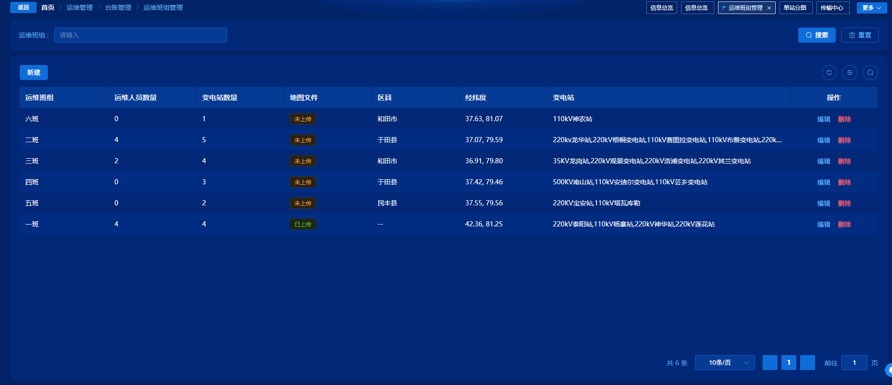
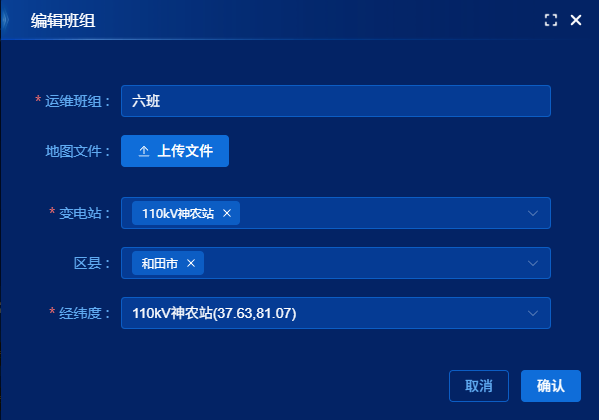

# 运维班组管理

> 入口：`src/views/EquipmentManage/TeamsManagement/Index.vue`  
> 路由：后台动态菜单，不在 `src/routers` 静态配置里  
> 组件名：`AuditLogQuery`（从审计日志页拷过来的旧名，实际标题是「运维班组管理」）

本文从代码层面说明本页做什么、怎么走、难点和风险在哪。结论均来自当前代码，未读到的不写。

---






## 1. 一句话说明

这个页面给运维配置**班组**：班组名称、管辖变电站、聚焦经纬度、（阿克苏/和田才有）区县，以及一张 **KML 地图文件**。

典型使用场景：新建或改一个运维班组，把负责的变电站和区域边界绑上去。首页百度地图只会加载「已经上传地图文件」的班组，用 KML 画多边形边界。

---

## 2. 代码地图

```
src/views/EquipmentManage/TeamsManagement/
├── Index.vue                 壳：表格 + 打开新增/编辑抽屉，真正调新增/更新接口
├── useTeamsManageQuery.tsx   列配置、列表请求、删除、站点字典（阿克苏/和田）
└── components/
    └── TeamDrawer.vue        新增/编辑弹窗：表单、KML 上传、提交

相关但不在本目录：
├── src/hooks/useUpload.ts                      真正传文件（整文件或分片）
├── src/utils/worker.ts + src/utils/file.ts     分片 Worker + SparkMD5
├── src/api/modules/equipmentManage.ts          班组 CRUD、变电站列表
├── src/api/modules/system.ts                   传输中心建记录 / 上传
├── src/stores/modules/transformer.ts           刷新传输中心列表
├── src/components/BaseMap/baiduMap.vue         首页用 address 拉 KML 画边界
└── src/views/home/index.vue / index_kt.vue     首页只展示有 address 的班组
```

### 改功能先动哪

| 你想改什么 | 先看 |
|---|---|
| 表格列、搜索、删除、区县列显隐 | `useTeamsManageQuery.tsx` |
| 新建/编辑打开时带哪些字段、调哪个保存接口 | `Index.vue` 的 `openCreate` / `openEdit` |
| 弹窗表单、校验、变电站/经纬度联动 | `components/TeamDrawer.vue` |
| 地图文件怎么选、怎么传到服务器、`address` 何时写入 | `TeamDrawer.vue` + `src/hooks/useUpload.ts` |
| 首页地图为何画不出班组边界 | `src/views/home/index.vue` 的 `loadTeamOptions` + `src/components/BaseMap/baiduMap.vue` 的 `canvasPolygon` |
| 阿克苏/和田区县下拉 | `TeamDrawer.vue` 里写死的 `akesuList` / `hetianList` |

---

## 3. 页面长什么样、能做什么

整体是「上搜索 + 中表格 + 弹窗」。没有左树、没有 Tab。

### 3.1 表格上方

- **新建**：打开「新增班组」弹窗，空表单
- 刷新 / 列配置 / 搜索折叠：`BaseTable` 自带，本页没改
- 搜索项：只有「运维班组」名称输入框（列上配了 `search`）

### 3.2 表格列

| 列 | 看见什么 |
|---|---|
| 运维班组 | 名称 |
| 运维人员数量 | `userCount` |
| 变电站数量 | 接口 `stationName` 数组长度，前端算出来的 |
| 地图文件 | 有 `address` → 绿色「已上传」，没有 → 橙色「未上传」 |
| 区县 | 仅阿克苏或和田站点显示 |
| 变电站 | `stationName` 数组合并成逗号字符串 |
| 经纬度 | 用本页另拉的变电站列表，按 `focusStationId` 拼 `纬度, 经度` |
| 操作 | 编辑、删除 |

### 3.3 行操作

- **编辑**：打开「编辑班组」弹窗，带回名称、地图地址、聚焦站、变电站列表；阿克苏/和田再带回区县
- **删除**：确认框「是否删除【班组名】?」→ 调删除接口 → 成功提示 → 刷新表格

本页按钮**没有做权限码判断**，新建/编辑/删除始终显示。菜单能不能进，由后台动态路由决定，代码里未再拦一层。

### 3.4 新增/编辑弹窗

`BaseDialog`，宽 600px，标题「新增班组」或「编辑班组」。

| 字段 | 必填 | 行为 |
|---|---|---|
| 运维班组 | 是 | 最多 50 字 |
| 地图文件 | **否** | 只接受 `.kml`，最多 1 个；选完立刻上传，不点确定才传 |
| 变电站 | 是 | 多选；改选后会自动校正「经纬度」那一项 |
| 区县 | 否 | 仅阿克苏/和田出现；多选；选项写死在前端 |
| 经纬度 | 是 | 下拉来自「已选变电站」的经纬度，值是变电站 id（`focusStationId`） |

点确定：校验通过后由父组件传入的 `api` 去新增或更新。点取消/关闭只关弹窗，**不会回滚已经上传成功的文件**（文件已经在传输中心了，只是班组 `address` 没保存）。

---

## 4. 页面流程（用户视角）

### 4.1 进页

1. `BaseTable` 自动请求列表：`GET /api/OpsTeam/GetOpsTeamSumery`，分页字段从 `pageNum` 改成 `page`
2. 同时拉一次变电站列表 `POST /api/station/list`，给「经纬度」列做 id → 坐标翻译
3. 读全局字典 `systemEnv`：有可见的 `akesu` 或 `hetian` 就显示区县列

没有路由 query 定位、没有默认选中行。

### 4.2 新建一个班组

1. 点「新建」→ 弹窗打开，表单 `{ teamName: '', stationId: [] }`，文件列表空
2. 填名称、选变电站（经纬度会自动落到第一个已选站）、可选区县
3. 若需要首页画边界：上传 `.kml`（完整链路见 4.4）
4. 点确定 → `POST /api/OpsTeam/add` → 成功则关弹窗、刷新表格、发 `team:change` 事件

### 4.3 编辑 / 删除

- 编辑：把行上的 `teamId / teamName / address / focusStationId / stationId` 带进弹窗；有 `address` 时文件列表会显示一条（名字和 url 都是这个地址字符串）
- 保存走 `POST /api/OpsTeam/edit`
- 删除走 `POST /api/OpsTeam/remove`，参数 `{ teamId }`

保存/删除成功后都会 `mittBus.emit('team:change')`。当前仓库里**没有监听这个事件的代码**，首页不会因此自动刷新班组地图，需要用户自己再进首页（或首页自己的挂载逻辑再拉一次列表）。

### 4.4 地图文件上传（完整流程）

这是本页最绕的一条链，选文件后**马上上传**，确定保存只是把返回的 `address` 写进班组。

```
用户点「上传文件」选 .kml
        │
        ├─ 已有 1 个文件（limit=1）→ onExceed：清掉旧文件，把新文件 handleStart 进列表
        │
        └─ @change → changeFile
              │  若这次 change 带了 size（说明是本地新文件，不是回显）
              │  先把 address 清空、进度归 0
              └─ uploadRef.submit()
                    │
                    └─ httpRequest（自定义上传，auto-upload=false）
                          │
                          ├─ 1. POST /api/downloadCenter/add/record
                          │     请求体就是数字 `1`（和算法包上传同一套「先建传输中心记录」）
                          │     返回 data = 记录 id
                          │
                          ├─ 2. transformerStore.getTransformCenterList()
                          │     刷新传输中心列表，让右上角/传输中心能看到这条上传任务
                          │
                          └─ 3. useUpload().uploadFile(本地文件, 记录id, 成功回调, 失败回调, 进度回调)
                                │
                                ├─ 文件 ≤ 20MB：一次 POST /api/downloadCenter/upload
                                │     FormData: chunk=整文件, fileName, isChunk=false, id, isSkipBusiness=true
                                │
                                └─ 文件 > 20MB：Web Worker 切 5MB 片，最多 6 路并发
                                      每片带 hash / chunkIndex / chunkCount，仍带 isSkipBusiness=true
                                │
                                ├─ 进度回调 processCallback：进度条、address = res.data.fileUrl
                                ├─ 成功：关 loading，提示「上传完成」
                                └─ 失败：关 loading，进度条显示「上传失败」
```

用户再点弹窗「确认」时，`address` 作为班组字段一起提交。首页之后用这个 URL `fetch` 成 XML，解析 `<coordinates>` 画多边形。

---

## 5. 页面逻辑（代码视角）

### 5.1 阿克苏 / 和田控区县

`Index.vue` 和 `TeamDrawer.vue` **各自**扫一遍 `globalStore.systemEnv`：

- `dictCode == 'akesu' && isVisible` → `isAkesu`
- `dictCode == 'hetian' && isVisible` → `isHetian`

影响三处：

1. 表格「区县」列 `isShow`
2. 编辑时要不要把 `row.county` 带进弹窗
3. 弹窗「区县」表单项 `v-if`；提交时若两个旗标都是 false，会删掉 `county` 再提交

区县选项不是字典接口，是组件里写死的县市列表。`isAkesu` 优先于 `isHetian`。

### 5.2 父子怎么通信

- 抽屉只 `defineExpose({ acceptParams })`，父组件 `ref` 调用打开
- 保存接口不写在抽屉里：`openCreate` 传入 `createTeam`，`openEdit` 传入 `updateTeam`
- 保存成功后抽屉调用父传入的 `getTableList`，并 `mittBus.emit('team:change')`

### 5.3 变电站 ↔ 经纬度

弹窗里再拉一次 `stationList`（和表格 hook 各拉一次，互不共享）。

`currentStationOptions` = 全站列表里 id 落在已选 `stationId` 中的项。经纬度下拉只显示这些站。

`handleStationChange`：

- 还没有 `focusStationId` → 默认第一个已选站
- 已有的聚焦站不在当前已选里 → 也改成第一个已选站
- 把已选站全部清空时，这段 `if (value && value.length > 0)` 不进，**不会清掉**旧的 `focusStationId`

### 5.4 `address` 谁在改

同一字段至少四条写入路径，容易互相覆盖：

| 时机 | 谁改 | 写成什么 |
|---|---|---|
| 打开弹窗 | `acceptParams` | 编辑带回的原 `address`，或空 |
| `fileList` 的 watch | 有文件就取 `fileList[0].url` | 回显时是服务器地址；刚选本地文件时可能是 blob / 空 |
| `changeFile` | 发现有 `size` | 先清空，等上传结果 |
| `onRemove` | 用户删文件 | 空 |
| `processCallback` | 上传接口返回 | `res.data.fileUrl` |

确定保存时提交的就是当时的 `drawerProps.rowData.address`。地图文件**没有**表单校验，空着也能保存。

### 5.5 列表数据整形

`dataCallback` 把 `stationName: string[]` 变成逗号拼接，并补 `stationNum`。分页用表格内部的 `pageNum/pageSize`，总数用接口 `totalCount`。

---

## 6. 重难点

### 6.1 地图文件不是「表单一并提交」，而是先走传输中心再把 URL 写回班组

1. **一句话**：选 KML 后立刻上传到「传输中心」，班组保存的只是返回的文件地址，不是文件本身。
2. **知识点**：这是项目统一的大文件上传范式：先 `add/record` 占一条任务，再用 `useUpload` 把文件挂到这条 id 上。传 `processCallback` 时会带 `isSkipBusiness=true`，告诉后端「只存文件、返回 URL，不要当业务导入去解析 Excel」。
3. **代码依据**：

```331:348:src/views/EquipmentManage/TeamsManagement/components/TeamDrawer.vue
const httpRequest = async (option: any) => {
  loading.value = true;
  loadingText.value = '文件处理中, 请稍后...';
  const headers = {
    'Content-Type': 'application/json'
  };

  uploadRecord(1, { noLoading: true, headers })
    .then((result: ResultData) => {
      const transformerStore = useTransformerStore();
      transformerStore.getTransformCenterList();
      const { uploadFile } = useUpload();
      uploadFile(option.file, result.data, uploadSuccessCallback, uploadErrorCallback, processCallback);
    })
    .catch(() => {
      loading.value = false;
      loadingText.value = '';
    });
};
```

```63:95:src/hooks/useUpload.ts
  const uploadFile = async (
    file: File,
    id: number,
    successCallback?: () => void,
    errorCallback?: () => void,
    processCallback?: (res: ResultData) => void,
    isSkipBusiness?: boolean
  ) => {
    if (file.size > MAX_SINGLE_FILE_SIZE) {
      createUploadChunkTask(file, id, successCallback, errorCallback, processCallback, isSkipBusiness);
    } else {
      const formData = new FormData();
      formData.append('chunk', file);
      formData.append('fileName', file.name);
      formData.append('isChunk', 'false');
      formData.append('id', String(id));

      if (processCallback && !isSkipBusiness) {
        formData.append('isSkipBusiness', 'true');
      }
      // ... 调 /api/downloadCenter/upload
```

执行顺序：选文件 → `changeFile` 发现有 `size` → `submit()` → `httpRequest` → 建记录拿到 id → 刷新传输中心 → `uploadFile`。因为传了 `processCallback` 且没传第 6 个参数，`isSkipBusiness` 实际被设成 `'true'`。上传返回里带 `fileUrl` 才写进班组 `address`。
4. **新人易错**：以为点弹窗确定才会上传；或者把 `uploadRecord(1)` 的 `1` 当成班组 id。它和算法包上传一样，只是传输中心记录类型，返回值才是任务 id。

### 6.2 为什么进度条能出 URL：靠上传接口同步返回，不是 WebSocket

1. **一句话**：进度和最终地址都来自 `/api/downloadCenter/upload` 的 HTTP 响应，不是首页那套 Type 19 推送。
2. **知识点**：`processCallback` 同时干两件事：改进度条、把 `fileUrl` 写到表单。WebSocket 的 `socketTransformerImportUpdate` 会刷新传输中心列表并弹「导入成功/失败」，但**不会**给这个弹窗写 `address`。
3. **代码依据**：

```307:326:src/views/EquipmentManage/TeamsManagement/components/TeamDrawer.vue
const processCallback = (res: any) => {
  console.log(res);
  uploadProcess.value = res.data?.progress || 0;
  if (res.data?.fileUrl) {
    drawerProps.value.rowData.address = res.data?.fileUrl;
  }
};
const progressFormat = (percentage: number) => (percentage === null ? '上传失败' : `${percentage}%`);

const uploadSuccessCallback = () => {
  loading.value = false;
  loadingText.value = '';
  ElMessage.success('上传完成');
};
const uploadErrorCallback = () => {
  loading.value = false;
  loadingText.value = '';
  uploadProcess.value = null;
};
```

选文件后 `changeFile` 把进度打成 0；失败回调把进度打成 `null`，模板 `v-if="uploadProcess != 0"` 仍为真，格式化函数就会显示「上传失败」。成功后进度停在接口给的百分比，直到下次打开弹窗才在 `acceptParams` 里归零。
4. **新人易错**：在 WebSocket 处理里补「导入成功就写 address」——本页根本没订阅；或者看到传输中心提示成功，以为班组已经绑上地图，其实还要再点弹窗确定。

### 6.3 选文件立刻 `submit`，超限替换靠 `onExceed` + `handleStart`

1. **一句话**：`auto-upload=false`，真正开传的是 `@change` 里手动 `submit`；已经有一个文件时，新文件走超限钩子而不是普通 change。
2. **知识点**：Element Plus `limit=1` 时，再选文件会触发 `onExceed` 而不是直接进列表。本页照抄算法包上传：清列表、给新文件生成 uid、`handleStart` 塞进去。`handleStart` 会再发一次 `change`，于是 `changeFile` 仍能 `submit`。
3. **代码依据**：

```285:305:src/views/EquipmentManage/TeamsManagement/components/TeamDrawer.vue
const changeFile = (res: any) => {
  if (res?.size) {
    drawerProps.value.rowData.address = '';
    uploadProcess.value = 0;

    uploadRef.value!.submit();
  }
};

const onRemove = () => {
  uploadRef.value!.clearFiles();
  drawerProps.value.rowData.address = '';
  uploadProcess.value = 0;
};

const handleExceed: UploadProps['onExceed'] = files => {
  uploadRef.value!.clearFiles();
  const file = files[0] as UploadRawFile;
  file.uid = genFileId();
  uploadRef.value!.handleStart(file);
};
```

打开编辑时回显的那条没有 `size`（只有 name/url），`changeFile` 不会误传。只有本地新文件带 `size` 才会提交。`accept=".kml"` 只是系统文件框过滤，**没有** `beforeUpload` 再校验扩展名。
4. **新人易错**：在 `handleExceed` 里再调一次 `submit`，会和随后的 `change` 打成两次上传、两条传输中心记录。

### 6.4 `address` 同时被 fileList 监听和上传回调改，可能互相踩

1. **一句话**：文件列表一变就用 `fileList[0].url` 覆盖 `address`，上传成功后又用 `fileUrl` 写一次，中间存在空窗期。
2. **知识点**：`v-model:file-list` 的 watch 适合「回显已有 URL」；本地新文件的 `url` 往往是 blob 或空。`changeFile` 先把 `address` 清空，是为了避免把旧地图地址提交上去，但也造成「上传没结束就点确定」会保存空地址。
3. **代码依据**：

```271:280:src/views/EquipmentManage/TeamsManagement/components/TeamDrawer.vue
watch(
  () => fileList.value,
  newVal => {
    if (newVal && newVal.length) {
      drawerProps.value.rowData.address = newVal[0].url;
    } else {
      drawerProps.value.rowData.address = '';
    }
  }
);
```

打开编辑：`acceptParams` 把 `address` 填进 `fileList` 的 name/url → watch 再写回同一地址。选新文件：watch 可能先写成 blob → `changeFile` 清空 → 上传成功再写成服务器 `fileUrl`。若 watch 在 `processCallback` 之后因 fileList 引用变化再跑一次，有可能把服务器地址盖回本地 `url`。
4. **新人易错**：只改 `processCallback` 或只改 watch 的一边，保存出去的 `address` 仍不对；调试时别只看文件列表里显示的文件名（编辑回显用的是整段 URL 当 name）。

### 6.5 首页地图只认「有 address 的班组」，KML 解析很粗

1. **一句话**：班组保存成功不等于首页立刻出现区域；首页会丢掉没地图文件的班组，并且只读 KML 里第一个 `<coordinates>`。
2. **知识点**：区域站首页把班组列表当地图图层数据源。`fetch(team.address)` 当 XML 解析，坐标串按空白切开、按逗号取 lng/lat，画蓝色半透明多边形。点多边形会把 `selectedRegion` 设成班组 id。
3. **代码依据**：

```865:874:src/views/home/index.vue
const loadTeamOptions = async () => {
  try {
    const res: any = await getTeamList({ page: 1, pageSize: 99999 }, { noLoading: true });
    if (res?.success) {
      const items = res.data?.items || [];
      teamOptions.value = items
        .map((item: any) => ({ label: item.teamName, id: item.teamId, ...item }))
        .filter((item: any) => item.address);
```

```280:302:src/components/BaseMap/baiduMap.vue
const canvasPolygon = async ({ BMap, map }: { BMap: any; map: any }) => {
  kmlOverlays.value = [];
  const allPoints: any[] = [];
  try {
    const teams: any[] = props.teamOptions?.filter((t: any) => t.address) || [];
    // ...
    for (const team of teams) {
      try {
        const resp = await fetch(team.address);
        if (!resp.ok) continue;
        const text = await resp.text();
        const parser = new DOMParser();
        const xmlDoc = parser.parseFromString(text, 'text/xml');
        const coordEl = xmlDoc.querySelector('coordinates');
        if (!coordEl) continue;
        const coordText = coordEl?.textContent?.trim() || '';
        const pts = coordText.split(/\s+/).map((coord: string) => {
          const [lng, lat] = coord.split(',').map(Number);
          return new BMap.Point(lng, lat);
        });
```

`teamOptions` 变化时 `baiduMap` 会重跑 `canvasPolygon`。本页发的 `team:change` 没有人听，所以在班组页改完地图，已打开的首页不会自动重拉。
4. **新人易错**：KML 里多个 Placemark / MultiGeometry 只生效第一段坐标；`address` 若是内网路径或需鉴权，浏览器 `fetch` 会静默失败（只 `console.warn`），表格仍显示「已上传」。

### 6.6 经纬度下拉的值是变电站 id，不是坐标字符串

1. **一句话**：表单字段叫「经纬度」，提交的却是 `focusStationId`；表格上再拿变电站列表翻译成「纬度, 经度」。
2. **知识点**：聚焦站必须属于已选变电站。改多选时用「是否还在过滤后的 options 里」判断要不要重置。表格翻译依赖 hook 里那份 `stationOptions`，和弹窗里那份不是同一份数据。
3. **代码依据**：

```202:216:src/views/EquipmentManage/TeamsManagement/components/TeamDrawer.vue
const currentStationOptions = computed(() => {
  return stationOptions.value.filter((item: StationOption) => drawerProps.value.rowData.stationId.includes(item.id));
});

const handleStationChange = (value: string[]) => {
  if (value && value.length > 0) {
    if (!drawerProps.value.rowData.focusStationId) {
      drawerProps.value.rowData.focusStationId = drawerProps.value.rowData.stationId[0];
    }

    if (!currentStationOptions.value.find((item: StationOption) => item.id === drawerProps.value.rowData.focusStationId)) {
      drawerProps.value.rowData.focusStationId = drawerProps.value.rowData.stationId[0];
    }
  }
};
```

```86:92:src/views/EquipmentManage/TeamsManagement/useTeamsManageQuery.tsx
    {
      prop: 'focusStationId',
      label: '经纬度',
      align: 'left',
      render(scope) {
        const station = stationOptions.value.find((item: StationOption) => item.id === scope.row.focusStationId);
        return station?.latitude && station?.longitude ? `${station.latitude}, ${station.longitude}` : '';
      }
    },
```

进页后 `loadStationOptions()` 是异步的。列表先出来、变电站列表后到时，经纬度列可能先空再有数；接口失败则整列一直空，不代表班组没配聚焦站。
4. **新人易错**：给「经纬度」加校验去检查 `lat,lng` 字符串格式；或在表格里改 `focusStationId` 的展示却忘了 hook 里这份 stationList 可能还没回来。

### 6.7 保存接口由父组件注入，抽屉不关心新增还是编辑

1. **一句话**：抽屉只负责校验和调用传入的 `api(payload)`，新增/编辑的差异全在 `Index.vue`。
2. **知识点**：这是项目抽屉的常见写法，方便同一套表单复用。成功判断是 `res.success`；没有 `api` 时走「本地占位」成功分支（现在父组件两条路径都传了 api）。
3. **代码依据**：

```45:60:src/views/EquipmentManage/TeamsManagement/Index.vue
const openCreate = () => {
  teamDrawerRef.value?.acceptParams({
    title: '新增班组',
    isView: false,
    rowData: { teamName: '', stationId: [] },
    api: async (payload: any) => {
      const res = await createTeam(payload, { noLoading: false });
      return res;
    },
    getTableList: () => {
      try {
        (baseTable.value as any)?.getTableList?.();
      } catch (e) {}
    }
  });
};
```

```239:255:src/views/EquipmentManage/TeamsManagement/components/TeamDrawer.vue
const handleSubmit = () => {
  formRef.value?.validate(async valid => {
    if (!valid) return;
    const payload = drawerProps.value.rowData;
    const submitParams = { ...payload };
    if (!isAkesu.value && !isHetian.value) {
      submitParams.county && delete submitParams.county;
    }
    if (drawerProps.value.api) {
      const res: any = await drawerProps.value.api(submitParams);
      const ok = typeof res === 'object' ? !!res.success : !!res;
      if (ok) {
        ElMessage.success({ message: `${drawerProps.value.title}成功！` });
        drawerVisible.value = false;
        drawerProps.value.getTableList && drawerProps.value.getTableList();
        mittBus.emit('team:change');
      }
    }
```

新建不带 `teamId`，编辑从行数据带上。非阿克苏/和田会删 `county`。校验失败直接 return，不会调接口。
4. **新人易错**：在抽屉里再 import `createTeam`/`updateTeam`，和父组件传入的 api 打成两次请求；或改完父组件字段却忘了 `openEdit` 的 `rowData` 白名单——例如漏传 `address`，编辑保存会把已上传地图清掉。

---

## 7. 坑点（已存在的别扭实现）

### 7.1 组件名、表格缓存名还是审计日志

`Index.vue` 的 `name="AuditLogQuery"`，`BaseTable` 的 `name="auditLogQuery"`。`name` 会用来持久化列宽/显隐。用户在本页改列配置，可能写进「审计日志查询」那份缓存，或反过来被审计日志页带偏。

```3:11:src/views/EquipmentManage/TeamsManagement/Index.vue
    <div class="table-box">
      <BaseTable
        ref="baseTable"
        name="auditLogQuery"
        title="运维班组管理"
        :columns="columns"
        :init-param="initParams"
        :request-api="getTableList"
        :data-callback="dataCallback"
      >
```

### 7.2 `team:change` 只发不收

删除和保存成功都会 `mittBus.emit('team:change')`，全仓库搜下来没有 `mittBus.on('team:change')`。首页班组下拉不会因此更新。

### 7.3 `loadingText` 从不展示

`httpRequest` 里写了 `loadingText = '文件处理中, 请稍后...'`，模板只有 `v-loading="loading"`，没有 `element-loading-text`。用户只看到转圈，看不到文案。

### 7.4 死代码和空 catch

`useTeamsManageQuery.tsx` 的 `handleEdit` 只 `console.log`，没有地方调用。`Index.vue` 刷新表格用空 `catch (e) {}` 吞掉异常。`processCallback` 里留着 `console.log(res)`。

### 7.5 类型和表单不一致

`EquipmentManage.TeamsManagement` 没有 `address`，`county` 写成 `string`，弹窗却是 `county?: string[]` 多选。`stationId` 接口形态未在类型里写清。

```909:919:src/api/interface/index.ts
  export interface TeamsManagement {
    teamId: string;
    teamName: string;
    teamCode: string;
    teamerNum: number;
    stationNum: number;
    stationList: string;
    focusStationId: string;
    county: string;
  }
```

### 7.6 变电站列表拉两次

表格 hook 和抽屉各调一次 `stationList`，失败各清各的。表格经纬度列和弹窗下拉可能一个成功一个失败。

### 7.7 取消弹窗不会撤销上传

文件在点「上传文件」时已经进传输中心。用户取消编辑，服务器上的文件还在；班组 `address` 以最后一次成功保存为准。

### 7.8 分片成功条件偏脆

`useUpload` 分片分支里，`successCallback` 写在「剩余 chunks 长度为 0」时触发，长度是在 `finally` 里才减的，和 `then` 的时序不一定对得上。KML 通常远小于 20MB，会走整文件分支；只有超大文件才踩这个。

---

## 8. 风险点（改这里容易出事故）

### 8.1 编辑漏传 `address` 会覆盖已有地图

`openEdit` 靠白名单组 `rowData`。漏了 `address`，保存会把地图文件变成空，首页该班组从地图下拉消失，已画的 KML 也不再加载。

```63:73:src/views/EquipmentManage/TeamsManagement/Index.vue
const openEdit = (row: EquipmentManage.TeamsManagement) => {
  const rowData = {
    teamId: row.teamId || '',
    teamName: (row as any).teamName || '',
    address: (row as any).address || '',
    focusStationId: (row as any).focusStationId || '',
    stationId: (row as any).stationId || []
  } as any;
  if (isAkesu.value || isHetian.value) {
    rowData.county = row.county;
  }
```

### 8.2 上传未完成就点确定

地图非必填。`changeFile` 会先清空 `address`。上传进行中保存，可能把原来的已上传地图清掉，或把 blob URL 存进后端。首页 `fetch` 这种地址会失败。

### 8.3 改 `isSkipBusiness` 会变成「业务导入」

`useUpload` 里「有 processCallback 就带 isSkipBusiness=true」是为了只要文件 URL。拿掉 `processCallback`、或把第 6 参设成 true/false 搞反，后端可能按 Excel/业务包去解析 KML，传输中心进错误态，弹窗也拿不到 `fileUrl`。

### 8.4 首页 KML 与班组页不同步

改完地图必须重新进首页（或等首页自己再请求列表）。不要假设 `team:change` 已经刷新了地图。阿克苏首页 `index_aks.vue` 的班组列表**不过滤** `address`，和主首页/奎屯首页行为不一致。

### 8.5 区县写死 + 双份站点开关

县市列表写在 `TeamDrawer.vue`。阿克苏/和田判断在入口和抽屉各做一次，改一处漏一处会出现「表有区县列、弹窗没有」或提交仍带 `county`。非这两地提交前会 `delete county`，改掉这段可能把别的站点的区县脏数据写进库。

### 8.6 无前端权限点

本页未使用 `usePermission`。若产品指望按钮级权限，只改菜单不够，现在登录能进页就能新建/删除。

### 8.7 删除不可逆

删除只按 `teamId`，没有二次业务校验（例如班组下还有用户）。用户管理、首页树都会查班组列表，删掉后那些下拉会少一项；代码里未在本页处理级联。

---

## 9. 改动导航

| 需求 | 先看哪个文件 |
|---|---|
| 改列、搜索、删除确认文案、区县列显隐 | `useTeamsManageQuery.tsx` |
| 改新建/编辑提交字段、换保存接口 | `Index.vue` |
| 改弹窗字段、校验、变电站与聚焦站联动 | `components/TeamDrawer.vue` |
| 改 KML 何时上传、进度、address 写入时机 | `TeamDrawer.vue` 的 `changeFile` / `httpRequest` / `processCallback` |
| 改 20MB 阈值、分片大小、并发 | `src/hooks/useUpload.ts` |
| 改传输中心记录类型、上传 URL | `src/api/modules/system.ts` 的 `uploadRecord` / `uploadFile` |
| 改首页谁能出现在班组地图、KML 怎么画 | `src/views/home/index.vue`（及 `_kt` / `_aks`）+ `src/components/BaseMap/baiduMap.vue` |
| 改阿克苏/和田县市选项 | `TeamDrawer.vue` 顶部写死数组 |
| 班组 CRUD 路径 | `src/api/modules/equipmentManage.ts`：`GetOpsTeamSumery` / `add` / `edit` / `remove` |
