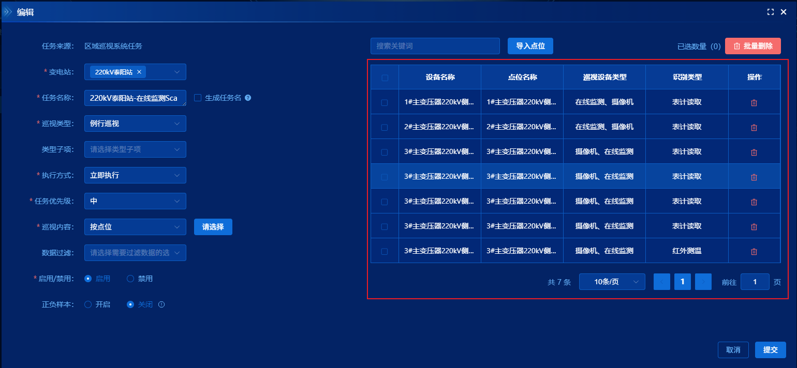
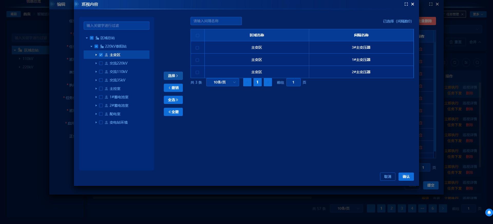
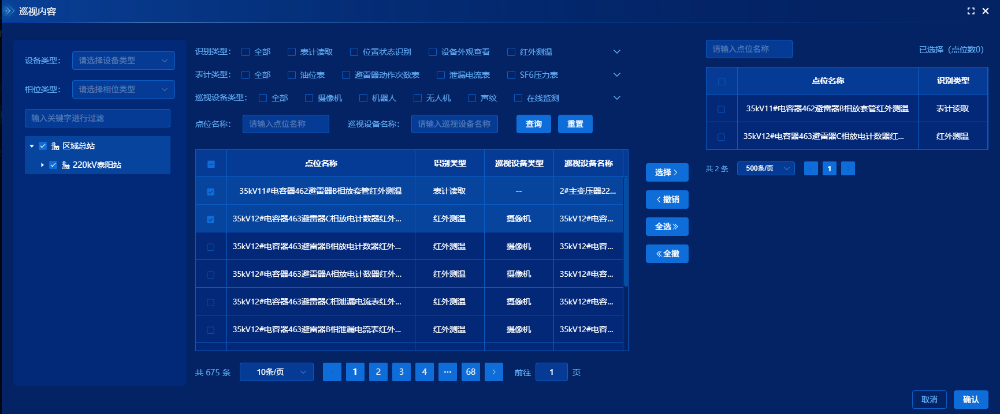
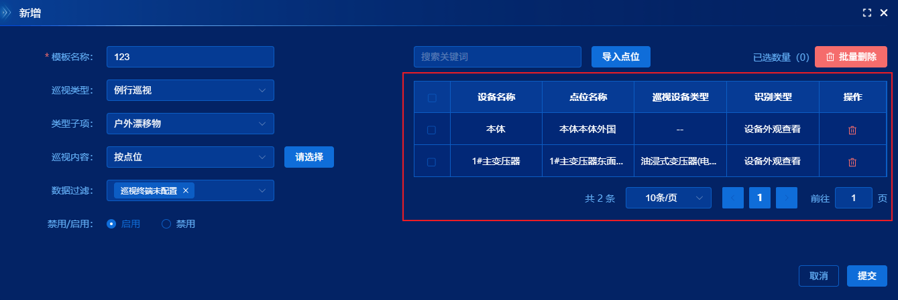
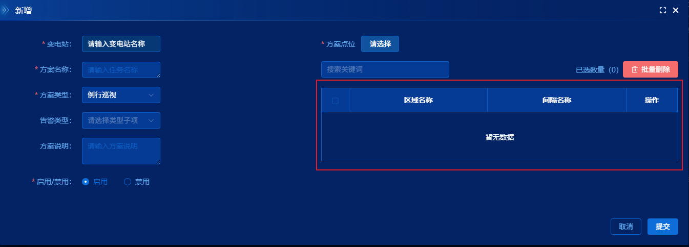
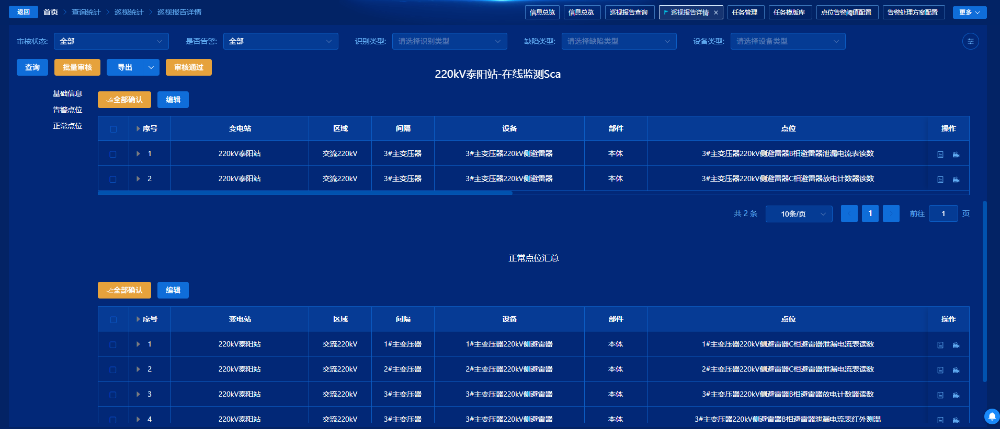

# 项目内 vxe-table 查阅手册

> 扫描范围：`src/**/*.{vue,ts,tsx}`  
> 依赖版本：`vxe-table@^4.5.13`（另有 `vxe-utils`、`xe-utils`，业务源码未直接引用）  
> 结论先行：**全项目仅使用 `vxe-table`，未使用 `vxe-grid`；无 `proxyConfig` / `editConfig` / 内置 `pager` / `toolbar`。**

---

## 0. 全局注册与基础约定

```64:78:src/main.ts
import VXETable from 'vxe-table';
import 'vxe-table/lib/style.css';
// ...
VXETable.config({
  tooltip: {
    zIndex: 99999
  }
});
app.use(VXETable);
```

| 项 | 现状 |
|---|---|
| 注册方式 | 全量 `app.use(VXETable)` |
| 全局配置 | 仅抬高 tooltip `zIndex`，避免被弹窗遮挡 |
| 类型声明 | `src/vite-env.d.ts` 中 `declare module 'vxe-table'`（无细粒度类型） |
| 与 BaseTable 关系 | 列表页主表几乎都用 `BaseTable`（el-table）；vxe 只出现在「穿梭选择 / 报告树表」场景 |

---

## 1. 使用页面总览

| # | 业务页面 | 含 vxe 的组件 | 组件类型 | 表格数量 | 典型能力 |
|---|---|---|---|---|---|
| 1 | 巡视任务管理 | `EditTask.vue` | `vxe-table` | 1 | 多级列切换、跨页勾选、前端分页、批量删除 |
| 2 | 同上 | `SelectInterval.vue` | `vxe-table` | 1 | 树→表穿梭、虚拟滚动、跨页勾选 |
| 3 | 同上 | `SelectDevice.vue` | `vxe-table` | 1 | 同上（设备维度） |
| 4 | 同上 | `SelectComponent.vue` | `vxe-table` | 1 | 同上（部件维度） |
| 5 | 同上 | `SelectPoint.vue` | `vxe-table` | 2 | 左筛选表（服务端分页）+ 右已选表（前端分页） |
| 6 | 任务模板库 | `EditTemplateDialog.vue` | `vxe-table` | 1 | 复用任务选择器，动态 `keyField` |
| 7 | 告警方案 | `UserDrawer.vue` | `vxe-table` | 1 | 与 EditTask 类似的已选汇总表（实际只选点位） |
| 8 | 同上 | `SelectPoint.vue` | `vxe-table` | 2 | 与任务管理 SelectPoint 同构 |
| 9 | 巡视报告预览 | `PatrolReportPreview/index.vue` | `vxe-table` | 5 | 树表、列宽持久化、动态列、行内修正、批量审核 |

> 任务模板库的间隔/设备/部件/点位选择器 **直接复用** `PatrolTaskManage/components/Select*.vue`，不单独再写一份。

---

## 2. 逐页解析

### 2.1 巡视任务管理 · EditTask

**路径**：`src/views/IntelligentPatrol/PatrolTaskManage/components/EditTask.vue`  
**入口页面**：`PatrolTaskManage/Index.vue`（BaseTable 列表 → 新增/编辑打开本弹窗）



#### 业务场景 & 功能目标

配置巡视任务的「巡视内容」：按间隔 / 设备 / 部件 / 点位四级之一选择目标，右侧表格展示已选集合，支持搜索、批量删除、导入点位、提交保存。

#### 使用组件

`vxe-table`（非 grid）

#### 核心配置

| 配置项 | 值 / 说明 |
|---|---|
| proxyConfig | **无** |
| editConfig | **无** |
| 虚拟滚动 | `:scroll-y="{ enabled: true }"` |
| 列配置 | `:column-config="{ resizable: true }"`；列按 `activeTableType` 条件 `v-if` 切换 |
| row-config | `{ isHover: true, useKey: true }`（**未设 keyField**） |
| checkbox-config | `{ reserve: true, highlight: true }` |
| 工具栏 / 分页 | 无 vxe toolbar/pager；外挂项目 `Pagination`，对全量 `tableData` 做 `slice` 前端分页 |
| 其它 | `show-overflow`、`tooltip-config.enterable`、`max-height=500`、`highlight-current-row` |

#### 用到的能力 & 业务作用

- **跨页勾选保留**：`getCheckboxReserveRecords().concat(getCheckboxRecords())` 做批量删除与已选计数。
- **动态列**：`activeTableType` 1~4 对应不同字段列 + 操作列。
- **前端过滤+分页**：关键词搜区域/间隔/设备/部件/点位名，再 slice。
- **层级切换**：换巡视内容类型时清空勾选并整表替换数据。

#### 写法特点

- 左侧表单 + 右侧 vxe 已选表；通过子对话框 `Select*` 回传 `reviewSelection`。
- 行主键靠 `typeIdNameArr[activeTableType]`（`intervalId` / `deviceId` / `componentId` / `pointId`）业务侧维护，表格本身未绑定 `keyField`。
- 执行中任务（`taskState` 为 2/3）禁用选点与删除。

---

### 2.2 SelectInterval / SelectDevice / SelectComponent（同构）

**路径**：

- `.../PatrolTaskManage/components/SelectInterval.vue`
- `.../SelectDevice.vue`
- `.../SelectComponent.vue`



#### 业务场景 & 功能目标

穿梭选择器：左树勾选节点 → 中间「选择/撤销/全选/全撤」→ 右表展示已选明细 → 确认回传父组件。

| 组件 | 树 type | 节点过滤 | keyField | 列表字段 |
|---|---|---|---|---|
| SelectInterval | 5 | treeNodeType===5 | `intervalId` | 区域、间隔 |
| SelectDevice | 6 | treeNodeType===6 | `deviceId` | 间隔、设备 |
| SelectComponent | 7 | treeNodeType===7 | `componentId` | 设备、部件 |

#### 使用组件

`vxe-table`

#### 核心配置

```49:71:src/views/IntelligentPatrol/PatrolTaskManage/components/SelectDevice.vue
        <vxe-table
          border
          ref="tableRef"
          show-overflow
          :align="'center'"
          :max-height="500"
          :column-config="{ resizable: true }"
          :tooltip-config="{ enterable: true }"
          :row-config="{ isHover: true, useKey: true, keyField: 'deviceId' }"
          :data="showTableData"
          :scroll-y="{ enabled: true }"
          :scroll-x="{ enabled: true }"
          :checkbox-config="{ reserve: true, highlight: true }"
          @checkbox-all="selectAllChangeEvent"
          @checkbox-change="selectChangeEvent"
          highlight-current-row
          ...
        >
```

| 配置项 | 说明 |
|---|---|
| proxyConfig / editConfig | 无 |
| scroll-y / scroll-x | 均 `enabled: true` |
| checkbox reserve | 有，配合前端分页跨页勾选 |
| 分页 | 外挂 `Pagination`；`pageSize` 默认 10；数据一次拉 `pageSize: 100000` 再前端 slice |
| 工具栏 | 无（中间按钮区是自定义） |

#### 用到的能力 & 业务作用

- 勾选撤销：合并 reserve + 当前页 records，按主键从 `tableData` 删除并反勾树。
- 已选计数：`selectIds` 与 checkbox 事件同步。

#### 写法特点

三份代码高度复制；差异主要是树类型、主键字段、接口 `pointSelectLevelType`、搜索字段名。样式统一把 hover/current/checked 行刷成 `rgb(7 68 158)`。

---

### 2.3 SelectPoint（任务管理 & 告警方案各一份）

**路径**：

- `src/views/IntelligentPatrol/PatrolTaskManage/components/SelectPoint.vue`
- `src/views/EquipmentManage/AlarmProgram/components/SelectPoint.vue`（同构，树接口略有差异）



#### 业务场景 & 功能目标

四点布局：左设备树 + 中筛选条件与候选点位表 + 穿梭按钮 + 右已选点位表。候选表服务端分页查询 `pointList`；已选表前端分页（默认 pageSize 500）。

#### 使用组件

两个 `vxe-table`（filter 表 + result 表）

#### 核心配置

| 表 | max-height | keyField | 分页 | checkbox 事件 |
|---|---|---|---|---|
| 筛选表 `filterTableRef` | 350 | `id` | 服务端（pageable.total） | 选行用 `getCheckboxRecords`（**未拼 reserve**） |
| 已选表 `tableRef` | 500 | `id` | 前端 slice + Pagination | 全选/变更同步 `selectIds`，撤销时拼 reserve |

两边都开 `scroll-y` + `scroll-x`、`checkbox-config.reserve`、`column-config.resizable`。

#### 用到的能力 & 业务作用

- `toggleCheckboxRow` / `clearCheckboxRow` / `clearCheckboxReserve`：撤销时同步左侧候选勾选状态。
- `mergeAndRemoveDuplicates`：向已选表追加去重。
- `selectMaxLen`：确认时限制最大条数。
- 全选：按当前筛选条件 `pageSize: 100000` 一次拉全量覆盖已选表。

#### 写法特点

最复杂的选择器；筛选表虽配了 `reserve: true`，但「选择→右侧」只取当前页 `getCheckboxRecords()`，跨页勾选后点「选择」可能漏掉非当前页勾选（见第 5 节踩坑）。

---

### 2.4 任务模板库 · EditTemplateDialog

**路径**：`src/views/IntelligentPatrol/TaskTemplateLibrary/components/EditTemplateDialog.vue`  
**入口**：`TaskTemplateLibrary/Index.vue`



#### 业务场景 & 功能目标

新增/编辑巡视任务模板：巡视类型、内容层级、已选集合；选择器复用任务管理的 Select*。

#### 使用组件

`vxe-table`

#### 核心配置

与 EditTask 几乎相同，差异点：

- `max-height="580"`
- **显式** `:row-config="{ ..., keyField: typeIdNameArr[activeTableType] }"`（EditTask / UserDrawer 未设 keyField）
- 无「执行中禁用」逻辑

#### 写法特点

`keyField` 随 `activeTableType` 变化，是项目里对动态主键处理最规范的一处。

---

### 2.5 告警方案 · UserDrawer

**路径**：`src/views/EquipmentManage/AlarmProgram/components/UserDrawer.vue`  
**入口**：`AlarmProgram/Index.vue`



#### 业务场景 & 功能目标

配置自动确认/忽略告警方案的「方案点位」。UI 保留多级列模板，但 `selectContent` **只打开 SelectPoint**，实际业务以点位为主。

#### 使用组件

`vxe-table`

#### 核心配置

与 EditTask 右侧表同构：`scroll-y`、`checkbox reserve`、条件列、`Pagination` 前端分页；`row-config` 无 `keyField`。

#### 写法特点

列上仍有间隔/设备/部件分支，但选择入口只有点位；`reviewSelection` 同类型合并时写死用 `'pointId'` 去重。

---

### 2.6 巡视报告预览 · PatrolReportPreview

**路径**：`src/views/PatrolQuery/PatrolReportPreview/index.vue`  
**入口**：巡视报告列表「查看」→ `/PatrolReportPreview`



#### 业务场景 & 功能目标

展示一份巡视报告的五类点位汇总树表，支持筛选、列设置、批量审核、行内修正结论、跳转结果详情/视频预览。同页 SF6/避雷器等 Tab 用 BaseTable，**不用 vxe**。

五张表：重点关注 / 未检 / 告警 / 待人工确认 / 正常。

#### 使用组件

5 × `vxe-table`（非 grid）

#### 核心配置

```267:286:src/views/PatrolQuery/PatrolReportPreview/index.vue
            <vxe-table
              border
              ref="attachTable"
              show-overflow
              :key="tableKey"
              id="patrolReportPreviewTaskTable"
              :data="attachPointList"
              :align="'center'"
              :max-height="500"
              :column-config="{ resizable: true }"
              :custom-config="{ storage: { resizable: true } }"
              :tooltip-config="{ enterable: true, contentMethod: contentMethod }"
              :row-config="{ keyField: 'id', isHover: true, useKey: true }"
              :tree-config="{ rowField: 'id', childrenField: 'children' }"
              :checkbox-config="{ reserve: true, highlight: true }"
              :scroll-y="{ enabled: true }"
              highlight-current-row
              @checkbox-all="..."
              @checkbox-change="..."
              @resizable-change="resizableChange"
            >
```

| 配置项 | 说明 |
|---|---|
| proxyConfig / editConfig | 无；修正结论用 `el-input` 直接绑 `row` 字段 |
| tree-config | `{ rowField: 'id', childrenField: 'children' }` |
| custom-config | `{ storage: { resizable: true } }` + 自研 Pinia `tableStore` 同步列宽/显隐 |
| 虚拟滚动 | 仅 `scroll-y` |
| 动态列 | `v-for="column in dynamicColumns"`，`template` 可为 JSX 组件 |
| 分页 | 外挂 Pagination；**服务端分页**（`pageIndex/pageSize`） |
| 工具栏 | 无 vxe toolbar；上方自定义「全部确认 / 编辑 / 保存」 |

#### 用到的能力 & 业务作用

- `setAllTreeExpand` / `clearTreeExpand`：表头自定义展开按钮。
- `setColumnWidth`：拖拽列宽后五表同步。
- `contentMethod`：定制 tooltip（如装置列显示 `deviceName`）。
- checkbox 收集 `{ id, resultId }` 做批量审核（**只取 `getCheckboxRecords`，未拼 reserve**）。
- 审核完成后 checkbox 列 `v-if="!previewInfo?.auditorTime"` 隐藏。

#### 写法特点

- 唯一使用 **树表 + 动态列 + 列状态持久化** 的页面。
- 五表配置复制粘贴，事件函数成套重复。
- `id="patrolReportPreviewTaskTable"` 五表共用同一 id（配合 custom storage 时需注意冲突风险）。
- 分页改页后会操作 `.vxe-table--body-wrapper` 滚动位置。

---

## 3. 高频通用用法（代码示例）

### 3.1 标准「已选列表」骨架

```vue
<vxe-table
  border
  ref="tableRef"
  show-overflow
  :align="'center'"
  :max-height="500"
  :column-config="{ resizable: true }"
  :tooltip-config="{ enterable: true }"
  :row-config="{ isHover: true, useKey: true, keyField: 'id' }"
  :data="showTableData"
  :scroll-y="{ enabled: true }"
  :scroll-x="{ enabled: true }"
  :checkbox-config="{ reserve: true, highlight: true }"
  highlight-current-row
  @checkbox-all="onCheckAll"
  @checkbox-change="onCheckChange"
>
  <vxe-column type="checkbox" width="55" />
  <vxe-column field="name" title="名称" />
  <vxe-column title="操作" fixed="right" width="100">
    <template #default="{ row }">
      <el-button type="danger" link @click="removeRow(row)" />
    </template>
  </vxe-column>
</vxe-table>
<Pagination
  v-if="filtered.length"
  :pageable="{ ...pageable, total: filtered.length }"
  :handle-size-change="handleSizeChange"
  :handle-current-change="handleCurrentChange"
/>
```

### 3.2 前端过滤 + slice 分页

```ts
const filterTableData = computed(() =>
  tableData.value.filter(
    (d: any) => !search.value || d.name?.includes(search.value)
  )
);
const showTableData = computed(() =>
  filterTableData.value.slice(
    (pageable.pageNum - 1) * pageable.pageSize,
    pageable.pageNum * pageable.pageSize
  )
);
```

### 3.3 跨页勾选取值（项目惯用）

```ts
const $table = tableRef.value;
const records = $table
  .getCheckboxReserveRecords()
  .concat($table.getCheckboxRecords());
```

> **必须**同时配 `:checkbox-config="{ reserve: true }"` 且 `:row-config` 提供稳定 `keyField`，reserve 才可靠。

### 3.4 动态层级列

```ts
const typeIdNameArr = ['', 'intervalId', 'deviceId', 'componentId', 'pointId'];
// template:
// v-if="[1,2,3].includes(activeTableType)" → areaName / intervalName
// v-if="[2,3,4].includes(activeTableType)" → deviceName
// v-if="[3].includes(activeTableType)" → componentName
// v-if="[4].includes(activeTableType)" → pointName / recognitionType ...
```

### 3.5 树表展开

```ts
if (expanded) {
  $table.clearTreeExpand();
} else {
  $table.setAllTreeExpand(true);
}
```

表头序号列加 `tree-node`，并用自定义 header 模拟「一键展开」图标。

### 3.6 行高亮样式（多处复制）

```scss
:deep(.vxe-table--render-default .vxe-body--row.row--hover),
:deep(.vxe-table--render-default .vxe-body--row.row--current),
:deep(.vxe-table--render-default .vxe-body--row.row--checked) {
  background-color: rgb(7 68 158);
}
```

### 3.7 项目中明确「不用」的能力

| 能力 | 状态 |
|---|---|
| `vxe-grid` | 未使用 |
| `proxyConfig` | 未使用（数据全手写请求） |
| `editConfig` | 未使用（行内编辑用 el-input） |
| `vxe-toolbar` / `vxe-pager` | 未使用（用 BaseTable Pagination） |
| `keep-source` | 未使用 |

---

## 4. 开发重难点

### 4.1 checkbox reserve 与前端分页耦合

已选数据全量在内存、表格 `:data` 只绑当前页。翻页后要靠 `reserve: true` + `keyField` 记住勾选。  
批量操作必须 `reserveRecords.concat(records)`；漏写 reserve 或未设 `keyField` 会导致「只删当前页 / 勾选丢失」。

### 4.2 动态 `activeTableType` 与列 / 主键切换

同一张表在四种业务主键间切换。换类型时要清空 `selectIds` 并整表换数据。`EditTemplateDialog` 用动态 `keyField`；`EditTask` / `UserDrawer` 没设，跨页勾选在层级切换后更容易出状态错乱。

### 4.3 选择器「一次拉十万」再前端分页

间隔/设备/部件选择：`getSelectedPointInfo` / `pointList` 的 `pageSize: 100000`。点位「全选」同理。大数据站点会卡顿、内存高；虚拟滚动只缓解 DOM，不减数据量。

### 4.4 报告预览树表 + 动态列 + 列配置双通道

列显隐/宽度同时依赖：

1. Pinia `tableStore`（与 BaseTable 同源配置键 `patrolReportPreviewOfTask`）
2. vxe `custom-config.storage`

再加五表 `setColumnWidth` 手动同步。改列字段名时三处都要动。

### 4.5 JSX 动态列模板

`dynamicColumns[].template` 为函数组件，通过 `<component :is="..." :row="row" :table-ref="..." />` 注入。需保证 `script lang="tsx"`，且预览图组件依赖塞进 table 实例上的兼容字段。

---

## 5. 边界问题 & 历史踩坑点

### 5.1 SelectPoint 筛选表「选择」未合并 reserve

筛选表配置了 `reserve: true`，但 `getSelectedRows` 只用 `getCheckboxRecords()`。  
**现象**：跨页勾选候选点后点「选择」，非当前页勾选不会进入右侧。  
**建议**：与右侧撤销逻辑一致，拼上 `getCheckboxReserveRecords()`。

### 5.2 报告预览勾选同样只取当前页

五表批量审核收集 ids 时仅 `getCheckboxRecords()`。虽多为服务端分页、一页条数有限，但配置了 `reserve: true` 却没用上，跨页勾选后「批量确认」会漏数据。

### 5.3 attach 分页误改 problemPage

```1626:1634:src/views/PatrolQuery/PatrolReportPreview/index.vue
const attachSizeChange = (size: number) => {
  problemPage.pageSize = size; // 应为 attachPage
  _patrolAttachPointList();
  _changeTop(1);
};
const attachCurrentChange = (currentPage: number) => {
  problemPage.pageNum = currentPage; // 应为 attachPage
  _patrolAttachPointList();
  _changeTop(1);
};
```

重点关注表翻页会污染告警表分页状态。

### 5.4 多表共用同一个 DOM `id`

五张报告表都写 `id="patrolReportPreviewTaskTable"`。vxe `custom-config.storage` 若按 id 存列状态，可能互相覆盖或串数据。

### 5.5 `highlight-current-row` 非 vxe 标准属性

项目多处写了 `highlight-current-row`（el-table 属性）。vxe 行高亮实际靠 `row-config.isHover` + `checkbox-config.highlight` + 自定义 CSS。该属性对 vxe **基本无效**，属于历史拷贝残留。

### 5.6 EditTask / UserDrawer 缺 `keyField`

有 `useKey: true` 和 `checkbox reserve`，但无 `keyField` 时 vxe 可能用内部 `_X_ROW_KEY`。数据刷新/层级切换后 reserve 勾选可能对不上业务主键。模板库写法（动态 keyField）更稳妥。

### 5.7 向 vxe 实例挂载 `value.tableData`

报告预览为兼容图片预览，执行：

```ts
attachTable.value.value = Object.assign(attachTable.value?.value || {}, {
  tableData: attachPointList.value
});
```

属于侵入实例内部结构，升级 vxe 大版本时易碎。

### 5.8 样式硬编码深蓝行底

`rgb(7 68 158)` 在多主题下对比度不佳，且与 Element 变量体系脱节；后续改主题要批量替换。

### 5.9 告警方案列模板与真实选择入口不一致

`UserDrawer` 保留四级列，但只打开点位选择器；编辑回显若带非点位层级，列与主键逻辑可能对不上预期。

### 5.10 依赖闲置

`package.json` 有 `vxe-utils`、`xe-utils`，业务源码检索无 import，注意勿误以为项目已封装工具层。

---

## 6. 选型建议（项目内约定）

| 场景 | 建议 |
|---|---|
| 普通 CRUD 列表 | 继续用 `BaseTable`（el-table），不要上 vxe |
| 左树右表穿梭、大数据已选、需要跨页勾选 | 沿用现有 `vxe-table` 模式 |
| 树形 + 动态列 + 列宽记忆 | 参考 `PatrolReportPreview` |
| 需要远程代理分页 / 内置编辑 / 工具栏 | 当前项目无先例；优先外挂 Pagination + 手写 API，保持与现网一致 |
| 新建选择器 | 优先抽公共组件，避免再复制 SelectInterval/Device/Component |

---

## 7. 文件索引（便于跳转）

```
src/main.ts                                          # 全局注册
src/vite-env.d.ts                                    # 模块声明

src/views/IntelligentPatrol/PatrolTaskManage/
  components/EditTask.vue
  components/SelectInterval.vue
  components/SelectDevice.vue
  components/SelectComponent.vue
  components/SelectPoint.vue

src/views/IntelligentPatrol/TaskTemplateLibrary/
  components/EditTemplateDialog.vue                  # 复用上述 Select*

src/views/EquipmentManage/AlarmProgram/
  components/UserDrawer.vue
  components/SelectPoint.vue

src/views/PatrolQuery/PatrolReportPreview/
  index.vue                                          # 5 张树表
  index.scss                                         # 行高亮 / 树节点样式
```

---

## 8. 修订记录

| 日期 | 说明 |
|---|---|
| 2026-08-31 | 首次全库扫描生成手册；确认无 vxe-grid / proxyConfig / editConfig |
