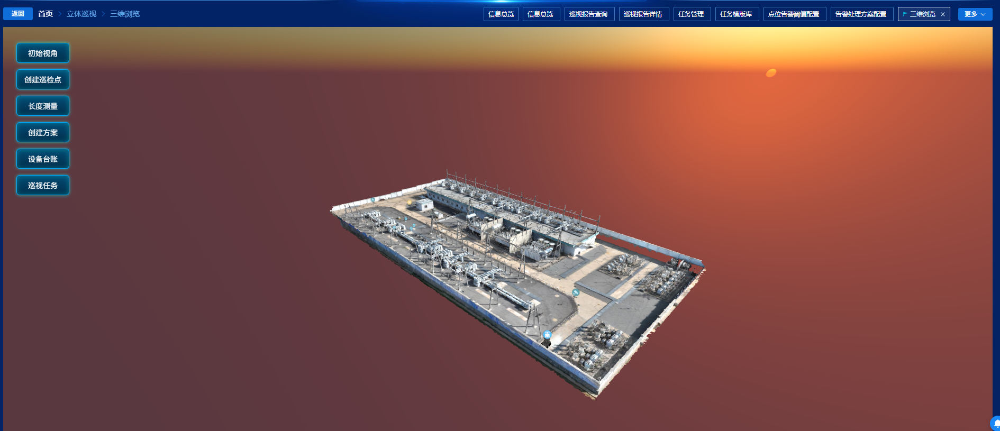
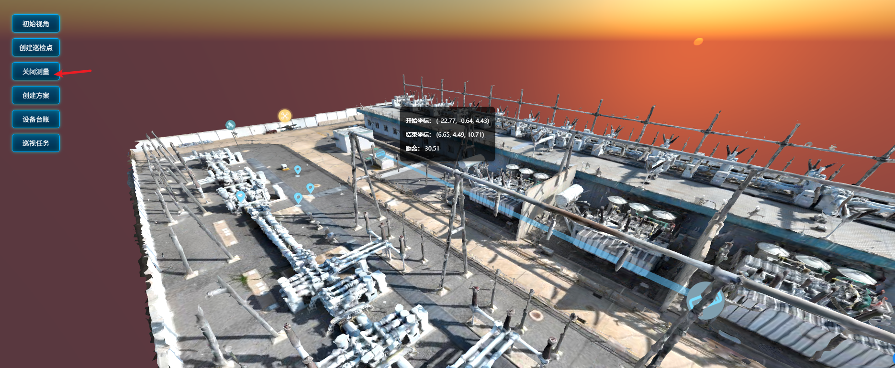

# 项目 Three.js 知识总结

> 基于仓库真实代码检索。Three.js 业务代码**仅出现在** `src/views/ExtendFunction/ThreeDimensional/index.vue`。  
> 版本：`three@0.162.0`（`package.json` 声明 `^0.162.0`，`yarn.lock` 锁定 `0.162.0`）。  
> 未安装 `@types/three`；`src/vite-env.d.ts` 用 `declare module 'three'` 把类型打成 `any`。

---




长度测量




## 0. 检索范围与排除项

### 0.1 实际使用入口

| 文件 | 结论 |
| --- | --- |
| `src/views/ExtendFunction/ThreeDimensional/index.vue` | **唯一真实 Three.js 场景**：加载变电站 GLB、无人机 OBJ、摄像机 OBJ、机器人 FBX，支持轨道漫游、点击拾取、长度测量、巡检点、设备标签、相机/模型补间 |
| `public/glb/` | 模型资源：`ldsw.glb`、`uav.obj/.mtl`、`cameraEntity.obj/.mtl`、`robot.fbx` |
| `src/assets/images/three-dimensional/` | 精灵图标：无人机 / 机器人 / 摄像机 / 巡检点 / 测量点 |

当前静态路由、`testMenuList.json` **都没有挂载** `ThreeDimensional/index.vue`。菜单里的「立体巡视 / 三维浏览 / 三维交互 / 三维巡视」指向的是 `NotOpen` 占位页。本页更像可独立打开的三维原型。

### 0.2 名字像 3D、但不是 Three.js（已排除）

| 位置 | 实际技术 | 为何排除 |
| --- | --- | --- |
| `src/views/home/components/Map/useMap3D.ts` | **echarts-gl** 的 `geo3D` / `map3D` | 首页三维地图，底层不是 Three.js API |
| `src/main.ts` 的 `import 'echarts-gl'` | ECharts WebGL 插件 | 与 Three.js 无 import 关系 |
| `src/components/BaseVideo/components/threeDResult.vue` | 2D Canvas 框选变焦 | 文件名含 3D，代码是 `getContext('2d')` |
| `src/views/stereoscopicInspection/threeDBrowse|Interactive|Patrol` | `NotOpen` 占位 | 无 Three.js |
| `src/views/ExtendFunction/MultiDimensionalAnalysis/ThreePhaseCompare` | 三相数据分析 | 业务名「三相」，不是 3D |

### 0.3 依赖声明了、业务代码未用

| 包 | 版本 | 结论 |
| --- | --- | --- |
| `three-orbitcontrols` | 2.110.3 | `package.json` 有，**全仓库无 import**。这是 three r110 时代的旧包，和 r162 不兼容。项目实际用的是 `three/examples/jsm/controls/OrbitControls` |
| `@types/three` | 未安装 | r162 自带 `.d.ts`，但被 `declare module 'three'` 覆盖 |
| lil-gui / stats / cannon / DRACOLoader / CSS3DRenderer | — | **未出现** |

### 0.4 配套生态库（实际用到）

| 包 | 锁定版本 | 用途 |
| --- | --- | --- |
| `@tweenjs/tween.js` | 18.6.4 | 相机飞入、无人机水平移动 |
| `meshoptimizer` | 0.24.0 | 给 `GLTFLoader` 提供 Meshopt 网格解码器，加载压缩 GLB |

---

## 1. 用到模块清单（位置 + 摘要）

### 1.1 Three.js 原生模块

| 模块 / API | 文件:行号 | 代码片段摘要 |
| --- | --- | --- |
| `THREE.Scene` | `index.vue:89` | 场景图根节点，全程单例 |
| `THREE.PerspectiveCamera` | `index.vue:222` | `fov=75`，near=0.1，far=1000；按容器宽高算 aspect |
| `THREE.WebGLRenderer` | `index.vue:288-291` | `antialias: true`，`setPixelRatio(devicePixelRatio)`，canvas 挂到容器 |
| `THREE.Raycaster` + `Vector2` | `index.vue:85-86, 484-491` | 点击转 NDC，射线拾取模型表面点 / 设备 Group |
| `THREE.Vector3` | 多处 | 位置、方向、包围盒中心、相机偏移、测量向量 |
| `THREE.Group` | `index.vue:161-186` | 模型 + 头顶 Sprite 打成一组，用 `name` 当类型（`uav` / `robot` / `cameraEntity`） |
| `THREE.Box3` | `index.vue:165, 253, 517, 550, 590` | 包围盒 → 中心 / 尺寸 / 头顶标签高度 |
| `THREE.TextureLoader` + `SpriteMaterial` + `Sprite` | `index.vue:150-156` | 始终朝向相机的 2D 图标（设备、巡检点、测量点） |
| `THREE.BoxGeometry` + `MeshBasicMaterial` + `Mesh` | `index.vue:411-425` | 把「测量线」做成半透明长方体 |
| `THREE.Quaternion.setFromUnitVectors` | `index.vue:431-433` | 把长方体默认 X 轴旋到两点连线方向 |
| `THREE.MathUtils.degToRad` + `Vector3.setFromSphericalCoords` | `index.vue:336-339` | 天空太阳方向 |
| `THREE.DirectionalLight` | `index.vue:342-345` | 模拟太阳，`castShadow=true`（但渲染器未开阴影） |
| `THREE.AmbientLight` | `index.vue:348-349` | 环境光，避免背光全黑 |
| `Object3D` 常用方法 | 多处 | `add/remove/traverse/clone/lookAt/updateMatrixWorld/getObjectByName` |
| `THREE.AxesHelper` | `index.vue:225-226` **已注释** | 调试坐标轴，运行时不生效 |

### 1.2 Three.js examples/jsm（官方附加模块，随 three 包提供）

| 模块 | 引入路径 | 文件:行号 | 摘要 |
| --- | --- | --- | --- |
| `OrbitControls` | `three/examples/jsm/controls/OrbitControls` | `313-319` | 鼠标旋转/缩放/平移；限制俯仰、距离、开阻尼 |
| `CSS2DRenderer` / `CSS2DObject` | `three/examples/jsm/renderers/CSS2DRenderer` | `294-308, 357` | 把 Vue 里的 DOM（设备详情、测量弹窗）钉在 3D 坐标上 |
| `GLTFLoader` | `three/examples/jsm/loaders/GLTFLoader` | `118-119, 242-285` | 加载站所主体 `ldsw.glb` |
| `MTLLoader` + `OBJLoader` | `three/examples/jsm/loaders/MTLLoader`、`OBJLoader` | `190-214` | 先材质后网格，加载无人机、摄像机 |
| `FBXLoader` | `three/examples/jsm/loaders/FBXLoader.js` | `232-239` | 加载机器人，`scale=0.01` |
| `Sky` | `three/examples/jsm/objects/Sky` | `323-339` | 程序化天空穹顶 + 大气散射参数 |

### 1.3 配套插件 / 生态库

| 库 | 引入 | 文件:行号 | 摘要 |
| --- | --- | --- | --- |
| `@tweenjs/tween.js` | `import TWEEN from '@tweenjs/tween.js'` | `64, 356, 371-400, 605-614` | 相机位姿补间、Group 水平移动；**必须在 `animate` 里 `TWEEN.update()`** |
| `meshoptimizer` | `import { MeshoptDecoder } from 'meshoptimizer'` | `71, 118-119` | `gltfLoader.setMeshoptDecoder(MeshoptDecoder)`，解码 Meshopt 压缩网格 |

---

## 2. 逐模块解析

说明：下面每个模块都只写**本项目用到的部分**。r162 里还有大量未使用能力（骨骼动画、后期处理、物理、粒子等），不展开。

---

### 2.1 Scene（场景）【原生 · 重点】

**作用与概念**

Scene 是一棵树的根。所有看得见的东西（模型、灯、天空、Sprite、CSS2D 标签）都通过 `scene.add()` 挂上去。渲染时：`renderer.render(scene, camera)` 从这棵树收集物体。

**本项目用途**

模块级单例：`const scene = new THREE.Scene()`。生命周期内不重建。GLB 克隆体、OBJ/FBX 的 Group、测量 Mesh/Sprite、Sky、灯光、CSS2DObject 全部进同一棵树。`scene.getObjectByName('uav')` 用来找无人机做飞行动画。

**核心 API（项目用到的）**

| API | 含义 |
| --- | --- |
| `scene.add(obj)` | 挂到场景 |
| `scene.remove(obj)` | 从场景摘掉（不自动 dispose GPU 资源） |
| `scene.children` | 直接子节点数组 |
| `scene.getObjectByName(name)` | 按 `name` 深度查找 |
| `scene.clear()` | 清空子节点（r162 可用） |
| `scene.traverse(fn)` | 深度遍历（卸载时释放 Mesh） |

**实现思路**

场景在「script setup」顶层创建，不放进 `ref`。相机、渲染器、控制器用 `ref`，是因为它们要等 DOM 容器就绪后才 `new`。卸载时先 `scene.clear()` 再 `clearScene()` 试图 dispose 几何/材质。

**注意 / 坑**

- `remove` ≠ 释放显存。几何、材质、贴图要自己 `dispose()`。
- `getObjectByName` 返回**第一个**同名对象。无人机 Group 的 `name` 来自文件名 `'uav'`，同名多个会找错。
- 卸载顺序：`scene.clear()` 已经把 `children` 清空，后面的 `clearScene()` 循环基本跑空，几何 dispose 可能没真正执行到。见第 4 节。

---

### 2.2 PerspectiveCamera（透视相机）【原生 · 重点 · 易错】

**作用与概念**

人眼透视：近大远小。四个参数：`fov`（垂直视角，度）、`aspect`（宽/高）、`near`、`far`。只有 `[near, far]` 之间的物体会被画出来。

**本项目用途**

```222:222:src/views/ExtendFunction/ThreeDimensional/index.vue
  camera.value = new THREE.PerspectiveCamera(75, containerRef.value.clientWidth / containerRef.value.clientHeight, 0.1, 1000);
```

GLB 加载成功后，用模型包围盒对角线估距离，把相机放到「能看全站」的斜上方，并记下初始位姿供「初始视角」按钮飞回。

```257:271:src/views/ExtendFunction/ThreeDimensional/index.vue
        const maxDim = Math.max(size.x, size.y, size.z);
        const fov = camera.value.fov * (Math.PI / 180); // 角度转弧度
        const cameraDistance = maxDim / (2 * Math.tan(fov / 2));
        const k = 0.7; // 越小越近
        camera.value.position.set(
          center.x + cameraDistance * k,
          center.y + cameraDistance * k * 0.8,
          center.z + cameraDistance * k
        );
        camera.value.lookAt(center);
```

窗口缩放时改 `aspect` 并 `updateProjectionMatrix()`，否则画面拉伸。

**核心 API**

| API | 含义 |
| --- | --- |
| `camera.position` | 相机世界坐标 |
| `camera.lookAt(v)` | 朝向某点（只改相机朝向，**不改** OrbitControls 的 target） |
| `camera.fov` | 垂直视角，公式里要转弧度 |
| `camera.aspect` | 必须跟画布一致 |
| `camera.updateProjectionMatrix()` | 改 fov/aspect/near/far 后必须调用，否则不生效 |

**注意 / 坑**

1. **`lookAt` 与 OrbitControls.target 不同步**（高频 bug）  
   加载完模型后只 `camera.lookAt(center)`，接着却把 `controls.target` 记成初始目标。此时控制器 target 仍是默认 `(0,0,0)`。若模型中心不在原点，「初始视角」飞回去会对不准。正确做法是同时：`controls.target.copy(center); controls.update()`。
2. `far=1000`：Sky 的 `scale` 是 `450000`，天空几何远超 far。Sky 内部用着色器画大气，一般仍能看见；若以后把天空换成巨大 Mesh，会被裁掉。
3. `fov=75` 偏广角，边缘有变形。站所浏览常用 45～60。
4. 自适应距离公式按「最大边」而不是真正对角线，再乘 `k=0.7`，是经验值，换模型要重调。

---

### 2.3 WebGLRenderer（渲染器）【原生 · 重点 · 性能】

**作用与概念**

真正往 GPU 画的对象。它创建 `<canvas>`，每帧 `render(scene, camera)`。本项目还有第二路 `CSS2DRenderer`，专门画 DOM 标签，**每帧两个 renderer 都要 render**。

**本项目用途**

```287:291:src/views/ExtendFunction/ThreeDimensional/index.vue
  renderer.value = new THREE.WebGLRenderer({ antialias: true });
  renderer.value.setSize(containerRef.value.clientWidth, containerRef.value.clientHeight);
  renderer.value.setPixelRatio(window.devicePixelRatio);
  containerRef.value.appendChild(renderer.value.domElement);
```

动画循环：

```353:359:src/views/ExtendFunction/ThreeDimensional/index.vue
const animate = () => {
  animateId.value = requestAnimationFrame(animate);
  controls.value?.update();
  TWEEN.update();
  labelRenderer?.render(scene, camera.value);
  renderer.value?.render(scene, camera.value);
};
```

卸载：`removeChild` → `dispose()` → `forceContextLoss()`。

**核心 API**

| API | 含义 |
| --- | --- |
| `new WebGLRenderer({ antialias })` | 抗锯齿，代价是填充率 |
| `setSize(w,h)` | 画布 CSS 像素尺寸 |
| `setPixelRatio(n)` | 物理像素倍率 |
| `render(scene, camera)` | 画一帧 |
| `dispose()` | 释放内部缓冲 |
| `forceContextLoss()` | 强制丢 WebGL 上下文，防页面切走后 GPU 泄漏 |
| `domElement` | 真正的 canvas，OrbitControls 要绑这个 |

**注意 / 坑**

1. **`setPixelRatio(window.devicePixelRatio)` 未封顶**  
   2x/3x 屏上像素量是 4～9 倍。变电站 GLB 面数通常不小，容易掉帧。常见写法：`setPixelRatio(Math.min(window.devicePixelRatio, 2))`。
2. **r152+ 颜色空间**  
   r162 默认 `outputColorSpace = SRGBColorSpace`（旧 API `outputEncoding = sRGBEncoding` 已废弃）。项目没手动设，走默认即可。若以后贴图发灰/过曝，先查颜色空间，不要用 r152 前的 `sRGBEncoding`。
3. 开了 `directionalLight.castShadow = true`，但**没有** `renderer.shadowMap.enabled = true`，阴影不会出现。
4. 未设 `toneMapping`。GLTF 的 PBR 材质在 r152+ 默认色彩管线下可能偏亮/偏暗，需要时再加 `ACESFilmicToneMapping`。
5. `animate` 在 `onMounted` 里无条件启动。容器宽高为 0 时（例如父级 `v-if` 晚到）会先画出错误尺寸，要靠 `handleResize` 补救。

---

### 2.4 Vector2 / Vector3 / Quaternion / MathUtils【原生 · 重点 · 坐标】

**作用与概念**

Three.js 几乎所有空间计算都是这几个数学对象，不是普通 `{x,y,z}` 字面量。

- `Vector2`：这里只用在鼠标 NDC（归一化设备坐标，范围 `[-1,1]`）。
- `Vector3`：位置、方向、包围盒中心。
- `Quaternion`：旋转，避免万向节死锁。项目用来「把盒子的 X 轴转到两点连线」。
- `MathUtils.degToRad`：角度转弧度（Three 内部三角函数全是弧度）。

**本项目用途（三类）**

1. 点击 → NDC → 射线：

```485:489:src/views/ExtendFunction/ThreeDimensional/index.vue
  const rect = containerRef.value.getBoundingClientRect();
  mouse.x = ((event.clientX - rect.left) / rect.width) * 2 - 1;
  mouse.y = -((event.clientY - rect.top) / rect.height) * 2 + 1;
  raycaster.setFromCamera(mouse, camera.value);
```

Y 必须取负：屏幕向下为正，NDC 向上为正。

2. 向量运算：`subVectors`（p2-p1）、`addVectors` 再 `multiplyScalar(0.5)`（中点）、`normalize`、`length`、`clone`、`copy`。
3. 测量棒旋转：

```431:433:src/views/ExtendFunction/ThreeDimensional/index.vue
  const xAxis = new THREE.Vector3(1, 0, 0);
  const quaternion = new THREE.Quaternion().setFromUnitVectors(xAxis, dir.clone().normalize());
  measureLine.quaternion.copy(quaternion);
```

`setFromUnitVectors(a, b)`：算出把单位向量 a 转到 b 的最短旋转。BoxGeometry 默认沿 X 轴伸长，所以先把几何 `translate(distance/2, 0, 0)` 让原点在一端，再整根旋到 p1→p2。

**注意 / 坑**

- `subVectors` 会改**调用者**。`dir.multiplyScalar(distance)` 同样改原向量。后面若还要用 `dir` 当方向，必须先 `clone()`。项目在相机偏移处写了 `dir.multiplyScalar(distance)`，该 `dir` 用完即弃，当前安全。
- `position.copy(v)` 与 `position.set(x,y,z)` 都是改同一 Vector3，不会换引用。
- 世界坐标 vs 本地坐标：`object.position` 是相对父节点的。包围盒 `Box3.setFromObject` 给出的是**世界** AABB。`moveGroupTo` 用「包围盒中心」和 `group.position` 的差当 offset，就是在处理「pivot 不在几何中心」。
- 不要对同一 Vector3 又当起点又当动画对象还去 mutate，Tween 在 `onUpdate` 里直接改 `startPos`，依赖 TWEEN 每帧写入。

---

### 2.5 Raycaster（射线拾取）【原生 · 重点 · 易错】

**作用与概念**

从相机出发，穿过鼠标那根射线，求与网格三角形的交点。返回数组按距离从近到远。

**本项目用途**

同一次 click 做了**两次**拾取：

1. `raycaster.intersectObject(cloneObj, true)`  
   只打站所 GLB。命中后取 `intersects[0].point` 作为测量点 / 巡检点世界坐标。
2. `raycaster.intersectObjects(scene.children, true)`  
   打整棵场景。从命中 Mesh 一直 `parent` 爬到 Scene 的直接子节点，当作设备 Group，弹出详情并飞相机。

`recursive=true` 才会进入 Group 内部的 Mesh。

**核心 API**

| API | 含义 |
| --- | --- |
| `setFromCamera(ndc, camera)` | 用 NDC + 相机生成射线 |
| `intersectObject(obj, recursive)` | 与单个对象 |
| `intersectObjects(arr, recursive)` | 与数组 |
| 命中项 `.point` | 世界坐标交点 |
| 命中项 `.object` | 被击中的 Mesh |
| 命中项 `.distance` | 相机到交点距离 |

**注意 / 坑**

1. **监听绑在 `window` 上**，不是 canvas。点右侧菜单按钮也会走 `onMouseClick`，可能误拾取。
2. **两次拾取互相干扰**：测距时点到模型，第一段会打点画线，第二段只要爬到带 `name` 的 Group（含整个 GLB 克隆体——但 GLB 的 `cloneObj` 没设 name，会 `return`），点到无人机/摄像机仍会弹出设备面板并飞相机。测距和点选设备没有互斥。
3. Sprite / CSS2D 默认也能被射线打到。测量模式下 `intersectObject(cloneObj)` 避开了它们；第二段 `scene.children` 则可能先打到刚生成的测量 Sprite。
4. `cloneObj` 在 GLB 回调前是 `{}`。若用户在模型加载完前点击，`intersectObject` 行为未定义，可能直接报错。
5. NDC 必须用容器 `getBoundingClientRect()`，不能用 `clientX / window.innerWidth`（页面有顶栏侧栏）。

---

### 2.6 Group / Object3D 场景图【原生 · 重点】

**作用与概念**

`Object3D` 是所有 3D 对象的基类（Mesh、Group、Camera、Light、Sprite、CSS2DObject 都是）。`Group` 是空的 Object3D，专门用来打包。子节点坐标相对父节点；父节点一动，整组跟着动。

**本项目用途**

`createModelGroup(model, type)`：

1. `new Group()`，`add(model)`，`group.name = type`（`'uav'` / `'robot'` / `'cameraEntity'`）。
2. 算模型包围盒，在 `box.max.y + 1` 放类型 Sprite。
3. `scene.add(group)`。

点击设备时沿 parent 链爬到 Scene 直系子节点，用这个 Group 当「一台设备」。`moveGroupTo('uav', {x,z})` 用名字取 Group，Tween 改 `group.position`（锁 Y），实现无人机飞向巡检点。

**核心 API**

| API | 含义 |
| --- | --- |
| `group.add / remove` | 维护子节点 |
| `group.name` | 检索与业务类型 |
| `group.position / scale / rotation / quaternion` | 本地变换 |
| `updateMatrixWorld(true)` | 立刻刷新世界矩阵（改完 position 马上算包围盒时需要） |
| `clone()` | 深拷贝对象树（GLB 用了 `obj.clone()`） |
| `getObjectByName` | 子树查找 |
| `traverse` | 卸载时遍历 Mesh 做 dispose |
| `visible` | 显隐（CSS2DObject 用） |

**注意 / 坑**

- 爬 parent 时条件是 `!(obj.parent instanceof THREE.Scene)`。Sky、灯、测量线都是 Scene 直系子节点；点到天空或测量棒时 `group.name` 为空会 return。点到无人机则能对上。
- `cloneObj.rotation.set(0,0,0); position.set(0,0,0)` 假设 GLB 自身朝向已正确。很多导出模型是 Z-up，进 Three（Y-up）会躺倒，本页没做轴转换。
- `labelObject` 会被 `group.add(labelObject)`。CSS2DObject 同时只能有一个 parent，从上一台设备挪到下一台时要先摘掉。代码用 `oldLabel = group.getObjectByName('device-label')`，但添加时设的是 `labelObject.name = group.name`（uav/robot/…），**不是** `'device-label'`，这段摘除逻辑对不上。

---

### 2.7 Box3 包围盒【原生 · 重点】

**作用与概念**

轴对齐包围盒（AABB）：世界坐标系下的 min/max 立方体。用来量尺寸、找中心、把标签放头顶、算相机距离。

**本项目用途**

| 场景 | 用法 |
| --- | --- |
| 设备图标高度 | `center` + `box.max.y + 1` |
| GLB 自适应相机 | `getSize` → maxDim → cameraDistance |
| 测量后飞相机 | 测量棒的 box 中心当 lookAt |
| 设备详情面板 | `box.max.y + 5` |
| 无人机平移 | 中心点当 Tween 起点，`group.position - center` 当 pivot 补偿 |

**核心 API**

| API | 含义 |
| --- | --- |
| `new Box3().setFromObject(obj)` | 含所有子孙的世界 AABB |
| `getCenter(target)` | 写入 target 并返回 |
| `getSize(target)` | 三边长度 |
| `box.max.y` | 世界最高点 |

**注意 / 坑**

- `setFromObject` 依赖世界矩阵。OBJ 加载后先 `position.copy` 再 `updateMatrixWorld(true)`，就是为了包围盒正确。若忘了 update，box 还在原点。
- AABB 不是物体真实形状。斜着的测量棒的 box 比棒本身大，用它当相机目标会略偏。
- `getCenter(new Vector3())` 每次 new，当前频率低无所谓；热循环里应复用临时向量。

---

### 2.8 TextureLoader / Sprite / SpriteMaterial【原生】

**作用与概念**

Sprite 是广告牌：永远正对相机的一张图。适合标注，不适合当真实三维设备。

**本项目用途**

`createIconSprite(url, scale)`：`TextureLoader.load` → `SpriteMaterial({ map, transparent: true })` → `Sprite` → `scale.set(s,s,1)`。用于：

- 设备头顶：无人机 / 机器人 / 摄像机 PNG
- 测量两点的标记
- 巡检点标记

**核心 API**

| API | 含义 |
| --- | --- |
| `TextureLoader.load(url)` | 异步加载，返回的 Texture 立刻可赋给材质（图稍后才显示） |
| `SpriteMaterial.map` | 贴图 |
| `SpriteMaterial.transparent` | PNG 透明通道 |
| `sprite.scale` | 世界单位下的宽高；第三分量对 Sprite 无意义，习惯填 1 |
| `sprite.position` | 世界或父空间位置；测量点会 `y += 0.7` 避免陷入地表面 |

**注意 / 坑**

- 没设 `texture.colorSpace = THREE.SRGBColorSpace`（r152+ 彩色贴图建议设置）。图标可能略偏色。
- `clearMeasurePoints` 对 Sprite 调 `child.geometry?.dispose()`。Sprite 的几何是共享的；主要该 dispose 的是 `material` 和 `material.map`。项目没 dispose 贴图。
- 大量 Sprite 仍是一次一次 draw call，巡检点没有上限，点多了会卡。
- `TextureLoader` 没有 LoadingManager，失败时没有业务提示。

---

### 2.9 Mesh / BoxGeometry / MeshBasicMaterial【原生】

**作用与概念**

看得见的实体 = **几何（顶点）+ 材质（怎么着色）+ Mesh（前两者的容器）**。

本项目几乎不「手建」站所网格（站所来自 GLB），唯一手建 Mesh 是测量棒。

**为何用 Box 而不是 Line**

`Line` 宽度在 Windows 上受 GL 限制，基本只能 1 像素。用细长方体可以有体积、半透明、可被包围盒计算。

```411:438:src/views/ExtendFunction/ThreeDimensional/index.vue
  const geometry = new THREE.BoxGeometry(distance, 0.2, 0.2);
  geometry.translate(distance / 2, 0, 0);
  const material = new THREE.MeshBasicMaterial({
    color: 0x5dc5ff,
    transparent: true,
    opacity: 0.5
  });
  measureLine = new THREE.Mesh(geometry, material);
  measureLine.position.copy(p1);
  // quaternion 对齐 dir ...
  measureLine.position.y += 0.7;
```

`MeshBasicMaterial`：**不受光照**。测量棒在任何天空亮度下颜色稳定。PBR 的 `MeshStandardMaterial` 才对灯光有反应——那是 GLB 内部材质，本页没手写。

**核心 API**

| API | 含义 |
| --- | --- |
| `BoxGeometry(x,y,z)` | 以原点为中心的盒子 |
| `geometry.translate` | 烘焙进顶点，改变几何本地原点 |
| `MeshBasicMaterial.color/transparent/opacity` | 纯色半透明 |
| `mesh.quaternion` | 用四元数旋转 |
| `geometry.dispose()` / `material.dispose()` | 释放 GPU |

**注意 / 坑**

- `BoxGeometry` 默认中心在原点。不 `translate(distance/2,0,0)` 的话，旋转中心在棒中点，`position.copy(p1)` 会对不齐起点。
- 两点几乎重合时 `dir.normalize()` 不稳定。
- 两点与 X 轴反向平行时 `setFromUnitVectors` 仍可用，但 degenerate 方向要小心。
- 清测量时 dispose 了 geometry/material，这是对的；但 `scene.children.forEach` 里按 `name === 'measureSprite'` 删除，遍历时 `remove` 可能跳过元素。代码用了 `slice()` 浅拷贝再遍历，这点是正确的。

---

### 2.10 灯光：DirectionalLight + AmbientLight【原生 · 易错】

**作用与概念**

- `AmbientLight`：到处均匀加一层亮，没有方向，不产生明暗对比。没有它，背光面全黑。
- `DirectionalLight`：平行光（模拟太阳）。`position` 只表示**方向**（从 position 指向原点），不是点光源位置。

**本项目用途**

太阳方向来自 Sky 的球面坐标，再拷给平行光：

```336:349:src/views/ExtendFunction/ThreeDimensional/index.vue
  const phi = THREE.MathUtils.degToRad(90);
  const theta = THREE.MathUtils.degToRad(180);
  sun.setFromSphericalCoords(1, phi, theta);
  skyUniforms['sunPosition'].value.copy(sun);
  const directionalLight = new THREE.DirectionalLight(0xffffff, 2);
  directionalLight.position.copy(sun);
  directionalLight.castShadow = true;
  const ambientLight = new THREE.AmbientLight(0xffffff, 1);
```

Three 的球面：`phi` 是与 +Y 的夹角。`phi=90°` 表示太阳在地平线，场景会偏暗、偏橙。`theta=180°` 是方位角。

强度：平行光 `2` + 环境光 `1`，整体偏亮。GLTF PBR 在 r152+ 工作流里 `intensity=1` 的环境光已经很亮。

**注意 / 坑**

- `castShadow=true` 只是光源愿意投影；还必须 `renderer.shadowMap.enabled = true`，并给 Mesh `castShadow/receiveShadow`。当前全没开，**没有阴影**。
- 平行光 `position.copy(sun)` 而 sun 是长度为 1 的方向向量，光等于从很近的地方照向原点。对 DirectionalLight 够用；若改成 PointLight 就会错。
- 环境光颜色 `0xffffff`、强度 `1` 会冲掉平行光的立体感。调氛围优先降环境光，而不是只改天空。

---

### 2.11 GLTFLoader【jsm · 重点】

**作用与概念**

glTF/GLB 是实时三维交换格式。GLB 是二进制打包（网格 + 材质 + 贴图）。`gltf.scene` 是已经组装好的 Object3D 树，直接 `scene.add`。

**本项目用途**

```118:119:src/views/ExtendFunction/ThreeDimensional/index.vue
let gltfLoader = new GLTFLoader();
gltfLoader.setMeshoptDecoder(MeshoptDecoder);
```

加载 `/glb/ldsw.glb`（放在 `public/glb/`，开发时走站点根路径）。成功后 `clone()` 再 add，旋转位置归零，用包围盒摆相机，关掉全屏 Loading。失败则 `ElMessage.error`。

**核心 API**

| API | 含义 |
| --- | --- |
| `load(url, onLoad, onProgress, onError)` | 本页 onProgress 传了 `undefined` |
| `setMeshoptDecoder(decoder)` | 解码 `EXT_meshopt_compression` |
| 回调参数 `gltf.scene` | 场景根 |
| `gltf.animations` | 动画片段（**本页未用**） |
| `gltf.cameras` | 文件内相机（**未用**） |

**注意 / 坑**

- `obj.clone()` 默认浅拷贝几何、深拷贝节点。对只展示、不卸载单份资源可以；若一边改材质一边留原件，会互相影响。本页原件 `obj` 没有 add 进场景，只留 clone。
- 未使用 `DRACOLoader`。若以后换 Draco 压缩 GLB，必须再 `setDRACOLoader`，否则加载失败。
- 未 `LoadingManager`，进度条只有全局 `showFullScreenLoading`，大模型会长时间白屏。
- `.bind(this)` 写在普通函数回调上：本页是「script setup」，没有有意义的 `this`，多余。
- 路径 `/glb/ldsw.glb` 依赖 `public/` 拷贝；生产 `base` 若不是 `/`，要改成 `import.meta.env.BASE_URL + 'glb/ldsw.glb'`。

**版本**

r162 的 GLTFLoader 在 `three/examples/jsm/loaders/GLTFLoader`。r153+ 文档开始推荐 `three/addons/loaders/GLTFLoader.js`（等价别名）。两条在 r162 都可用。不要用更老的 `THREE.GLTFLoader` 全局挂载写法。

---

### 2.12 MTLLoader + OBJLoader【jsm】

**作用与概念**

OBJ：纯网格文本。MTL：配套材质（颜色、贴图路径）。必须先 MTL 再 `objLoader.setMaterials(materials)`。

**本项目用途**

`loadObjFile(filename, coordinate, scaleSize)`：

- 无人机：`uav`，坐标 `(30,5,22)`，缩放 `0.1`
- 摄像机：`cameraEntity` 两台，缩放默认 1

流程：`mtlLoader.load(/glb/xx.mtl)` → `materials.preload()` → `objLoader.setMaterials` → `load(/glb/xx.obj)` → `scale` / `position` → `updateMatrixWorld(true)` → `createModelGroup` → `scene.add`。

**注意 / 坑**

- MTL 里的贴图路径是相对 MTL 文件的。本页贴图与 mtl 同在 `/glb/`（`uav.jpg`、`cameraEntity.jpg`），对得上。若 MTL 写 `map_Kd textures/xx.jpg` 而文件不在该相对路径，模型会变白。
- OBJ 没有 PBR，观感比 GLB 站所「塑料」。这是格式限制。
- 没有 onError；mtl/obj 404 时只在控制台失败，场景里缺模型。
- `filename` 同时当 Group.name 和文件名，类型枚举写死在 `createModelGroup` 的 switch。

---

### 2.13 FBXLoader【jsm】

**作用与概念**

FBX 常见于 3ds Max / Maya。单位经常是厘米，Three 场景按米，所以要缩到 `0.01`。

```232:238:src/views/ExtendFunction/ThreeDimensional/index.vue
  const fbxLoader = new FBXLoader();
  fbxLoader.load('/glb/robot.fbx', object => {
    object.position.set(31, -2.2, 24);
    object.scale.set(0.01, 0.01, 0.01);
    const group = createModelGroup(object, 'robot');
    scene.add(group);
  });
```

**注意 / 坑**

- FBX 常自带动画。本页没用 `AnimationMixer`，机器人是静帧。
- FBXLoader 体积大（解析 ASCII/Binary），会打进这个页面的 JS 包。当前该页未进路由，对主包影响取决于有没有别处异步 import 它。
- 同样没有 onError。
- 引入写成 `FBXLoader.js`（带后缀），其它 loader 不带后缀。r162 + Vite 两种都能解析，但建议统一。

---

### 2.14 OrbitControls【jsm · 重点 · 易错】

**作用与概念**

绕一个 **target 点** 旋转、滚轮拉近拉远、右键平移。它改的是 `camera.position` 和自己的 `target`，不是 Scene。

**本项目用途**

```312:319:src/views/ExtendFunction/ThreeDimensional/index.vue
    controls.value = new OrbitControls(camera.value, renderer.value.domElement);
    controls.value.maxPolarAngle = Math.PI / 2;
    controls.value.dampingFactor = 0.05;
    controls.value.enableDamping = true;
    controls.value.maxDistance = 80;
    controls.value.minDistance = 20;
```

- `maxPolarAngle = π/2`：不能转到地平线以下，避免钻地。
- `enableDamping`：惯性。**开了就必须每帧 `controls.update()`**，项目在 `animate` 里做了。
- 距离夹在 20～80，和自适应相机公式、测量飞入距离 `3` 是不同尺度，飞到设备近处时可能被 `minDistance=20` 立刻弹开。

**核心 API**

| API | 含义 |
| --- | --- |
| `controls.target` | 旋转中心，默认 (0,0,0) |
| `enableDamping` / `dampingFactor` | 阻尼 |
| `minDistance` / `maxDistance` | 透视相机的dolly范围 |
| `maxPolarAngle` | 最大极角（从 +Y 往下） |
| `update()` | 阻尼或外部改了 camera/target 后调用 |
| `dispose()` | 卸事件 |

**注意 / 坑**

1. 必须绑 `renderer.domElement`，不要绑 `window` 或外层 div，否则事件坐标和射线不一致。
2. CSS2DRenderer 的 DOM 盖在 canvas 上。项目设了 `pointerEvents = 'none'`，鼠标才能穿透到 OrbitControls。设备面板内部又设 `pointer-events: auto`，所以标签可点、画布可拖。
3. Tween 相机时每帧改 `camera.position` 和 `controls.target`，并 `controls.update()`。若漏 update，阻尼会把相机拉回去。
4. **与 `minDistance=20` 冲突**：点击设备后 `distance = 3` 试图贴到物体旁，控制器会在下一帧把相机推回至少 20。表现为「飞过去又弹开」。测距飞入同样问题。
5. `three-orbitcontrols` npm 包不要用，那是 r110 的 `THREE.OrbitControls` 全局补丁。

**版本**

r162：从 `three/examples/jsm/controls/OrbitControls` 导入。r150 左右曾有 `OrbitControls` 导入路径文档变更，`examples/jsm` 与 `addons` 等价。不要用 `import { OrbitControls } from 'three'`（核心包不导出它）。

---

### 2.15 CSS2DRenderer / CSS2DObject【jsm · 重点】

**作用与概念**

把 HTML 元素变成「钉在 3D 世界坐标上的 2D 标签」。每帧按相机投影算 left/top。不是 CSS3D（CSS3D 会带透视倾斜）；本页注释写「CSS3D 场景」是笔误。

**本项目用途**

1. 创建 `labelRenderer`，绝对定位铺满容器，`pointerEvents: 'none'`。
2. 把模板里 `#device-label`、`#measure-popup` 包成 `CSS2DObject`，默认 `visible=false`。
3. 点设备：标签 `position` 设到包围盒顶上，`group.add(labelObject)`。
4. 测距完成：标签放到线段中点上方，`scene.add(measureObject)`。
5. `animate` 里先 `labelRenderer.render` 再 WebGL `render`。

模板里这两个 div 写了 `v-show="false"`，是为了不占 Vue 布局；真正显隐靠 `CSS2DObject.visible`。`#device-label { pointer-events: auto }` 让关闭按钮和下拉可点。

**核心 API**

| API | 含义 |
| --- | --- |
| `setSize(w,h)` | 必须与 WebGLRenderer 同步 |
| `domElement` | 覆盖在 canvas 上的 div |
| `new CSS2DObject(htmlElement)` | 把已有 DOM  spoof 进场景图 |
| `labelObject.position` | 3D 世界/父空间坐标 |
| `labelObject.visible` | 显隐 |

**注意 / 坑**

- Vue `v-show="false"` 是 `display:none`。CSS2D 仍可能把它移到自己的层。关闭按钮用 `labelObject.visible = false`，不要指望再靠 v-show。
- 元素被 CSS2DRenderer 挪走后，不再是 `.three-container` 的 Vue 子节点布局参与者，但事件仍走 Vue。这是故意的。
- 窗口 resize 必须同时 `labelRenderer.setSize`，否则标签偏移。
- 层级：CSS2D 在 canvas **之上**。3D 遮挡关系不会挡住 HTML，远处设备的标签仍完整显示（会「透视穿透」）。要 occlude 得自己做深度检测，本页没有。
- `cancelDeviceDetail` 只藏标签，不飞回相机。

---

### 2.16 Sky【jsm】

**作用与概念**

`examples/jsm/objects/Sky` 是一个巨大天空球 + 大气散射 Shader。不是 HDRI 环境贴图，**不会**给 GLTF 提供 IBL（镜面环境反射）。站所金属/绝缘子的「环境反射」主要靠材质自身和两盏灯。

**本项目用途**

```323:339:src/views/ExtendFunction/ThreeDimensional/index.vue
  const sky = new Sky();
  sky.scale.setScalar(450000);
  scene.add(sky);
  const skyUniforms = sky.material.uniforms;
  skyUniforms['turbidity'].value = 10;
  skyUniforms['rayleigh'].value = 3;
  skyUniforms['mieCoefficient'].value = 0.005;
  skyUniforms['mieDirectionalG'].value = 0.7;
  sun.setFromSphericalCoords(1, phi, theta);
  skyUniforms['sunPosition'].value.copy(sun);
```

`scale.setScalar(450000)` 是 Three 官方示例的惯用值，让穹顶包住整个场景。

参数直觉：

| uniform | 本页值 | 效果 |
| --- | --- | --- |
| turbidity | 10 | 浑浊，偏霾 |
| rayleigh | 3 | 瑞利散射，蓝天浓度 |
| mieCoefficient | 0.005 | 米氏散射（太阳周围光晕） |
| mieDirectionalG | 0.7 | 光晕朝向性 |
| sunPosition | phi=90°, theta=180° | 太阳在地平线 |

**注意 / 坑**

- Sky 不是 `scene.background`，是场景里一个 Mesh。射线第二段 `intersectObjects(scene.children)` **可能打到天空球**。天空 Group 无 name，随后 return，一般只是多一次无意义命中。
- 没有 `PMREMGenerator` / `scene.environment`，GLB 的 `MeshStandardMaterial` 环境反射偏黑，主要靠 Ambient + Directional。
- r162 仍用 `sky.material.uniforms['sunPosition']`。后续版本若改成 NodeMaterial，这套 uniforms API 会变；升级 three 时 Sky 是高风险点。

---

### 2.17 AxesHelper【原生 · 已注释未启用】

```225:226:src/views/ExtendFunction/ThreeDimensional/index.vue
  // let axisHelper = new THREE.AxesHelper(1000);
  // scene.add(axisHelper);
```

红=X、绿=Y、蓝=Z。调试坐标时打开。生产应保持注释：长度为 1000 的轴会穿过整座站。

---

### 2.18 @tweenjs/tween.js【配套生态 · 重点】

**不是 Three.js 内置。** 项目用的是 **18.6.4 旧版默认导出 API**：`TWEEN.Tween` / `TWEEN.update` / `TWEEN.Easing`。

> v21+ 改为具名导出 `Tween`、`Group`，且必须自己 `group.update(time)`。升级 `@tweenjs/tween.js` 会直接把本页写挂。**不要无说明升到 21+。**

**本项目两处动画**

1. `createCameraTween(endPos, endTarget)`：2 秒，`Quadratic.Out`，同时插值相机 position 和 controls.target。用于初始视角、点设备、测距完成。
2. `moveGroupTo`：默认 5 秒，`Quadratic.InOut`，只改 XZ，Y 锁定，并用包围盒中心与 `group.position` 的差补偿 pivot。用于「创建巡检点」后无人机飞过去。

**必须**在 `requestAnimationFrame` 里调用 `TWEEN.update()`，否则动画静止。Tween 对象没有存起来，无法 `stop()`。连续点击会**多个 Tween 同时改相机**，互相打架。

**注意 / 坑**

- 没有 `TWEEN.removeAll()`。卸载时 `cancelAnimationFrame` 后 update 不再跑，残留 Tween 不会继续，但逻辑上应在 `onUnmounted` 清掉。
- `onUpdate` 里改 camera 后调用了 `controls.update()`，与阻尼叠加，结束时可能再滑一小段。
- 时长写死 2000 / 5000，和 `minDistance` 冲突时用户会看到「飞过去 → 弹回 → 阻尼晃」。

---

### 2.19 meshoptimizer（MeshoptDecoder）【配套生态】

**作用与概念**

Meshoptimizer 把网格量化压缩，glTF 扩展名 `EXT_meshopt_compression`。浏览器端要用兼容 WASM/JS 的 Decoder。`GLTFLoader` 不会默认带这个解码器。

```javascript
gltfLoader.setMeshoptDecoder(MeshoptDecoder);
```

本页从 npm 包 `meshoptimizer` 取 `MeshoptDecoder`，而不是 Three 自带的 `three/examples/jsm/libs/meshopt_decoder.module.js`。两条都能用，只要对象带 `ready` 与 `decodeGltfBuffer`。

**注意 / 坑**

- 若 `ldsw.glb` **没有** meshopt 扩展，这行是空操作，无害。
- 若 **有** meshopt 却忘了 setDecoder，加载会报错或网格缺失。
- `meshoptimizer` 与 `three` 版本没有硬绑定；升级任一方后要用真实 GLB 回归一次。
- 不要和 Draco 搞混：Draco 是另一套，走 `DRACOLoader` + `setDRACOLoader`。本项目未用 Draco。

---

### 2.20 类型与构建（@types / declare module）

`src/vite-env.d.ts`：

```33:34:src/vite-env.d.ts
declare module 'three';
declare module 'three/*';
```

three@0.162 **自带 TypeScript 类型**。这两行把它覆盖成 `any`，所以 `index.vue` 即使是 JS 风格也能过 `vue-tsc`。副作用：编辑器没有 API 提示，`camera.value.fov` 之类也不会在类型层检查。

`three-orbitcontrols`：仅依赖，无代码引用，可视为死依赖。

`index.vue` 是「script setup」 **无 `lang="ts"`**，与仓库大部分 TS 页面不一致。

---

## 3. 本页业务闭环（把模块串起来）

用「用户操作 → 模块协作」看，比按类名记更快建立心智模型。

```
onMounted
  ├─ initScene
  │    ├─ PerspectiveCamera
  │    ├─ MTL/OBJ 加载无人机、摄像机 → Group + Sprite
  │    ├─ FBX 加载机器人 → Group + Sprite
  │    ├─ GLTFLoader(+Meshopt) 加载站所 → Box3 自适应相机
  │    ├─ WebGLRenderer + CSS2DRenderer
  │    ├─ OrbitControls（阻尼、极角、距离）
  │    └─ Sky + DirectionalLight + AmbientLight
  ├─ window click / resize
  └─ requestAnimationFrame：controls.update + TWEEN.update + 双 renderer.render

点击（Raycaster）
  ├─ 命中站所 GLB → 若测量：Sprite 打点，两点后 BoxGeometry 棒 + CSS2D 距离 + 相机 Tween
  ├─ 命中站所 GLB → 若巡检点：Sprite + 无人机 Group Tween 平移
  └─ 命中带 name 的 Group → CSS2D 设备详情 + 相机 Tween

卸载
  └─ 卸事件、cancelAnimationFrame、controls.dispose、renderer.dispose、scene.clear
```

资源路径约定：模型在 `public/glb/`，运行时 URL 为 `/glb/...`；图标走 Vite 打包的 `@/assets/images/three-dimensional/`。

---

## 4. Three.js 常用知识点汇总（仅限本项目用到的）

### 4.1 基础核心

**三个对象缺一不可**

1. `Scene`：装东西  
2. `Camera`：从哪看  
3. `Renderer`：画出来  

循环：`requestAnimationFrame` → 更新控制器/补间 → `render`。

**基础流程（对照本页 `initScene` + `animate`）**

1. 准备容器 DOM（`containerRef`）  
2. `new Scene`  
3. `new PerspectiveCamera(fov, aspect, near, far)`  
4. `new WebGLRenderer`，`setSize`，canvas `appendChild`  
5. 加灯光、天空、模型  
6. 加 `OrbitControls`  
7. 循环里 `controls.update()` + `renderer.render(scene, camera)`  
8. `resize` 时改 aspect、`updateProjectionMatrix`、`setSize`  
9. 离开页 `cancelAnimationFrame` + `dispose`

**坐标系（必记）**

- 右手系，**Y 向上**（和不少 CAD/Z-up 模型相反）。  
- `position` 相对**父节点**；射线 `.point`、`Box3.setFromObject` 是**世界坐标**。  
- 屏幕 → 3D：像素 → NDC（x,y ∈ [-1,1]，y 翻转）→ `Raycaster.setFromCamera`。  
- 旋转优先 `quaternion`；欧拉 `rotation` 本页几乎只用来把 GLB 置 0。

**物体组成**

`Mesh = Geometry + Material`。本页手写材质只有 `MeshBasicMaterial`（不受光）和 `SpriteMaterial`（广告牌）。站所外观来自 GLB 内部的 Standard/PBR 材质，吃灯光。

---

### 4.2 项目用到模块分类

```
A. 场景与相机
   Scene / PerspectiveCamera / OrbitControls / Sky

B. 渲染
   WebGLRenderer / CSS2DRenderer / CSS2DObject
   requestAnimationFrame 循环

C. 模型加载
   GLTFLoader + MeshoptDecoder
   MTLLoader + OBJLoader
   FBXLoader

D. 交互与空间计算
   Raycaster / Vector2 / Vector3 / Quaternion / MathUtils
   Box3 / Group / Object3D.name

E. 可视化标注
   Sprite / SpriteMaterial / TextureLoader
   BoxGeometry / Mesh / MeshBasicMaterial
   CSS2D 设备面板与测量弹窗

F. 光照
   DirectionalLight / AmbientLight
   （阴影 API 写了但未接通）

G. 动画
   @tweenjs/tween.js（相机、无人机）
   无 AnimationMixer（FBX 动画未播）
```

---

### 4.3 重难点区分

#### 重点（高频，本页核心依赖）

| 主题 | 为什么是重点 | 对应代码 |
| --- | --- | --- |
| 场景-相机-渲染器循环 | 没有循环就没有画面；漏 `controls.update` / `TWEEN.update` 是最常见「卡住」原因 | `initScene` + `animate` |
| OrbitControls 的 target | 旋转中心；和 `lookAt`、相机 Tween 必须一起改 | `313-319`, `371-400` |
| Raycaster + NDC | 测量、巡检点、设备点选全部靠它 | `484-578` |
| 世界坐标 vs 本地坐标 | 包围盒中心、Sprite 头顶、无人机 pivot 补偿 | `Box3` + `moveGroupTo` |
| GLB 包围盒自适应相机 | 换模型先看这段，否则相机在模型内部或太远 | `253-274` |
| 双 Renderer | WebGL 画模型，CSS2D 画 HTML，resize/render 都要成对 | `288-308`, `357-358` |
| 资源释放 | 不 dispose 就切页漏 GPU | `onUnmounted` + `deleteGroup` |

#### 难点（门槛高 / 易出 bug / 性能）

**1. 坐标与拾取（易错）**

- NDC 的 Y 翻转、必须用容器 rect 而不是窗口宽高。  
- `intersectObject(cloneObj)` 与 `intersectObjects(scene.children)` 两次拾取语义不同，未互斥。  
- `lookAt(center)` **不会**写 `controls.target`。  

**2. 相机（易错）**

- `minDistance=20` 与飞入 `distance=3` 冲突。  
- `enableDamping` 时外部 Tween 结束仍会被阻尼带动。  
- `fov/aspect` 改完必须 `updateProjectionMatrix`。  
- `far=1000` 与巨大 Sky 的尺度差。  

**3. 材质与光照（易错 + 观感）**

- `MeshBasicMaterial` 不受光；GLB 的 Standard 受光。调灯只影响站所，不影响测量棒和 Sprite。  
- 环境光过强会「平」。  
- r162 默认 sRGB 输出；旧教程的 `outputEncoding = sRGBEncoding` 已废弃。  
- `castShadow` 未配合 `shadowMap.enabled`，属于无效代码。  
- Sky 不提供 IBL，PBR 金属偏「死」。  

**4. 渲染与性能**

- `setPixelRatio(devicePixelRatio)` 无上限。  
- `antialias: true` + 大 GLB + 每帧 CSS2D。  
- 巡检点 Sprite 只加不减（关「创建巡检点」不会清已有点）。  
- `clearScene` 在 `scene.clear()` 之后，dispose 可能没跑到。  
- FBXLoader / 多 loader 打进同一页 chunk。  

**5. 四元数对齐测量棒（理解门槛）**

几何沿 X 伸出 → `translate` 把原点移到端点 → `setFromUnitVectors(X, dir)` → 再抬高 Y。任一步漏掉，棒会对不齐两点。

**6. Vue 与 WebGL 生命周期**

- 场景对象不在 Vue 响应式里（正确，Three 对象不该 `reactive`）。  
- 相机/renderer 用了 `ref`，模板没引用它们，仅为了在回调里拿到最新实例。  
- CSS2D 把 DOM 从 Vue 布局中「偷走」，`v-show` 和 `.visible` 两套显隐。  
- `window` 级 click 与按钮 click 冒泡冲突。  

---

### 4.4 常见问题 & 性能优化（结合本页场景）

**现象 → 原因 → 改法（均针对当前实现）**

| 现象 | 更可能的原因 |
| --- | --- |
| 画布空白 | 容器宽高为 0；GLB 失败；相机在模型内部；`far` 太小 |
| 拖不动 | OrbitControls 没绑 canvas；CSS2D 层没设 `pointer-events:none` |
| 转着转着钻地 | `maxPolarAngle` 被改大 |
| 点了没反应 | NDC 用错坐标系；点在 GLB 加载前；点到 Sky |
| 点菜单也飞相机 | click 绑在 window |
| 测距时弹出设备卡片 | 两次 Raycaster 未分流 |
| 飞到设备又弹开 | `minDistance=20` vs 目标距离 3 |
| 初始视角不对 | `lookAt` 未同步 `controls.target` |
| 模型全黑 | 没灯；或只剩 Basic 材质以外的物体且环境光为 0 |
| 模型过曝发白 | Ambient 1 + Directional 2 太强 |
| 图标陷进地面 | 未 `position.y += 0.7` |
| 测量棒起点不对 | 未 `geometry.translate(distance/2,0,0)` |
| 切走页面风扇还转 | 未 `cancelAnimationFrame` / 未 `forceContextLoss` |
| 越用越卡 | Sprite 只增不减；pixelRatio 过高；未 dispose |

**性能要点（只提本页用得上的）**

1. `setPixelRatio(Math.min(devicePixelRatio, 2))`。  
2. 大 GLB：保持 Meshopt 压缩；必要时再上 Draco（需额外 Loader）。  
3. 不要对 Three 对象 `reactive()` / 往 `ref` 里塞整个 Scene。本页 Scene 放模块顶层是对的。  
4. 卸载时：停 RAF → 停 TWEEN → 遍历 Mesh `geometry.dispose()` + `material.dispose()` + `texture.dispose()` → `renderer.dispose()`。先 dispose 再 `scene.clear()`，不要反了。  
5. 巡检点设上限或走对象池，避免无限 Sprite。  
6. `window` 点击改为 `renderer.domElement` 点击。  
7. Sky 的巨大 Mesh 可设 `raycaster.layers` 或从拾取列表排除。  
8. 阴影若以后要开：先评估站所面数；阴影贴图很贵，不是开 `castShadow` 就完事。

---

### 4.5 学习顺序建议（按本仓库）

不要按 Three 官方手册从头看到实例化网格。按**本页代码能跑起来的顺序**学：

| 顺序 | 学什么 | 对着哪段代码 | 学完能干什么 |
| --- | --- | --- | --- |
| 1 | Scene + Camera + WebGLRenderer + RAF | `initScene` 相机/渲染器 + `animate` | 画出空画布 |
| 2 | 坐标轴、Y-up、position/scale | 取消注释 `AxesHelper`；改 `loadObjFile` 的坐标 | 知道自己在哪 |
| 3 | OrbitControls（target、damping、polar、distance） | `313-319` | 能逛起来 |
| 4 | 灯光与 MeshBasic vs 受光材质 | Ambient/Directional；对比测量棒和 GLB | 知道为什么有的物体不受灯影响 |
| 5 | GLTFLoader + Box3 自适应相机 | `242-285` | 换一个 glb 还能看全 |
| 6 | Group + Sprite 广告牌 | `createModelGroup` | 给设备加图标 |
| 7 | Raycaster + NDC | `onMouseClick` 前半 | 点到模型表面取点 |
| 8 | Vector3 / Quaternion 测量棒 | `drawMeasureLine` | 两点连线 |
| 9 | CSS2DRenderer | 设备标签、测量弹窗 | HTML 跟着 3D 走 |
| 10 | TWEEN 与 controls.target 同步 | `createCameraTween` / `moveGroupTo` | 飞相机、飞无人机 |
| 11 | Sky uniforms 与太阳方向 | `323-349` | 调白天/黄昏 |
| 12 | OBJ/MTL、FBX 差异与单位 | `loadObjFile`、`FBXLoader` scale 0.01 | 混用多种资产 |
| 13 | Meshopt、dispose、pixelRatio | `setMeshoptDecoder`、`onUnmounted` | 能上生产而不漏显存 |

刻意**先不要学**（本项目没用）：后期处理 composer、骨骼动画 Mixer、物理引擎、粒子、InstancedMesh、NodeMaterial、WebGPURenderer。等这个页面的拾取/相机/释放都改对了再加。

---

## 5. 版本差异与废弃 API（相对本项目 r162）

锁定版本：**three 0.162.0**（2024 年 r162）。下面只列和本页代码/旧教程相关的差，不罗列未使用模块。

| 话题 | r162 现状 | 旧教程常见写法 | 对本页 |
| --- | --- | --- | --- |
| 颜色空间 | `renderer.outputColorSpace = SRGBColorSpace`（默认已是） | `outputEncoding = sRGBEncoding`（r152 废弃） | 本页没写，走默认；不要抄回 `sRGBEncoding` |
| 贴图颜色空间 | `texture.colorSpace = SRGBColorSpace` | `texture.encoding = sRGBEncoding` | Sprite 贴图未设，可能轻微偏色 |
| examples 路径 | `three/examples/jsm/...` 与 `three/addons/...` 均可 | `THREE.OrbitControls` 挂到全局；或 `three-orbitcontrols` 包 | **不要**用已安装未引用的 `three-orbitcontrols@2.110.3` |
| Geometry | 只有 BufferGeometry | `THREE.Geometry`（r125 删除） | `BoxGeometry` 已是 BufferGeometry，OK |
| Sky | `sky.material.uniforms[...]` | 更早的 `Sky` 参数名不同 | 升级 major 时回归天空 |
| GLTFLoader | 独立 jsm 导入 | `import { GLTFLoader } from 'three'` 会失败 | 当前导入正确 |
| tween.js | 项目锁定 **18.6.4** 默认导出 | v21+ 具名导出 + Group.update | **禁止静默升级 tween 到 21** |
| 类型 | three 包内自带 d.ts | 另装 `@types/three` | 被 `declare module 'three'` 盖成 any |
| WebGPURenderer | r162 已有实验实现 | — | 本页用 WebGLRenderer，未用 |

升级 three 时优先回归：GLB 能否加载（Meshopt）、OrbitControls 导入路径、Sky uniforms、CSS2DRenderer、颜色是否发灰。

---

## 6. 一页速查：本页真实 API 表

**创建**

`Scene` · `PerspectiveCamera` · `WebGLRenderer` · `DirectionalLight` · `AmbientLight` · `Group` · `Sprite` · `SpriteMaterial` · `TextureLoader` · `BoxGeometry` · `MeshBasicMaterial` · `Mesh` · `Box3` · `Raycaster` · `Vector2` · `Vector3` · `Quaternion`

**数学**

`MathUtils.degToRad` · `Vector3.setFromSphericalCoords / subVectors / addVectors / multiplyScalar / normalize / length / clone / copy / add` · `Quaternion.setFromUnitVectors`

**加载（jsm）**

`GLTFLoader.load` · `setMeshoptDecoder` · `MTLLoader.load` + `materials.preload` · `OBJLoader.setMaterials/load` · `FBXLoader.load`

**控制 / 环境 / DOM（jsm）**

`OrbitControls`（enableDamping, dampingFactor, min/maxDistance, maxPolarAngle, target, update, dispose）  
`Sky`（scale.setScalar, material.uniforms）  
`CSS2DRenderer` / `CSS2DObject`

**对象操作**

`add/remove/clear/traverse/clone/lookAt/updateMatrixWorld/getObjectByName/getObjectByName` · `position/scale/rotation/quaternion/visible/name` · `geometry.dispose` · `material.dispose`

**渲染循环**

`setSize` · `setPixelRatio` · `render` · `forceContextLoss` · `camera.updateProjectionMatrix` · `requestAnimationFrame` / `cancelAnimationFrame`

**生态**

`TWEEN.Tween / .to / .easing / .onUpdate / .onComplete / .start` · `TWEEN.update` · `TWEEN.Easing.Quadratic.Out/InOut` · `MeshoptDecoder`

---

## 7. 检索结论（给后续改三维功能的人）

1. 全仓库 **Three.js 业务代码只有一个文件**：`src/views/ExtendFunction/ThreeDimensional/index.vue`。  
2. 能力集中在：**加载多种模型 + 轨道漫游 + 射线拾取 + 广告牌标注 + DOM 标签 + 测距 + 相机/模型补间 + 程序天空**。  
3. 没有用骨骼、物理、后期、实例化、Draco、WebGPU。  
4. 首页三维地图是 **echarts-gl**，改地图不要去改 Three 页，反过来也一样。  
5. 立体巡视菜单下的三维页目前是 **NotOpen 占位**，和本原型不是同一条路由。  
6. 改这页前先处理三个高风险点：`controls.target` 与 `lookAt` 同步、`minDistance` 与飞入距离、卸载时 dispose 顺序。
)