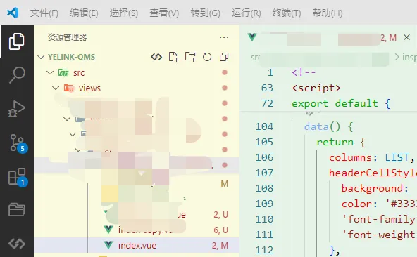
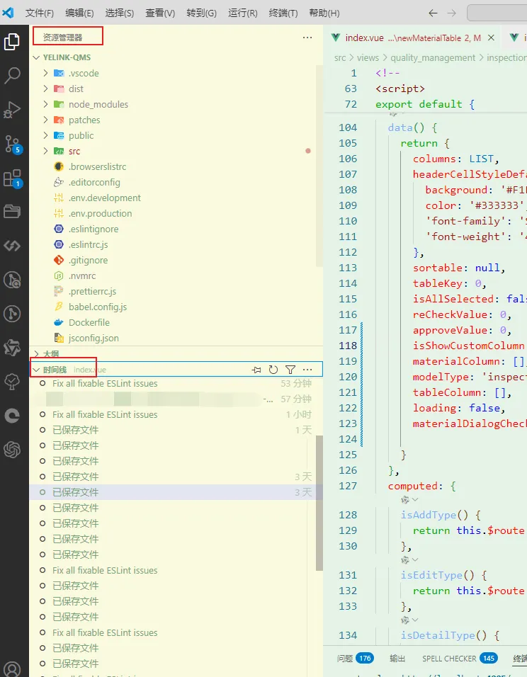
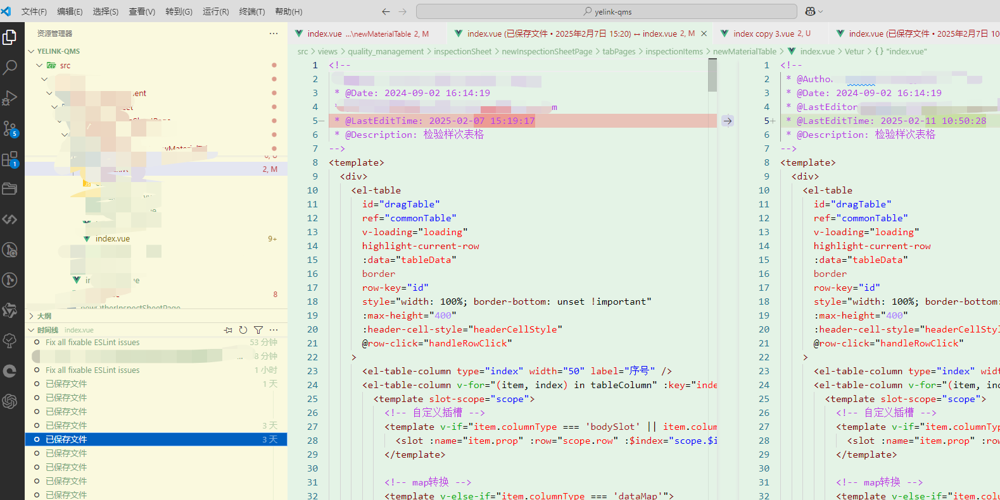
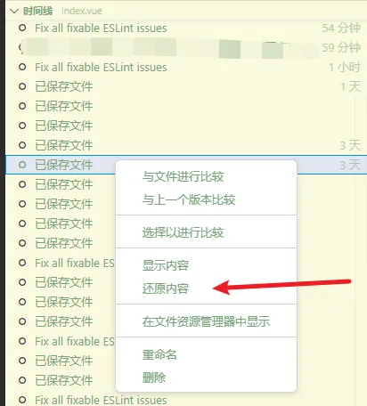

# VSCode中代码没有提交到远程仓库，本地代码已经还原的情况下，如何找回之前的代码

## 背景

代码没有提交到远程仓库，本地代码由于误操作还原了，此时想要找回之前的代码，如何操作。

## 方法

通过资源管理器的本地时间线中，本地记录找回

## 步骤

在VSCode中，打开被重置的文件

点击该文件的本地时间线，就可以在 vscode 中看到该文件的本地记录  

这里可以找到工作区编辑的代码和`ctrl + s`已保存的文件，单击可查看代码改动情况

然后鼠标右键选择性恢复即可

这里只能恢复当前打开的文件，如果要恢复另一个文件，则需重复上面操作。