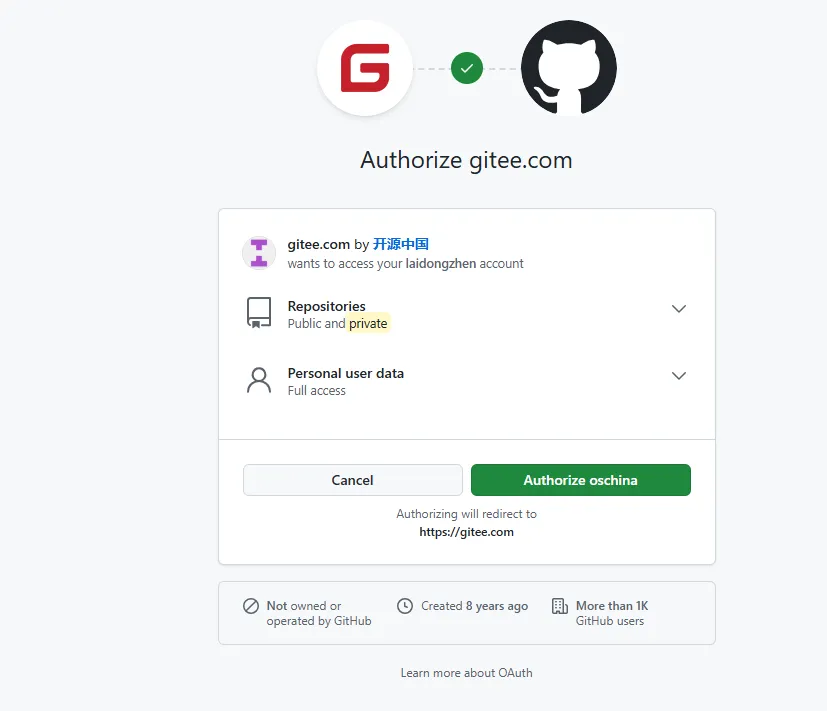

# 仓库镜像管理：Gitee-Github 双向同步

# 将项目同时提交到码云Gitee上面，同步GitHub仓库

## 在gitee上创建一个项目


将本地项目和远程仓库关联

```html
# 进入项目目录
cd /path/to/your/project

# 初始化 Git 仓库（如果尚未初始化）
git init

# 添加远程仓库
git remote add origin https://gitee.com/laidongzhen/vue3-hello.git

# 检查远程仓库
git remote -v
```


提交到远程仓库中


## <font style="color:rgb(64, 72, 91);">配置仓库镜像</font>
Push 方向的镜像用于将 `Gitee` 的仓库自动镜像到 `GitHub` 。


绑定github镜像

[https://gitee.com/help/articles/4336#article-header0](https://gitee.com/help/articles/4336#article-header0)





github上创建项目


申请github令牌

[https://gitee.com/help/articles/4336#article-header8](https://gitee.com/help/articles/4336#article-header8)

之后提交到码云后，会自动更新到github上


# <font style="color:rgb(64, 72, 91);">Gitee官网仓库镜像管理说明</font>
## <font style="color:rgb(64, 72, 91);">Gitee 支持设置两种镜像：</font>
1、[Push](https://gitee.com/help/articles/4336#添加-push-方向的镜像)：用于将 `Gitee` 的仓库自动镜像到 `GitHub` 。

配置此镜像后，当你提交代码到 Gitee 的仓库时，Gitee 会自动向 GitHub 同步仓库。


2、[Pull](https://gitee.com/help/articles/4336#添加-pull-方向的镜像)：用于将 `GitHub` 的仓库镜像到 `Gitee` 。

你可以根据自身需求选择 自动镜像 或 手动镜像；

自动镜像：当你提交代码到 GitHub 镜像仓库时，Gitee 会自动从 GitHub 同步仓库；

手动镜像：只有你手动点击更新按键时，Gitee 才会从 GitHub 同步仓库。

备注：选择的是自动镜像方式


<font style="color:rgb(106, 115, 125);">手动镜像：只有你手动点击更新按键时，Gitee 才会从 GitHub 同步仓库。</font>

备注：选择的是自动镜像方式


# 参考
[将项目同时提交到GitHub和码云Gitee上面，GitHub与Gitee同步](https://blog.csdn.net/qq_37255976/article/details/135453841)


[gitee官方文档](https://gitee.com/help/articles/4336#article-header0)