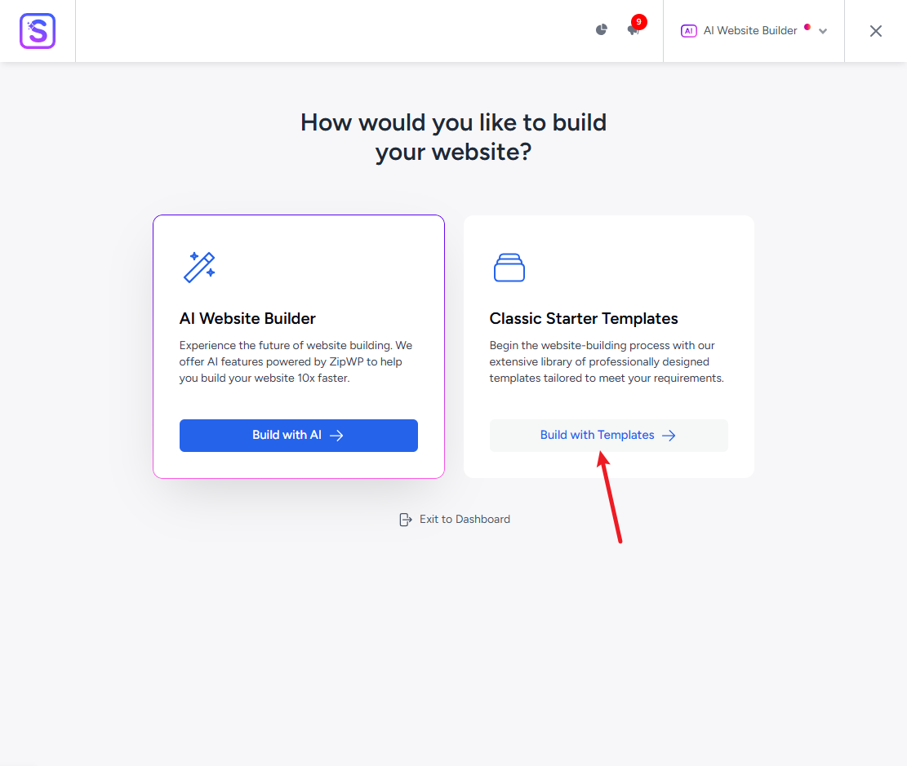
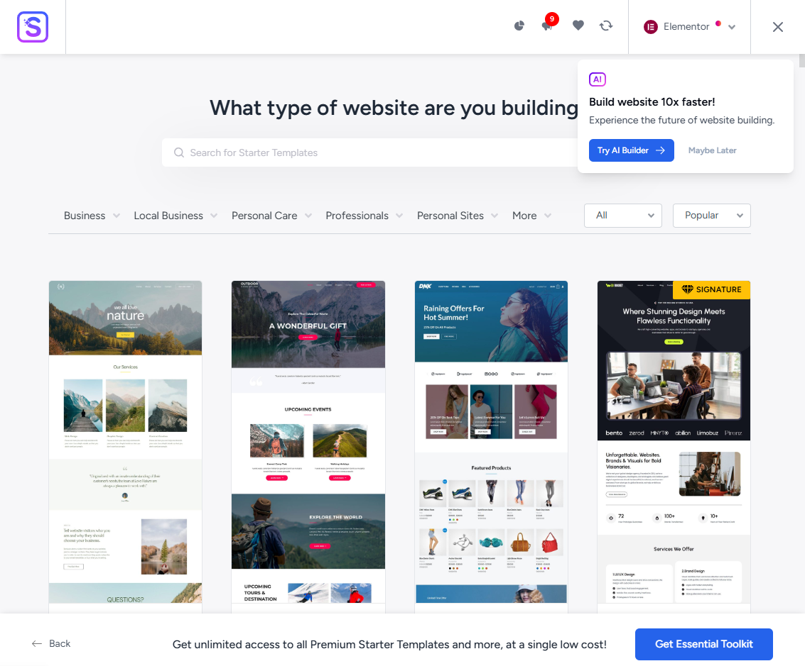

# 通过phpstudy_pro和wordpress在本地新建一个网站

# 前提

安装好phpstudy_pro和下载好wordpress

# 打开需要的套件

在小皮中打开Apache和MySQL

# 创建数据库

数据库信息在后面需要用到

# 创建网站

根目录会自动生成

打开网站该域名下的【管理】，点击根目录，打开。

将下载好的wordpress解压缩，复制到该文件夹中。

点击【网站】，对应域名下，打开网站

http://testwebsite:1313/wp-admin/setup-config.php

# 设置

选择【简体中文】

下一步

填写数据库信息，和刚刚创建数据库的一致

选择后安装wordpress

登录

进入页面

# 选择主题

外观-主题，安装新的主题：Astra（这是我选择的主题名称）

安装新主题

搜索Astra，安装

启用

回到小皮，点击网站，对应域名下【管理】，点击【打开网站】

# 修改主题下的模板

Astra，入门模板，

选择【Build with Template】

选择【Elementor】，进入加载中

搜索模板【Construction Company】（可以换成其他的）

等待生成中

有时候可能会报错，点击下面按钮再来一次。

安装成功

查看网站

