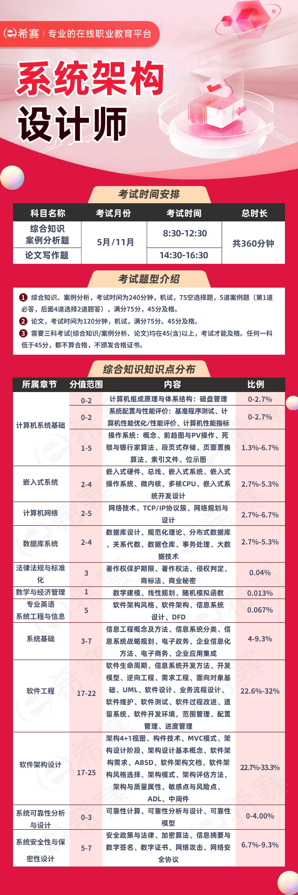

# 高级软考系统架构设计师

# 考试时间

架构师考试时间：每年两次  5月/11月

上午考试：

综合知识：150分钟（8：30-12：30） 单选题（75空） 满分75分，45分及格

案例分析：90分钟（8：30-12：30） 案例分析题（3道）满分75分，45分及格

下午考试：

论文写作：120分钟（14：30-16：30）论文写作题，满分75分，45分及格

上机考试（电脑打字）考试需要三门同时45分以上才算合格

报名时间：8月份（参考24年）

考试日期:11.8-11.11

# 考试费用

2025 年上半年福建软考系统架构设计师的报名费为 270 元。

购买教材等费用因个人选择有所不同。考试大纲与教材一般使用清华大学出版社出版的最新版指定大纲和教程，一套正版的指定教材及辅导资料费用大概在 200-500 元左右。

# 知识点分布

# 学习资料

以下是备考高级软考系统架构设计师相关的权威刷题网站、免费教学视频以及推荐购买的教材：

## 权威刷题网站
- **软考在线**：<https://www.ruankao.org.cn/>，提供历年真题及模拟试题，题目涵盖系统架构设计师考试的各个知识点，题型与实际考试一致，有助于考生熟悉考试题型和答题流程，提高答题速度和准确率。
- **软件通**：<https://rjt.softtone.cn/>，包含大量软考相关练习题，题型丰富，涵盖多个科目，还提供答案解析，能帮助考生更好地理解和掌握知识点。
- **100学考网**：<http://rk.100xuekao.com/>，包含历年真题、模拟试题等，提供智能练习、全真模拟等功能，能帮助考生提高答题能力和速度。
- **软考吧**：<https://www.ruankaoba.com/>，提供历年软考真题、真题解析、讲解视频、软考百科、真题测试和知识问答等备考服务。
- **软考达人**：<https://ruankaokao.com/>，专业的软考刷题题库，提供历年真题、模拟考试、考前押题等，能帮助考生进行有针对性的练习。

## 免费教学视频
- **网易公开课系统架构设计师课程**：<https://open.163.com/newview/movie/courseintro?newurl=THTUCIRE5>，课程内容全面，讲解深入浅出，适合系统学习。
- **哔哩哔哩系统架构设计师教程**：<https://www.bilibili.com/video/BV1G2ApeQEm7/>，包含系统架构设计师的精讲视频合集，内容丰富，从基础知识点到真题解析、论文写作等均有涉及。
- **51CTO学院软考课程**：<https://edu.51cto.com/surl=bGuA33>，提供软考相关的课程，包括视频、资料等，可免费使用，有助于提升备考效率。
- [2025软考系统架构设计师(第二版)](https://study.163.com/course/introduction.htm?courseId=1209009804)：任铄老师对软考系统架构设计师教材(第二版新版)按章节进行了详细讲解，能帮助考生把握考试重点，深入理解知识点。
- [2025年系统架构设计师--综合知识](https://study.163.com/course/introduction.htm?courseId=1005833008)：同样根据第二版新版教材按章节详细讲解考查知识点，助力考生系统复习。
- [软考高级系统架构设计师视频教程录播直播资料真题课程案例论文](https://open.163.com/newview/movie/courseintro?newurl=THTUCIRE5)：该课程共12集，涵盖了架构新老教材对比分析、考试介绍、学习计划、计算机组成与结构、操作系统等丰富内容。

## 推荐购买的教材
- **《系统架构设计师教程（第4版）》**：是软考高级系统架构设计师考试的官方指定教材，全面系统地介绍了考试所涵盖的知识点。
- **《系统架构设计师考试笔记》**：对考试的重点和难点进行了归纳和总结，方便考生复习和记忆。
- **《系统架构设计师历年真题详解》**：收录历年真题并提供详细解析，帮助考生熟悉考试题型和命题规律。

## 资料下载

架构师资料下载(希赛网)：https://wangxiao.xisaiwang.com/rk/xxzl/100110011003.html

## 这些资源中，你推荐哪个作为我的主要学习工具？

当从多个资源中选择一门主要学习工具时，您可以考虑以下推荐：

在备考高级软考系统架构设计师时，我更推荐你以 **官方指定教材《系统架构设计师教程（第4版）》为主要学习工具**，理由如下：

**系统全面**

它是软考官方指定教材，内容系统全面，涵盖了系统架构设计师考试的所有知识点，从计算机系统、操作系统、数据库、网络等基础技术，到软件工程、信息安全、项目管理等核心知识领域，再到系统架构设计等专业内容，能为学习提供完整的知识体系，确保学习时不遗漏重要考点。

**权威准确**

作为官方指定教材，其内容经过专业团队精心编写和审核，知识点准确权威，讲解深入浅出，有助于准确理解考试要求和知识点内涵，避免因学习错误或偏差信息而影响备考效果。

**适用性强**

无论是零基础入门还是有一定经验的考生复习巩固，都适用。对于零基础考生，它能帮助搭建知识框架；对于有经验的考生，可深入理解原理和方法，提升专业素养。

当然，**仅靠教材学习是不够的**，我建议你结合**软考在线刷题平台**进行练习，通过大量真题和模拟题熟悉考试题型、巩固知识点、提高答题速度；**网易公开课系统架构设计师课程**作为辅助，遇到理解困难或重点难点内容时观看教学视频，加深理解。

**例如**：先看教材学习基础知识，然后用软考在线做对应章节练习，遇到难题或薄弱点，再到网易公开课找相关讲解视频强化理解，最后定期用教材复习巩固，整理错题和重点笔记，形成自己的知识体系。

# 备考时间

以下是从2025年6月到2025年11月8日软考系统架构设计师考试的备考时间规划和复习频率建议：

## 不同基础情况下的备考时间规划
- **有基础的前端工程师**：如果本身具备一定的系统架构设计相关知识或经验，如熟悉软件工程的基本概念、了解常见的架构模式等，备考时间可相对较短，大约需要3-4个月。
- **零基础的前端工程师**：如果对系统架构设计完全陌生，需要从头开始学习相关的概念、理论和实践知识，则建议预留4-6个月的备考时间。

## 4个月时间备考操作

以下是4个月备考软考系统架构设计师的详细计划：

### 第1个月：基础学习，构建知识体系
- **学习内容**：掌握计算机系统、操作系统、数据库等基础知识点。参考《系统架构设计师教程（第4版）》第1-5章，学习计算机系统、操作系统、数据库基础。
- **学习方法**：每天学习2小时，精读教材，做笔记标记重点和难点。利用思维导图整理知识点，形成知识框架。搭配教学视频，如网易云课堂的2025年系统架构设计师课程辅助理解。
- **练习安排**：学习完每个知识点后，做课后习题巩固。可使用软考在线刷题平台，筛选对应章节的基础题练习，检查知识掌握程度。

### 第2个月：强化训练，提升实战能力
- **学习内容**：深入学习软件工程、信息安全、系统架构设计等核心知识。参考教材第6-10章，学习软件工程、信息安全、系统架构设计。
- **学习方法**：每天投入2.5小时学习。先复习教材知识，再通过教学视频加深理解。整理错题和薄弱点，进行针对性强化学习。
- **练习安排**：每周做2套历年真题，严格按照考试时间模拟实战。做完后认真分析错题，找出知识薄弱点返回教材和视频再学习。使用软考在线刷题平台，筛选对应专题的真题和模拟题练习，提高解题速度和准确率。

### 第3个月：模拟考试，适应考试节奏
- **学习内容**：进行全面复习，强化记忆，同时关注案例分析和论文写作。复习教材全部内容，总结重点知识点，强化记忆。学习案例分析和论文写作方法，多看范文，积累写作思路。
- **学习方法**：每天安排3小时学习。快速浏览教材和笔记，回顾知识点。观看教学视频中案例分析和论文写作部分，掌握答题思路和技巧。
- **练习安排**：每周进行3次模拟考试，每次做1套试卷，适应考试时间和题型。练习案例分析和论文写作，找真题案例和写作题目训练，提升答题速度和逻辑表达能力。利用软考在线刷题平台，筛选错题和难题进行针对性练习，避免重复错误。

### 第4个月：冲刺巩固，调整考试状态
- **学习内容**：梳理知识体系，查漏补缺，同时进行全真模拟和冲刺押题。梳理教材知识点，构建知识体系。做模拟试卷和押题卷，熟悉最新考试题型和命题趋势。
- **学习方法**：每天安排2.5小时学习。用思维导图梳理教材知识点，强化记忆。做模拟试卷和押题卷，找出知识薄弱点并强化学习。
- **练习安排**：每周做3套模拟试卷，做完后认真分析错题，找出薄弱环节进行针对性复习。进行考前热身练习，找少量真题或模拟题练习保持题感。整理错题和薄弱点，考前最后几天快速浏览，强化记忆。调整作息时间，保持良好的身体和心理状态迎接考试。

# 价值

高级软考的系统架构设计师含金量较高，且考过一次之后在大部分地区是终身有效的。

持有中级或高级软考证书的人员，可以按照 3600 元定额扣除，在个人专项附加扣除继续教育支出的抵税减免中进行个人所得税的抵扣，但需在取得证书当年申报。