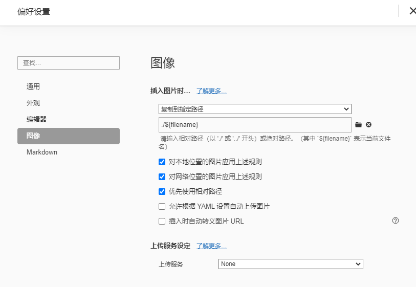

<!--
 * @Author: laidz laidz@yelinked.com
 * @Date: 2025-09-17 18:58:01
 * @LastEditors: laidz laidz@yelinked.com
 * @LastEditTime: 2025-11-19 09:42:17
 * @Description: 
-->
# 写博客文章注意点

1.标点符号尽量使用英文符号

2.不用直接写'watch','computed'等选项，需要加个英文引号，要不会报错

3.引用的图片等资源一定是需要存在在本地的，要不会报错

4.在typora中，图像设置格式：

复制到指定路径

./${filename}

