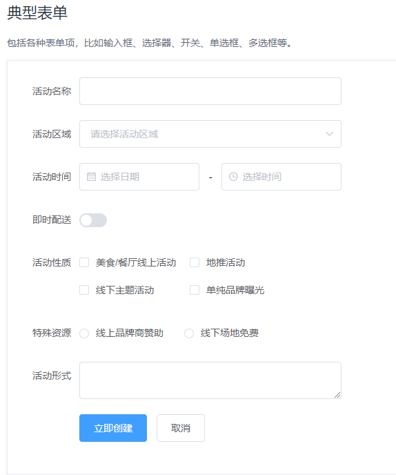

# el-table中如何移除表单的校验结果

## 实例

1、复制el-table中的代码

```vue
<el-form ref="form" :model="form" label-width="80px">
  <el-form-item label="活动名称" prop="name">
    <el-input v-model="form.name"></el-input>
  </el-form-item>
  <el-form-item label="即时配送">
    <el-switch v-model="form.delivery"></el-switch>
  </el-form-item>
  <el-form-item>
    <el-button type="primary" @click="onSubmit">立即创建</el-button>
    <el-button>取消</el-button>
  </el-form-item>
</el-form>
```



2、需要移除的校验字段

```js
// 移除校验结果
// form为el-form中ref="form"的值
// name为el-form-item中prop="name"的值
this.$nextTick(() => {
	this.$refs.form.clearValidate('name')
})
```

