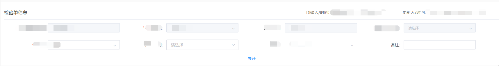

# el-form表单中，增加展开/收起功能，每行展示的字段根据内容自适应

## 需求

在一个el-form表单中，需要增加展开/收起功能。默认是收起状态，收起时，显示2行字段。


## 说明

一行内容根据页面自适应，可能是2-4个字段为一行。

el-form表单中，有些字段可能默认隐藏，一共展示多少个字段也是不固定的，是根据接口动态变化的。

之前写好的每一项，不想用v-for进行批量处理，每一项中的内容都是不同的。


## 思路

1. **添加表单容器和展开/收起逻辑**
2. **使用 CSS 控制显示行数**
3. **重点就是通过先设置最初的高度 max-height，可以容纳2行的数据；展开时在设置max-height，设置足够大的值确保显示所有内容。**
4. **注意：当字段每一个单元格的高度不一致的时候，可能会出现2行不能完全的展示出来，或者展示了2行半的情况，所以，高度的设置比较重要。**


## 代码

```vue
<el-form
  ref="projectForm"
  :inline="true"
  :model="formInline"
  :rules="rules"
  class="demo-form-inline"
  label-position="right"
  label-width="150px"
  >
  <!-- 基本信息 -->
  <section class="base-info">
    <div class="base-info-title">
      <!-- 标题内容保持不变 -->
    </div>

    <!-- 新增表单项容器 -->
    <div 
      class="form-items-container"
      :class="{ 'expanded': !isFold }"
      >
      <!-- 所有 el-form-item 保持原样 -->
      <el-form-item :label="getLabelName('code', '单据编号')" prop="code">
        <!-- 表单项内容 -->
      </el-form-item>
      <!-- 其他表单项... -->
    </div>

    <!-- 展开/收起按钮 -->
    <section 
      v-if="hasFold" 
      class="bottom-fold-board" 
      @click="expandOrFold"
      >
      <span>{{ isFold ? '展开' : '收起' }}</span>
    </section>
  </section>
</el-form>

<style scoped>
  /* 新增样式 */
  .form-items-container {
    display: flex;
    flex-wrap: wrap;
    max-height: 96px; /* 默认两行高度（根据实际项高度调整） */
    overflow: hidden;
    transition: max-height 0.3s ease;
    gap: 16px; /* 控制项间距 */
  }

  .form-items-container.expanded {
    max-height: 1000px; /* 足够大的值确保显示所有内容 */
  }

  .bottom-fold-board {
    cursor: pointer;
    color: #409EFF;
    text-align: center;
    padding: 8px;
  }
</style>

<script>
  export default {
    data() {
      return {
        isFold: true,    // 默认收起状态
        hasFold: false,  // 是否需要显示折叠按钮
      };
    },
    mounted() {
      this.checkIfOverflow();
    },
    methods: {
      // 检查是否需要显示折叠按钮
      // 这个函数实际中删除，默认都展示该按钮
      checkIfOverflow() {
        const container = this.$el.querySelector('.form-items-container');
        this.hasFold = container.scrollHeight > container.clientHeight;
      },
      // 切换展开/收起状态
      expandOrFold() {
        this.isFold = !this.isFold;
        this.$nextTick(() => this.checkIfOverflow());
      }
    }
  };
</script>
```


## 实现说明

1. **布局调整：**

- - 将表单项包裹在 `form-items-container` 容器中
  - 使用 flex 布局实现自动换行
  - 通过 max-height 控制显示高度

1. **展开/收起逻辑：**

- - 默认状态为收起（`isFold: true`）
  - 点击按钮切换 `isFold` 状态
  - 通过 CSS 类控制容器高度

1. **自适应逻辑：**

- - 使用 `checkIfOverflow` 方法检测内容是否超出容器
  - 根据检测结果决定是否显示折叠按钮（默认展示该按钮
  - 窗口变化时需要重新检测（可通过 ResizeObserver 优化）

1. **样式优化：**

- - 添加过渡动画提升用户体验
  - 通过 gap 属性控制表单项间距
  - 按钮样式与 Element UI 风格保持一致


## 截图说明




