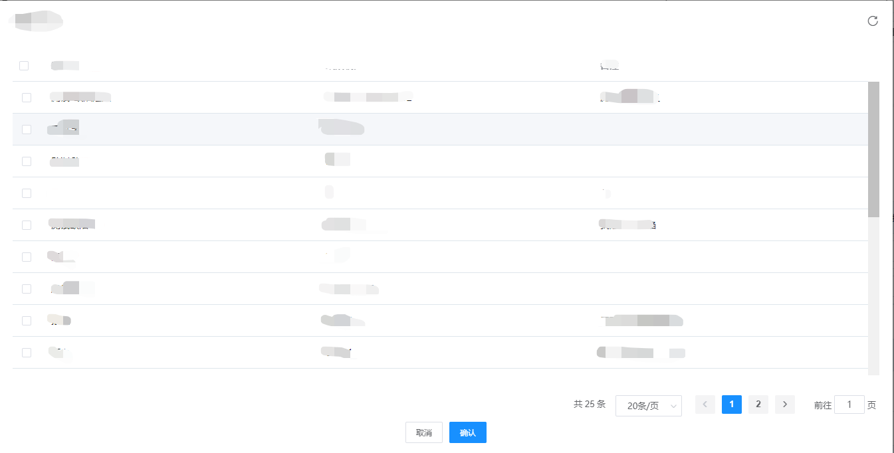

# 需求

表格中多选数据时，只有点击前面的勾选框才能选中该行。

要实现，点击该行就能选中该行。



# 方法

通过row-click和selection-change方法实现

1、在el-table中设置row-click

```js
@row-click="handleClickTableRow"

handleClickTableRow(row, column, event) {
	// 单击数据后，切换该行勾选的状态
	// table为el-table中ref="table"的值
	this.$refs['table'].toggleRowSelection(row)
}
```


2、在el-table中设置selection-change方法

```js
@selection-change="handleSelectionChange"

hasSelectedRows: [],//为选中的数组

handleSelectionChange(rows) {
	this.hasSelectedRows = rows
},
```

即可实现该效果。