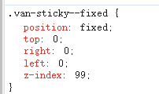

# vant中van-tabs有2个并且都设置sticky时如何生效

## 问题

1、页面中使用到了2个van-tabs，并且都需要使用到sticky进行自动吸顶，滑动时发现当有2个时，只能自动吸顶后面的那个

2、解决：需要2个都能够自动吸顶


## 排查

1、发现自动吸顶时，都是通过这个样式实现的

```css
.van-sticky--fixed {
    position: fixed;
    top: 0;
    right: 0;
    left: 0;
    z-index: 99;
}
```



2、那么，设置第二个van-tabs的样式，让top值等于第一个van-tabs的高度，即可实现2个van-tabs自动吸顶

```scss
::v-deep .van-sticky--fixed {
  top: 44px;
}
```


## 解决

在第二个van-tabs中设置样式

```
::v-deep .van-sticky--fixed {
  top: 44px;
}
```

