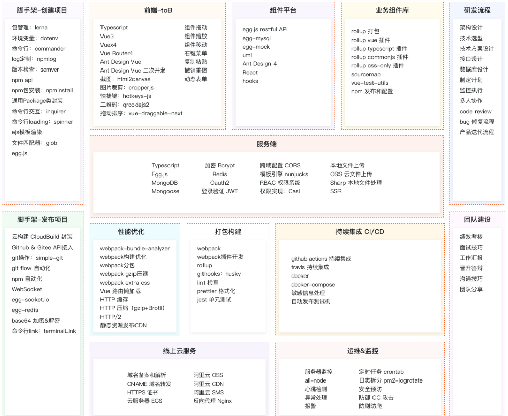
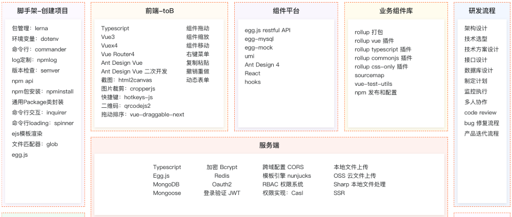
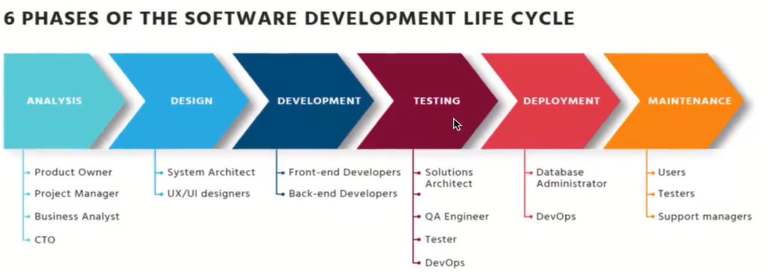
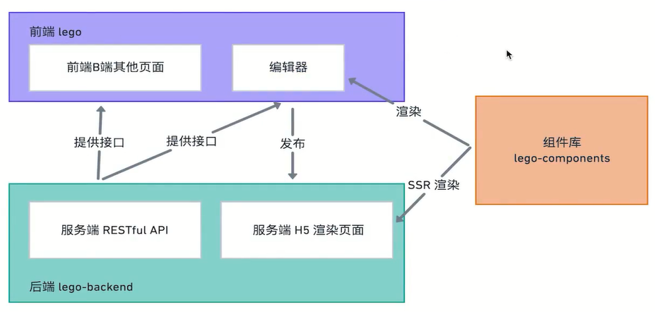
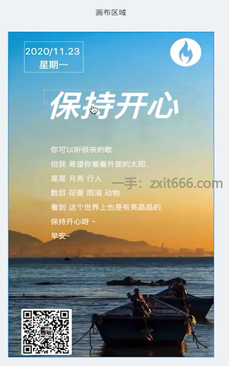
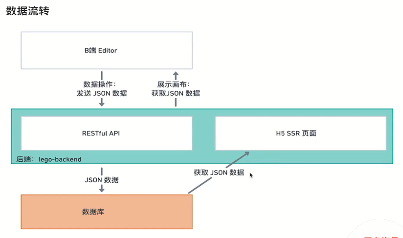
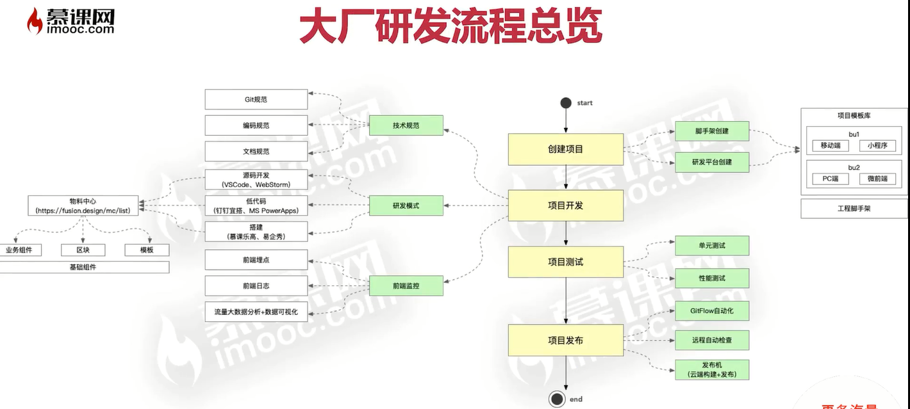
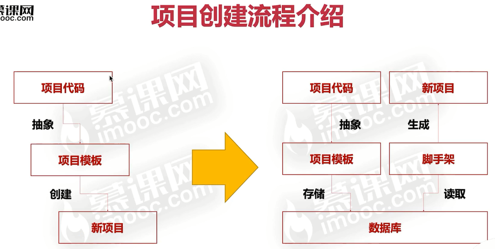
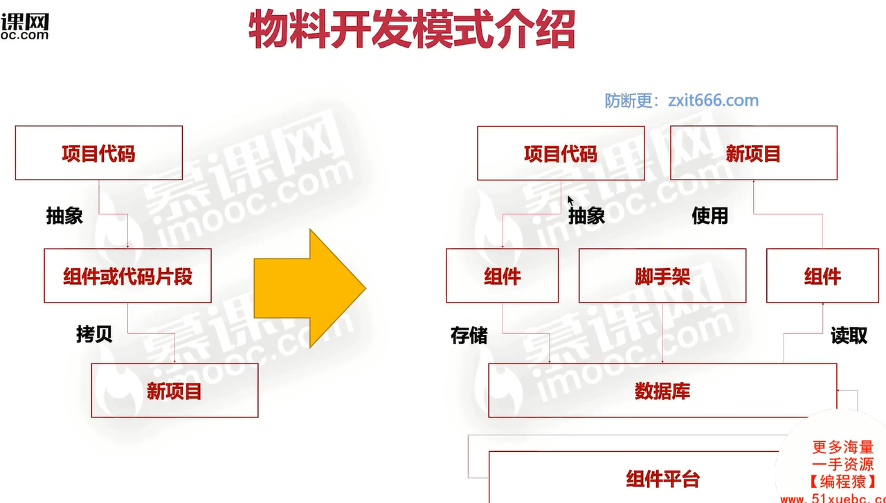
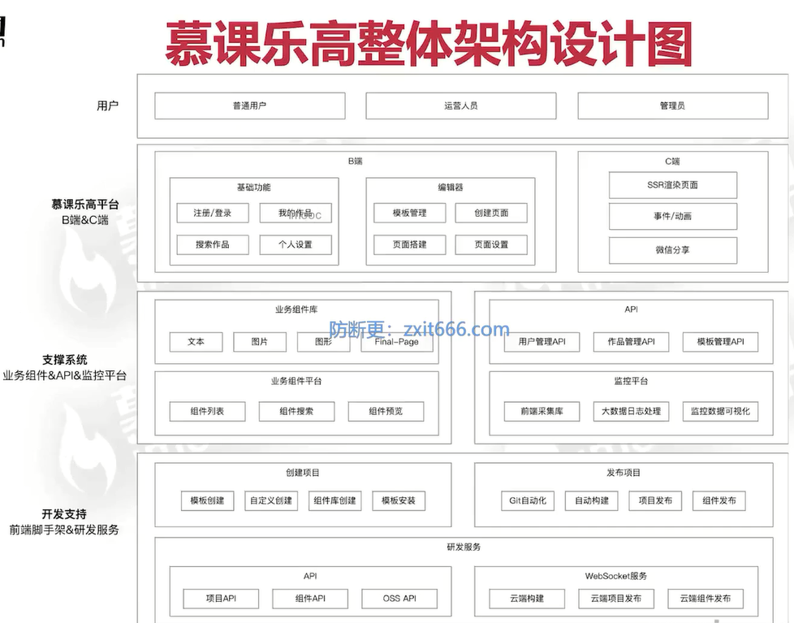

# 资料

[需求文档](https://imooc-lego.yuque.com/imooc-lego/zlz87z/wsaqd4)

[项目在线体验](https://www.imooc-lego.com/) 

[学生的学习笔记](https://homework.imooc-lego.com/) 

[代码仓库](https://github.com/orgs/imooc-lego/repositories) 

[技术方案](https://imooc-lego.yuque.com/imooc-lego/xgst0k/opanct)

[一尾流莺 | 我要当架构师](https://juejin.cn/column/7052907027638517773)

# 一、需求分析和架构设计：做什么，如何做？

## Ⅰ、课程简介

### 1、怎么成为一名前端架构师 ？

真实的架构设计过程

前沿+全面的前端技术栈

真实的商业级项目

完善的工程体系

标准的研发流程

### 2、网站体验

www.imooc-lego.com

### 3、课程包括哪些知识点

分开截图

### 4、课程面向什么人群

大于等于2年工作经验的前端工程师

掌握主流前端技术栈，能胜任常规的业务开发

渴望获得成长，突破职业天花板

## Ⅱ、需求分析

### 1、需求分析-了解软件开发生命周期

**软件开发生命周期**

### 2、技术整体架构 - 几个项目，项目的关系

（1）技术架构设计

**一个原则就是要看整体，从上帝视角出发，不要特别关注细节。**

**需要几个项目**

- 前后端分离项目

- 前端(SPA项目，使用Vue或者React)
  - 编辑器(lego-editor)
  - 其他页面(lego-pages)

- 后端– lego-backend
  - RESTful APl
  - H5页面SSR (Server side rendering)

- 组件库- lego-components

（2）项目之间的关系

### 3、技术整体架构 - 核心内容分析

核心问题分析

抓住关键问题:海报，或者说是作品，是整个系统的核心也是难点。

海报的组成

- 背景,由图片或者纯色组成。

- 元素
  - 由各种不同的元素（组件)组成。
  - —部分属性界定它的位置(position) 。
  - —部分属性界定它的展示(looks)。

向画布添加组件或者删除组件(向components数组添加或者删除特定的组件)

更新组件的某个属性(找到对应的component，然后更新它的props)

渲染画布或者作品（循环保存的作品信息，使用每个组件特定的属性进行渲染)

扩展性-场景设计

海报添加对应的背景音乐

新的组件类型–比如说当前日期

结论：不要关注细节

技术方案设计，为的就是寻找一个方向，论证：可行性、扩展性、复杂度高低。

数据流转

作业：写技术方案设计文档

[技术方案](https://imooc-lego.yuque.com/imooc-lego/xgst0k/opanct#3ce3fd93)

## Ⅲ、前端研发流程

### 1、为什么要优化前端研发流程？

1. 项目量级增加:几千行代码->几万行代码
2. 项目数量扩大:几个项目->几千个项目
3. 项目复杂度高:Web项目->H5/PC/小程序/后端/脚手架
4. 团队人数增长：几个人 -> 几百人
5. 传统的项目研发流程已经无法满足业务需求
6. 前端研发流程进化的内核∶效率、质量、性能

###  2、大厂研发流程揭秘

- 创建项目
  - 脚手架创建
  - 研发平台创建
- 项目开发
  - 技术规范
    - Git规范
    - 编码规范
    - 文档规范
  - 研发模式
    - 源码开发（VSCode、WebStorm）
    - 低代码（钉钉宜搭）
    - 搭建（慕课乐高、易企秀）
  - 前端监控
    - 前端埋点
    - 前端日志
    - 流量大数据分析+数据可视化
- 项目测试
  - 单元测试
  - 性能测试
- 项目发布
  - GitFlow自动化
  - 远程自动检查
  - 发布机（云端构建+发布）

### 3、创建项目流程优化背后的思考

如何让上千名前端开发创建项目体验趋于一致?

如何高效沉淀项目中的最佳实践，并能够快速复用?

如何在创建项目后尽可能少改动源码，最快速度投入开发?

**项目创建流程介绍**

### 4、前端研发模式优化背后的思考

- 有哪些提升前端研发效率的手段?
  - 复用代码->使用物料(组件、代码片段、模板代码)
  - 赋能产品、运营或后端非前端开发->低代码搭建
- 如何高效使用这些工具，并且快速投入生产?
- 物料和低代码会撼动前端工程师的地位吗?
  - 会影响初级前端工程师，因为简单的表单、H5页面不再需要初级前端开发
  - 前端工程师将逐步从初级页面开发转向高级工具开发、复杂全栈应用开发

物料开发模式介绍

重点看组件平台

### 5、前端监控体系+测试体系分享

**（1）前端监控体系介绍**

- 你所在的公司是如何做前端监控的?
- 前端监控的三个阶段?
  - 初阶:使用第三方平台，百度、友盟、阿里云ARMS等
  - 中阶∶自研前端监控库，缺乏完整的监控体系
  - 高阶:自研前端监控平台，具备完整的监控体系
- 前端监控的数据有什么用?
  - 流量数据监控，如∶PV、UV、点击率、页面停留时长等
  - 自定义事件监控，如∶曝光嘉件、滑动事件、请求事件等
  - 交易指标监控，如︰成交额、转化率等
  - 其他综合分析，如︰用户画像分析、流量漏斗、销量预测等

**（2）项目测试体系介绍**

前端项目如何做测试?

- 测试同学∶功能测试，性能测试，测试用例
- 前端同学:单元测试，常用于组件库、API等(Jest、Mocha )

上线项目如何做测试?

- 测试同学回归
- 利用前端监控，进行监控项目稳定性和性能，并上报前端日志
  - 稳定性:如jserror、白屏检测等
  - 性能:如秒开率、首屏渲染时长、接口请求时长
  - 前端日志︰如console.log、API请求记录等

### 6、前端发布体系+架构师课程大图分享

**（1）前端发布体系介绍**

- 发布体系∶利用脚手架统一管理发布阶段
- 利用脚手架做发布的优势
  - 规范:利用统一发布规范，如commit记录、分支名称、代码规范等
  - 效率:避免大量重复操作，浪费开发时间
  - 安全:构建和发布全部在云端操作，避免个人发布时带来的安全隐患
- 脚手架发布的流程?
  - GitFlow自动化代码提交
  - 远程代码自动检查
  - 云端完成构建与发布操作

**（2）慕课乐高整体架构设计图**

