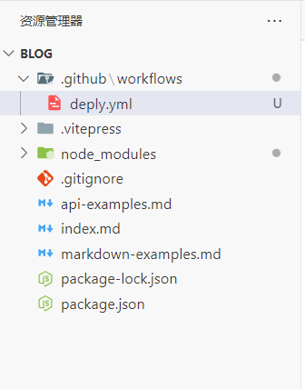
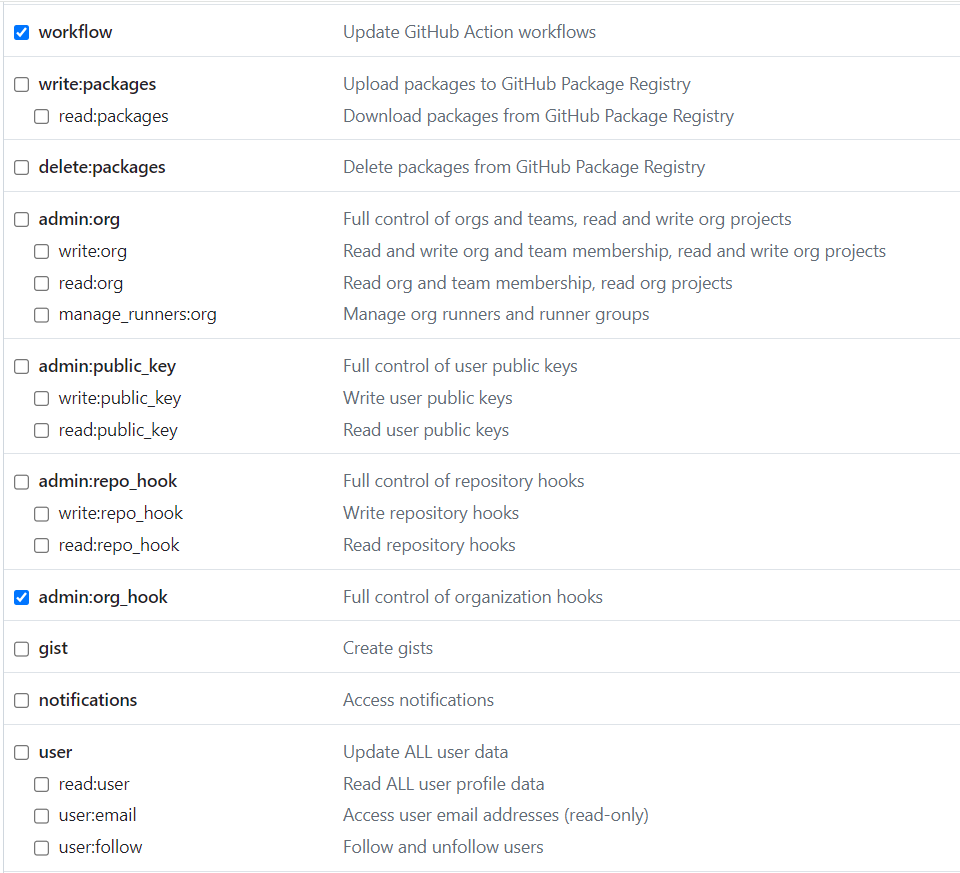
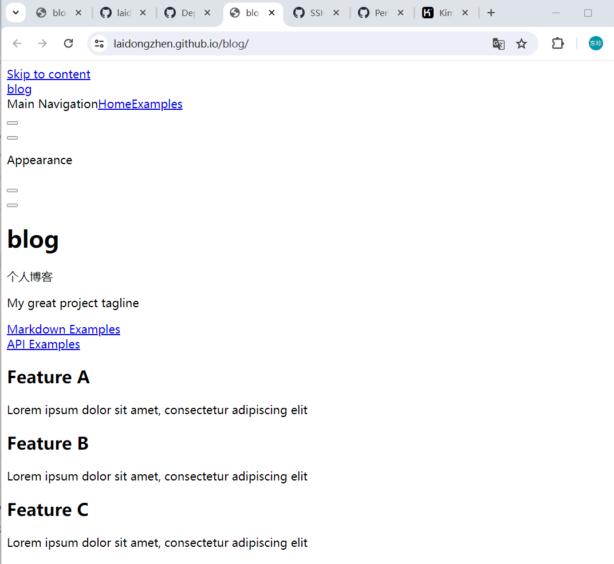

# 使用VitePress和GitHub Actions搭建个人博客

# 前言

vitePress官网：https://vitepress.dev/zh/

vitePres定义

VitePress 是一个[静态站点生成器](https://en.wikipedia.org/wiki/Static_site_generator) (SSG)，专为构建快速、以内容为中心的站点而设计。简而言之，VitePress 获取用 Markdown 编写的内容，对其应用主题，并生成可以轻松部署到任何地方的静态 HTML 页面。 

# 电脑本地创建项目

## 使用nvm安装node

```shell
nvm list available
nvm install 20.13.1
nvm use 20.13.1
```


## 创建vitepress项目

```shell
# 创建一个项目文件夹并进入
mkdir blog
cd blog

# 全局安装vitepress
npm install -D vitepress 

# 使用vitepress自带的npx初始化
npx vitepress init
```


创建博客时，选项描述

```
┌  Welcome to VitePress!
│
◇  Where should VitePress initialize the config?
   //在哪里初始化项目
│  ./docs（在docs文件夹下创建）
   ./（在根目录下创建，因为该项目仅用来写博客，所以选择此种）
│
◇  Site title:
│  My Awesome Project（项目名称）
│
◇  Site description:
│  A VitePress Site（项目介绍）
│
◆  Theme:（选择主题）
│  ● Default Theme (Out of the box, good-looking docs)
│  ○ Default Theme + Customization
│  ○ Custom Theme
└
```


创建后：


## 本地运行项目

```shell
npm run docs:dev
```


## 设定 public 根目录

我的网站地址是 ： https://laidongzhen.github.io/blog/

也就是仓库名为blog，所以需要在 VitePress 配置中将`base`选项设置为 `'/blog/'`。 

```
base: '/blog/',
```


> 后面样式丢失就是由于没有设置这个导致的


## 创建 gitworkflow的deply.yml文件

来给项目创建 workflows，在项目的根目录创建 .github/workflows/deply.yml，添加以下内容： 




deply.yml

详见官网：https://vitepress.dev/zh/guide/deploy#github-pages

> 复制的官网，只修改了name: Upload artifact里面的 with ， path: .vitepress/dist （对应public根目录）。其他不变
>

```yml
# 构建 VitePress 站点并将其部署到 GitHub Pages 的示例工作流程
#
name: Deploy VitePress site to Pages

on:
  # 在针对 `main` 分支的推送上运行。如果你
  # 使用 `master` 分支作为默认分支，请将其更改为 `master`
  push:
    branches: [main]

  # 允许你从 Actions 选项卡手动运行此工作流程
  workflow_dispatch:

# 设置 GITHUB_TOKEN 的权限，以允许部署到 GitHub Pages
permissions:
  contents: read
  pages: write
  id-token: write

# 只允许同时进行一次部署，跳过正在运行和最新队列之间的运行队列
# 但是，不要取消正在进行的运行，因为我们希望允许这些生产部署完成
concurrency:
  group: pages
  cancel-in-progress: false

jobs:
  # 构建工作
  build:
    runs-on: ubuntu-latest
    steps:
      - name: Checkout
        uses: actions/checkout@v4
        with:
          fetch-depth: 0 # 如果未启用 lastUpdated，则不需要
      # - uses: pnpm/action-setup@v3 # 如果使用 pnpm，请取消注释
      # - uses: oven-sh/setup-bun@v1 # 如果使用 Bun，请取消注释
      - name: Setup Node
        uses: actions/setup-node@v4
        with:
          node-version: 20
          cache: npm # 或 pnpm / yarn
      - name: Setup Pages
        uses: actions/configure-pages@v4
      - name: Install dependencies
        run: npm ci # 或 pnpm install / yarn install / bun install
      - name: Build with VitePress
        run: npm run docs:build # 或 pnpm docs:build / yarn docs:build / bun run docs:build
      - name: Upload artifact
        uses: actions/upload-pages-artifact@v3
        with:
          path: .vitepress/dist
          #只修改了上面这个，创建时是以./创建的
          # path: docs/.vitepress/dist

  # 部署工作
  deploy:
    environment:
      name: github-pages
      url: ${{ steps.deployment.outputs.page_url }}
    needs: build
    runs-on: ubuntu-latest
    name: Deploy
    steps:
      - name: Deploy to GitHub Pages
        id: deployment
        uses: actions/deploy-pages@v4
```


# 配置GitHub信息

## 设置电脑上github的账号

```
git config --global user.name "用户名"
git config --global user.email "邮箱"

git config --global user.name "laidongzhen"
git config --global user.email "2685023408@qq.com"
```


## 生成SSH密钥

```
ssh-keygen -t rsa -C "2685023408@qq.com"
```

生成后再去GitHub上创建下

# 远程GitHub

## 推送项目到github

初始化本地的 git，并将 node_modules 添加到 .gitignore 中 

执行 `git init` 

在项目的根目录创建一个 .gitignore 的文件，然后把文件的内容复制进去 

> 通常写 .gitignore 文件都比较麻烦，可以通过一些在线工具或者使用开发者工具中的一些插件（比如vscode 中gitignore生成工具）进行提效，在线工具有 [.gitignore.io](https://www.toptal.com/developers/gitignore) 这个工具，在里面输入要添加项，比如 macOS、Node.js等等
>
> 
>
> 点击创建后，就会生成 一个 .gitignore 的内容，接着在项目的根目录创建一个 .gitignore 的文件，然后把文件的内容复制进去 
>
> 


 提交代码 

```
git status
git add .
git commit -m "initial blog"
```


## 创建远程仓库

在GitHub上创建仓库

仓库名为blog


把仓库名和项目是否公开的选项以及描述填写完，就可以点击右下角的 Create repository 按钮，接着就会跳转到一个新页面，这个页面就是刚刚创建的仓库；如下图： 


## 关联仓库

将远程仓库的地址与本地项目的 git 关联 

修改分支为main

```
git remote add origin git@github.com:laidongzhen/blog.git
git branch -M main
```


## 获取 ACCESS_TOKEN 

在yml中，有用到 ACCESS_TOKEN 参数 。

**ACCESS_TOKEN 参数是通过 GitHub Secrets 来提供的**。
```
在 GitHub 仓库的 Settings 页面中，可以设置 Secrets，这些 Secrets 可以在 GitHub Actions 中使用，以便在工作流中安全地存储敏感信息，如访问令牌、密码等。在这段代码中，${{ secrets.ACCESS_TOKEN }} 会使用存储在 GitHub Secrets 中名为 ACCESS_TOKEN 的值作为访问令牌，用于部署到 GitHub Pages 和远程服务器。
```


打开GitHub，点击右上角头像，选择Settings


最下面，选择 [Developer Settings](https://github.com/settings/apps) ，根据下图箭头操作


生成token

Note为描述信息，随意写

Expiration设置事件，我选择的最后一个，为永不过期

下面的选项具体可查看官网，我勾选了workflow和admin：org_hook





设置完成后，点击Generate token生成token。


 一旦生成 token 后，就不能修改，只能重新生成！！！下图页面刷新后就看不到 token 啦！一定要记得copy 并妥善管理。 


 将刚生成的 SCCESS_TOKEN 添加到要使用的仓库（blog）中；如下图： 


Name为ACCESS_TOKEN

Secret为生成的token


 一旦添加之后，就看不到原来的内容了，所以要谨慎，不过可以修改。 


## 设置GitHub Actions

 在存储库设置中的“Pages”菜单项下，选择“Build and deployment > Source > GitHub Actions” 


## 提交代码

```
git status
git add .
git commit -m "提交博客"
git push origin main
```


去GitHub上查看


可以看到对应的网址： https://laidongzhen.github.io/blog/ 


# 问题

## 样式丢失

第一次部署后，访问网址，样式丢失。



原因是，没有设置public根目录导致的，详见上文。


修改后再次提交

```
git status
git add .
git commit -m "修改样式问题"
git push origin main
```


博客地址

https://laidongzhen.github.io/blog/


# 参考链接

[vitePress官网](https://vitepress.dev/zh/)


[使用VitePress和GitHub Actions高效搭建文档网站](https://juejin.cn/post/7366175769604210707?searchId=20240511175013FE88EB2CCCBC5FB08268#heading-0)


[VitePress 学习指南 | 部署篇](https://juejin.cn/post/7361629576416739369#heading-0)


[技术胖博客vitePress内容](https://jspang.com/%E7%B3%BB%E7%BB%9F%E6%95%99%E7%A8%8B/VitePress/00.%E3%80%90%E6%95%99%E7%A8%8B%E4%BB%8B%E7%BB%8D%E3%80%91%E6%88%91%E4%B8%BA%E4%BB%80%E4%B9%88%E8%A6%81%E7%94%A8VitePress.html)


[VitePress 1.0 正式版横空出世！来一份使用指南](https://juejin.cn/post/7351207099357380644?searchId=20240511175013FE88EB2CCCBC5FB08268#heading-3)


[十分钟使用vitepress+github action+gitee pages 搭建你的专属文档](https://blog.csdn.net/qq_31647491/article/details/134006896?spm=1001.2014.3001.5506)