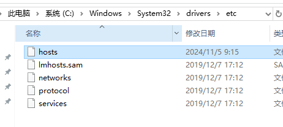
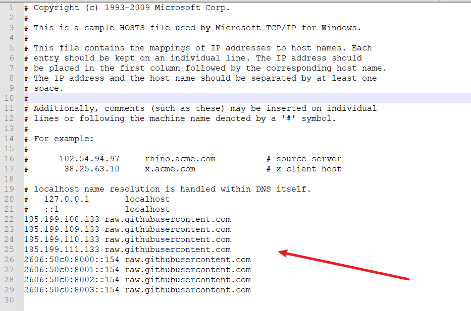
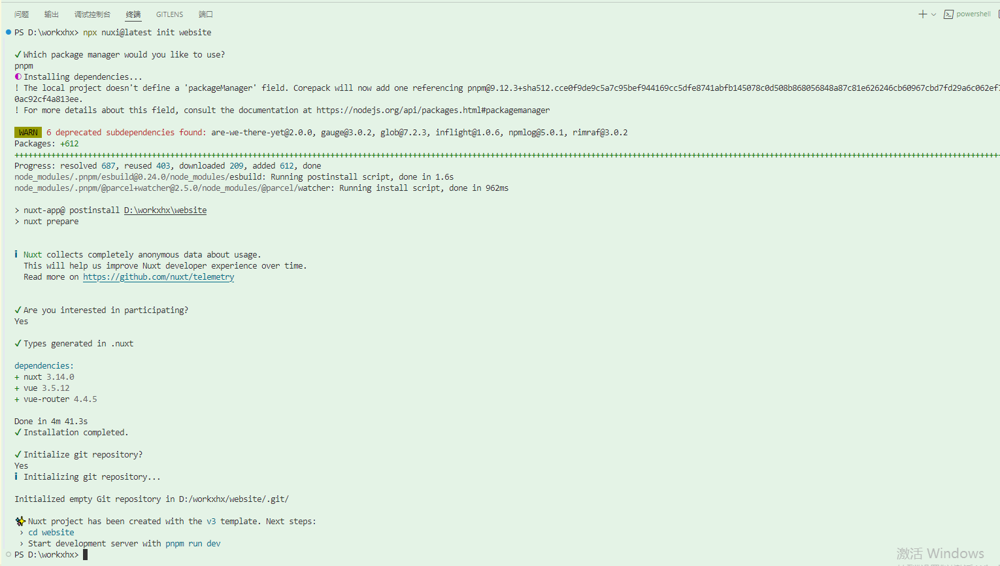

创建项目

问题

Error: Failed to download template from registry: Failed to download https://raw.githubusercontent.com/nuxt/starter/templates/templates/v3.json: TypeError: fetch failed 


解决：

Error: Failed to download template from registry: Failed to download https://raw.githubusercontent.c

https://blog.csdn.net/weixin_40803490/article/details/139897949


在路径C:\Windows\System32\drivers\etc添加上

```
185.199.108.133 raw.githubusercontent.com
185.199.109.133 raw.githubusercontent.com
185.199.110.133 raw.githubusercontent.com
185.199.111.133 raw.githubusercontent.com
2606:50c0:8000::154 raw.githubusercontent.com
2606:50c0:8001::154 raw.githubusercontent.com
2606:50c0:8002::154 raw.githubusercontent.com
2606:50c0:8003::154 raw.githubusercontent.com
```







创建项目

执行以下命令行，在选择pnpm

```
npx nuxi@latest init website
```

版本

```
dependencies:
+ nuxt 3.14.0
+ vue 3.5.12
+ vue-router 4.4.5
```



