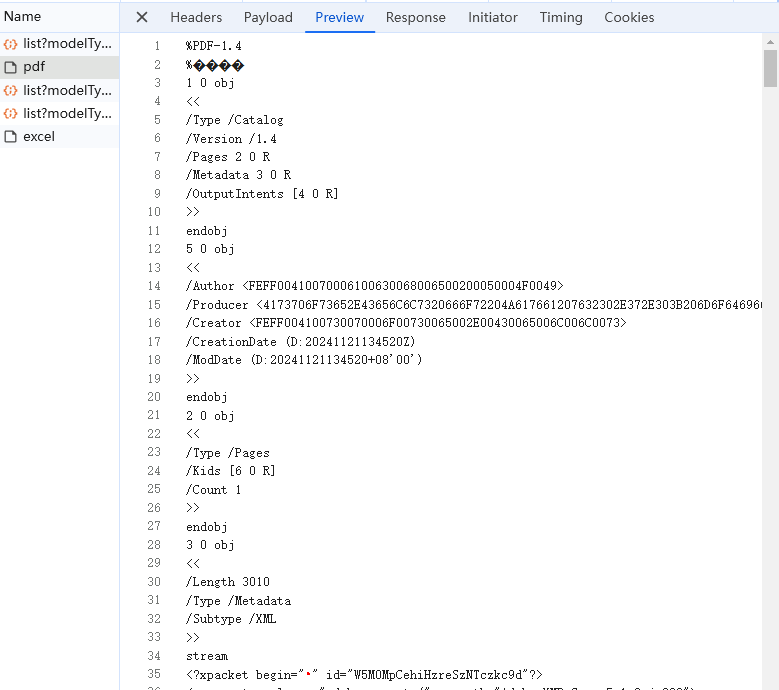
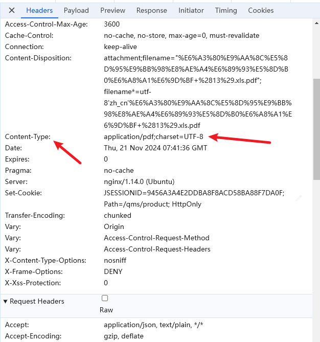

241121

## vscode插件

实现一个vscode插件：打开多个vscode项目时根据.nvmrc文件自动切换nvm

https://blog.csdn.net/qq_42611074/article/details/131662365


仓库

https://github.com/zqy233/vscode-nvmrc/blob/main/README-CN.md


## 文件预览

```
const qianzhui = 'http://192.168.103.89:8080/'
      const temp1 = 'oss-public/qms/20241121/1138004869aa42e8ad6f6f678b5b3764.doc'

      // const url1 = qianzhui + temp1
      const url1 = 'http://192.168.103.89:8080/oss-public/qms/20241121/1138004869aa42e8ad6f6f678b5b3764.doc'
      console.log('测试文件预览 temp1', temp1)
      console.log('测试文件预览 qianzhui', qianzhui)
      console.log('测试文件预览 url1', url1)
       const href = URL.createObjectURL(url1)
      console.log('测试文件预览 href', href)

      this.openNewWindow(href)
```

这种方式行不通

TypeError: Failed to execute 'createObjectURL' on 'URL': Overload resolution failed.


类型错误：在“URL”上执行“createObjectURL”失败：重载解析失败。


文件预览 
一、邓哥解决方案
pdf 参考检验单 文件预览
其他格式也是类似这种形式，从浏览器打开一个新的窗口，实现预览

二、查看页面
1、查看了产品检验单页面，只支持pdf预览。
是通过后端调用接口，返回一个文件，实现预览的。


目前通过地址+文件路径的形式没有办法实现预览，只能下载。


http://192.168.103.89:8080/factory/v1/qms/product/v1/inspects/print/export/pdf

{
    "fileName": "检验单默认打印模板 (13).xls.pdf",
    "fileAddress": "oss-public/qms/20241121/672cda101fb44b1c91996ed0694c1bd3.xlsx",
    "exportBillNumberList": [
        "20241121007"
    ]
}





