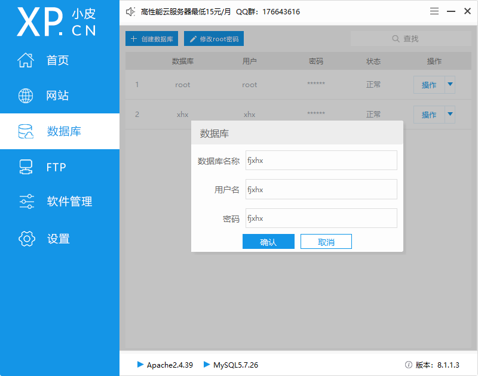
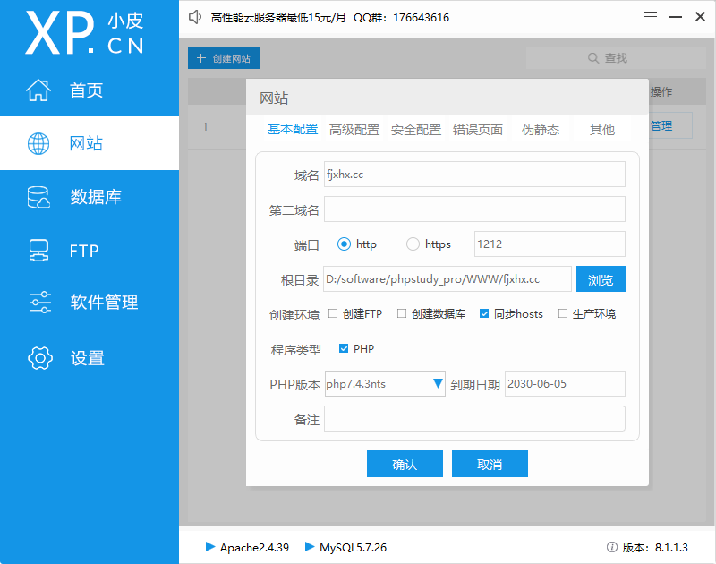
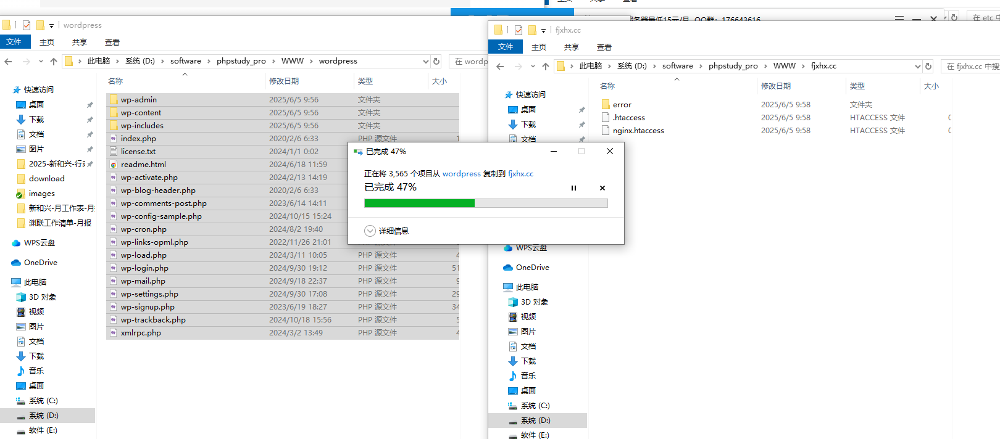
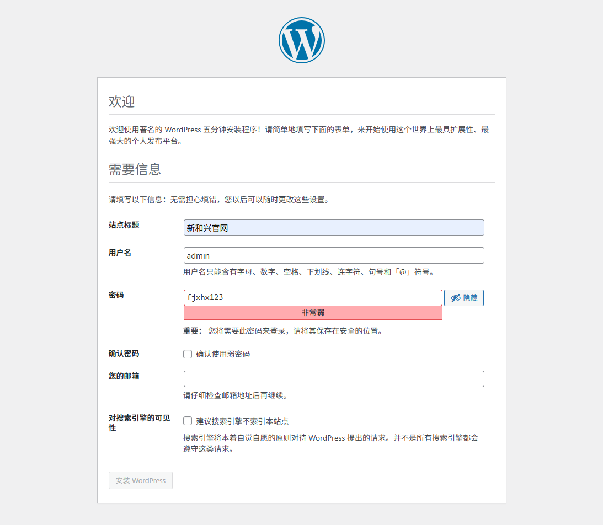
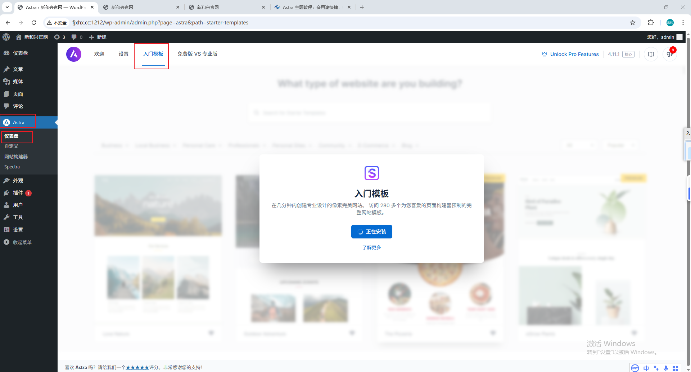
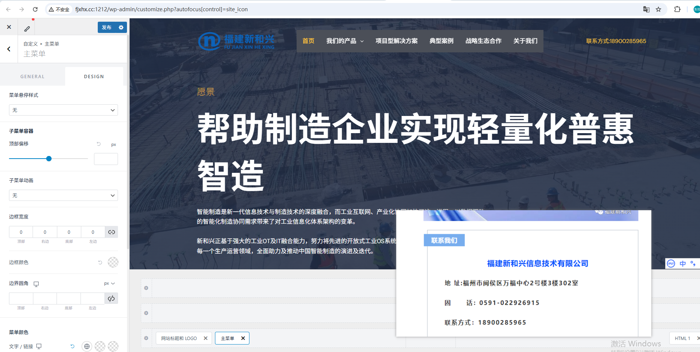

# 截图

# 新建网站

新建成功后，需要将woedpress解压后的文件复制到对应的文件夹中

# 安装主题

外观-主题，安装新的主题

Astra

选择Elementor，后面一个元素。

##### Construction Company

这边修改子菜单的背景颜色

# Briefly unavailable for scheduled maintenance. Check back in a minute

当在本地建立的 WordPress 网站出现 “Briefly unavailable for scheduled maintenance. Check back in a minute” 报错时，可能有以下原因及解决方法：

原因及解决方法

  * **原因** ：WordPress 在更新过程中会自动创建一个名为 “.maintenance” 的文件来触发维护模式，正常情况下更新完成后会自动删除该文件，但如果更新过程中出现问题或服务器响应较慢，该文件可能不会被及时删除，从而导致网站一直显示维护模式页面。
  * **解决方法** ：
    * 找到本地 WordPress 网站根目录下的 “.maintenance” 文件并删除它。该文件通常位于网站根目录，与 “wp-config.php” 等文件在同一目录下。
    * 如果删除后仍存在问题，可以通过 phpMyAdmin 或其他数据库管理工具，登录数据库，找到 “wp_options” 表（默认表前缀为 “wp_”），在该表中找到 “siteurl” 和 “home” 两个字段，确保它们的值正确指向本地 WordPress 网站的 URL。

  * **原因** ：某些插件或主题可能存在错误，导致维护模式未被正确关闭。
  * **解决方法** ：通过 FTP 客户端或本地服务器文件管理工具，进入 WordPress 网站根目录中的 “wp-content” 文件夹，将 “plugins” 文件夹和 “themes” 文件夹分别重命名为 “plugins_old” 和 “themes_old”，然后重新访问网站，查看维护模式提示是否消失。如果消失，可逐步恢复插件和主题文件夹名称，找出导致问题的具体插件或主题。

  * **原因** ：在 “wp-config.php” 文件中手动设置了维护模式，例如添加了 “define( 'WP_MAINTENANCE_MODE', true );” 代码。
  * **解决方法** ：打开 “wp-config.php” 文件，查找并删除该代码，保存文件后重新访问网站。

  * **原因** ：使用了某些安全插件或防火墙插件，它们可能将正常的本地访问误判为威胁，从而触发维护模式。
  * **解决方法** ：登录 WordPress 后台，在相关插件的设置中进行调整，将本地 IP 地址添加到信任列表或白名单中。

  * **原因** ：在更新 WordPress 版本、插件或主题时，文件可能未正确上传或解压，导致更新过程异常中断，进而使维护模式一直存在。
  * **解决方法** ：重新进行更新操作，确保更新文件完整上传和正确解压。可以手动下载最新版本的 WordPress、插件或主题文件，上传到对应的服务器目录，替换原有文件，然后再次访问网站。

点击链接查看和 Kimi 的对话 https://www.kimi.com/share/d114bm3mv21j6k3u86a0